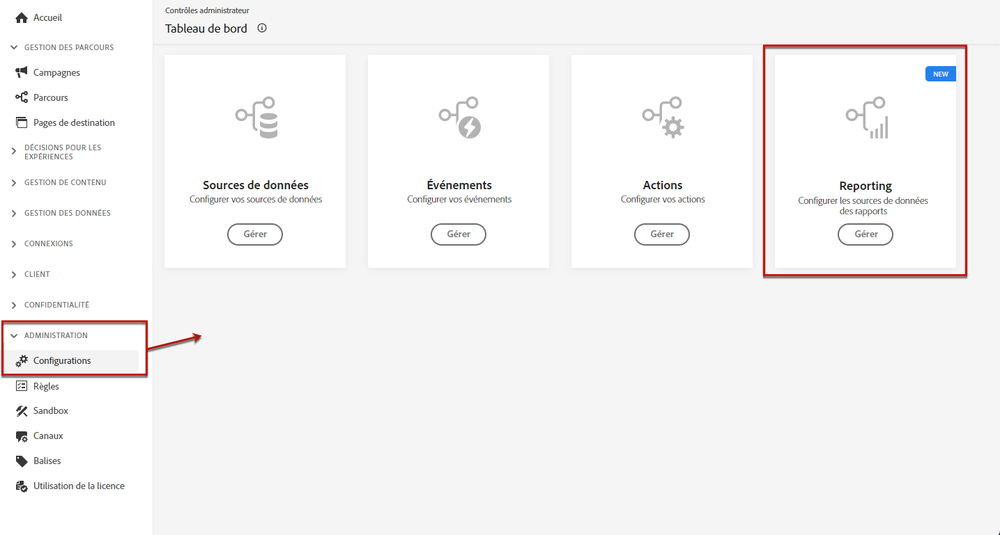
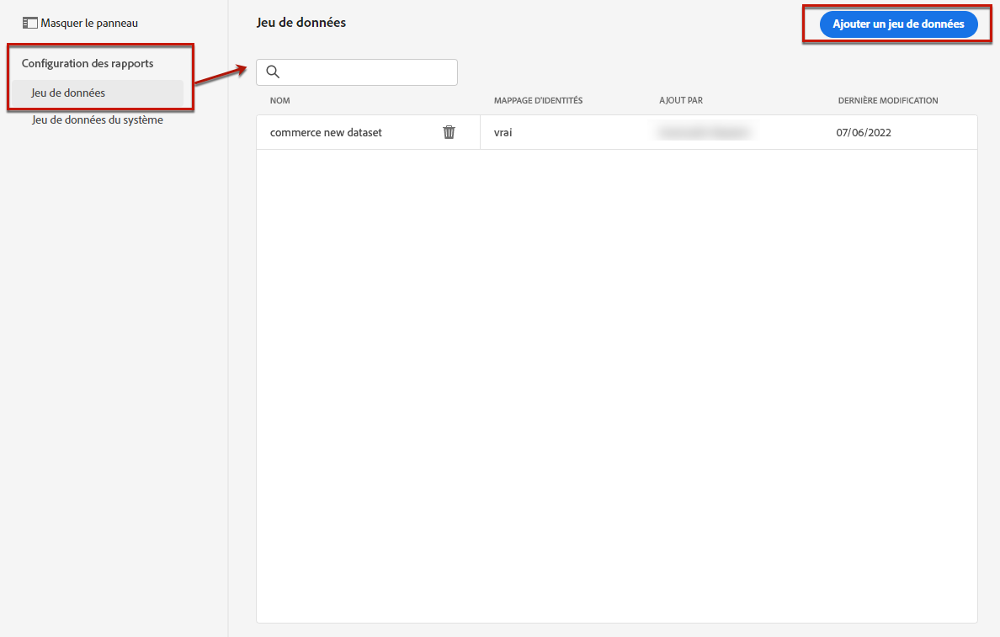
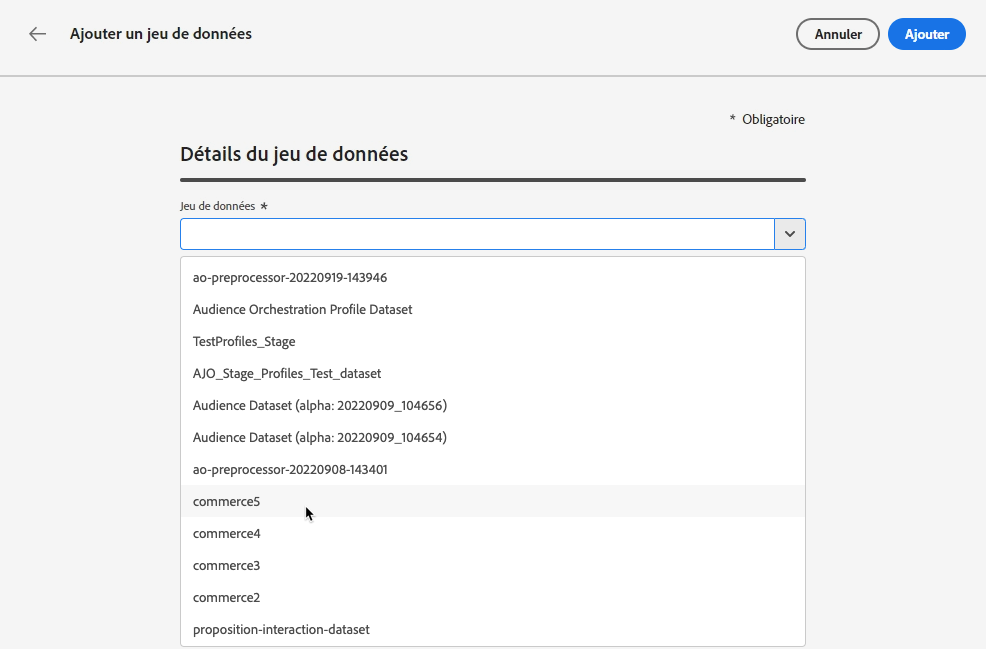
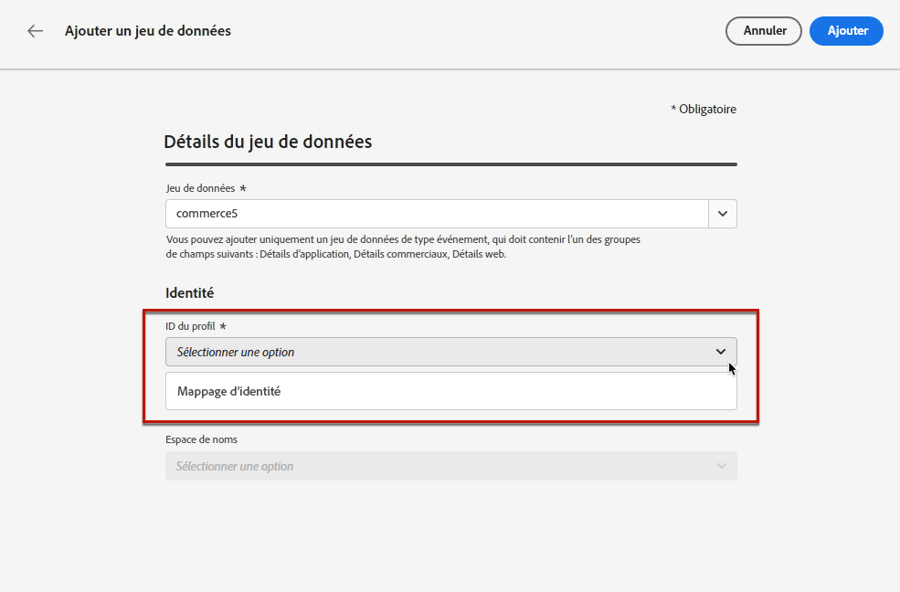
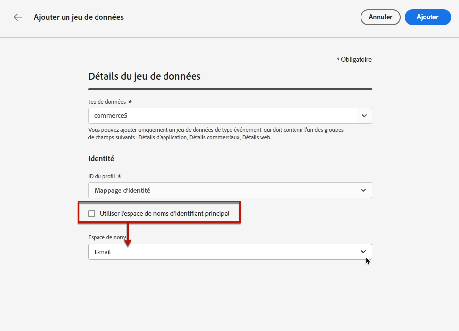
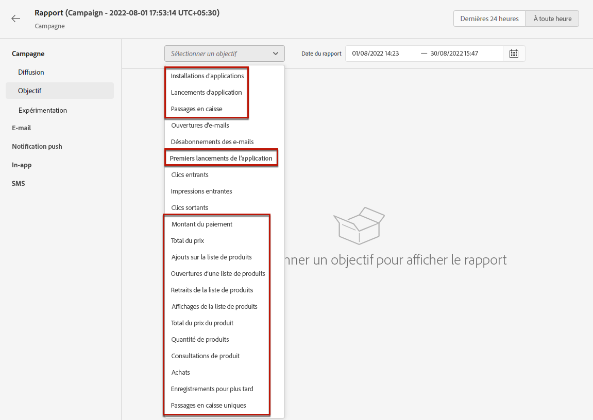

# Configurer des rapports pour l’expérimentation {#reporting-configuration}

>[!CONTEXTUALHELP]
>id="ajo_admin_reporting_config"
>title="Configurer des jeux de données pour la création de rapports"
>abstract="La configuration des rapports vous permet de récupérer des mesures supplémentaires qui seront utilisées dans vos rapports de campagne. Elle doit être effectuée par un utilisateur technique."

>[!CONTEXTUALHELP]
>id="ajo_admin_reporting_dataset"
>title="Sélectionner un jeu de données"
>abstract="Vous pouvez uniquement sélectionner un jeu de données de type événement qui doit contenir au moins l’un des groupes de champs pris en charge : Détails de l’application, Détails du commerce, Détails web."

La configuration des sources de données de rapports vous permet de définir une connexion à un système afin de récupérer des informations supplémentaires qui seront utilisées dans vos rapports.

<!--The reporting data source configuration allows you to retrieve additional metrics that will be used in the **[!UICONTROL Objectives]** tab of your campaign reports.-->

>[!NOTE]
>
>La configuration des rapports doit être effectuée par un utilisateur technique. <!--Rights?-->

Pour cette configuration, vous devez ajouter un ou plusieurs jeu(x) de données contenant les éléments supplémentaires que vous souhaitez utiliser pour vos rapports. Pour ce faire, suivez les étapes [ci-après](#add-datasets).

<!--
➡️ [Discover this feature in video](#video)
-->

## Conditions préalables

Avant de pouvoir ajouter un jeu de données à la configuration de création de rapports, vous devez le créer. Découvrez comment faire cela dans la [documentation d’Adobe Experience Platform](https://experienceleague.adobe.com/docs/experience-platform/catalog/datasets/user-guide.html?lang=fr#create){target="_blank"}.

* Vous pouvez uniquement ajouter des jeux de données de type événement.

* Ces jeux de données doivent inclure le [groupe de champ](https://experienceleague.adobe.com/docs/experience-platform/xdm/tutorials/create-schema-ui.html?lang=fr#field-group) `Experience Event - Proposition Interactions`{target="_blank"}.

* Ils peuvent également contenir l’un des [groupes de champs](https://experienceleague.adobe.com/docs/experience-platform/xdm/tutorials/create-schema-ui.html?lang=fr#field-group){target="_blank"} suivants : `Application Details`, `Commerce Details` ou `Web Details`.

  >[!NOTE]
  >
  >D’autres groupes de champs peuvent également être inclus, mais seuls les groupes de champs ci-dessus sont actuellement pris en charge dans les rapports Journey Optimizer.

  Par exemple, si vous souhaitez connaître l’impact d’une campagne par e-mail sur les données commerciales telles que les achats ou les commandes, vous devez créer un jeu de données d’événement d’expérience avec le groupe de champs `Commerce Details`.

  De même, si vous souhaitez générer des rapports sur les interactions mobiles, vous devez créer un jeu de données d’événement d’expérience avec le groupe de champ `Application Details`.

  <!--The metrics corresponding to each field group are listed [here](#objective-list).-->

* Vous pouvez ajouter ces groupes de champs à un ou plusieurs schémas qui seront utilisés dans un ou plusieurs jeux de données.

>[!NOTE]
>
>Pour en savoir plus sur les schémas et les groupes de champs XDM, consultez la [documentation de présentation du système XDM](https://experienceleague.adobe.com/docs/experience-platform/xdm/home.html?lang=fr){target="_blank"}.

<!--
## Objectives corresponding to each field group {#objective-list}

The table below shows which metrics will be added to the **[!UICONTROL Objectives]** tab of your campaign reports for each field group.

| Field group | Objectives |
|--- |--- |
| Commerce Details | Price Total Payment Amount (Unique) Checkouts (Unique) Product List Adds (Unique) Product List Opens (Unique) Product List Removal (Unique) Product List Views (Unique) Product Views (Unique) Purchases (Unique) Save For Laters Product Price Total Product Quantity |
| Application Details | (Unique) App Launches First App Launches (Unique) App Installs (Unique) App Upgrades |
| Web Details | (Unique) Page Views |
-->

## Ajouter des jeux de données {#add-datasets}

1. Dans la menu **[!UICONTROL ADMINISTRATION]**, sélectionnez **[!UICONTROL Configurations]**. Dans la section **[!UICONTROL Rapports]**, cliquez sur **[!UICONTROL Gérer]**.

   

   La liste des jeux de données déjà ajoutés s’affiche.

1. Sous l’onglet **[!UICONTROL Jeu de données]**, cliquez sur **[!UICONTROL Ajouter un jeu de données]**.

   

   >[!NOTE]
   >
   >Si vous sélectionnez l’onglet **[!UICONTROL Jeu de données système]**, seuls les jeux de données créés par le système s’affichent. Vous ne pourrez pas ajouter d’autres jeux de données.

1. Dans la liste déroulante de **[!UICONTROL Jeu de données]**, sélectionnez le jeu de données que vous souhaitez utiliser pour vos rapports.

   >[!CAUTION]
   >
   >Vous pouvez uniquement sélectionner un jeu de données de type événement, qui doit contenir au moins l’un des [groupes de champs](https://experienceleague.adobe.com/docs/experience-platform/xdm/tutorials/create-schema-ui.html?lang=fr#field-group){target="_blank"} pris en charge : **Détails de l’application**, **Détails du commerce**, **Détails web**. Si vous sélectionnez un jeu de données ne correspondant pas à ces critères, vous ne pourrez pas enregistrer vos modifications.

   

   Pour en savoir plus sur les jeux de données, consultez la [documentation d’Adobe Experience Platform](https://experienceleague.adobe.com/docs/experience-platform/catalog/datasets/overview.html?lang=fr){target="_blank"}.

1. Dans la liste déroulante des **[!UICONTROL identifiants de profil]**, sélectionnez l’attribut de champ de jeu de données qui sera utilisé pour identifier chaque profil dans vos rapports.

   

   >[!NOTE]
   >
   >Seuls les identifiants disponibles pour la création de rapports s’affichent.

1. L’option **[!UICONTROL Utiliser l’espace de noms d’identifiant principal]** est activée par défaut. Si l’**[!UICONTROL identifiant de profil]** sélectionné est **[!UICONTROL Mappage d’identités]**, vous pouvez désactiver cette option et choisir un autre espace de noms dans la liste déroulante qui s’affiche.

   

   Pour en savoir plus sur les espaces de noms, consultez la [documentation d’Adobe Experience Platform](https://experienceleague.adobe.com/docs/experience-platform/identity/namespaces.html?lang=fr){target="_blank"}.

1. Enregistrez vos modifications pour ajouter le jeu de données sélectionné à la liste de configuration des rapports.

   >[!CAUTION]
   >
   >Si vous avez sélectionné un jeu de données qui n’est pas de type événement, vous ne pourrez pas continuer.

Pour les canaux web et in-app, assurez-vous que le [jeu de données](../data/get-started-datasets.md) configuré pour la collecte de données est également ajouté à la configuration des rapports. Dans le cas contraire, les données web et in-app ne s’afficheront pas dans les rapports d’expérience de contenu.

* En savoir plus sur les conditions préalables aux expériences de contenu pour le canal web dans [cette section](../web/web-prerequisites.md#experiment-prerequisites).

* En savoir plus sur la configuration du canal in-app dans [cette section](../in-app/inapp-configuration.md).

<!--
When building your campaign reports, you can now see the metrics corresponding to the field groups used in the datasets you added. Go to the **[!UICONTROL Objectives]** tab and select the metrics of your choice to better fine-tune your reports. [Learn more](content-experiment.md#objectives-global)

>[!NOTE]
>
>If you add several datasets, all data from all datasets will be available for reporting.

## How-to video {#video}

Understand how to configure Experience Platform reporting data sources.

>[!VIDEO]()
-->
