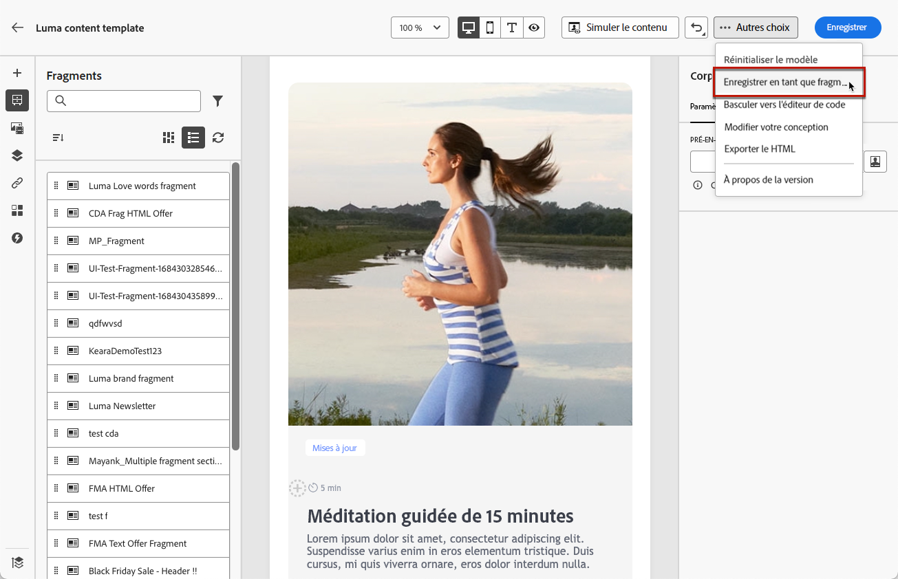
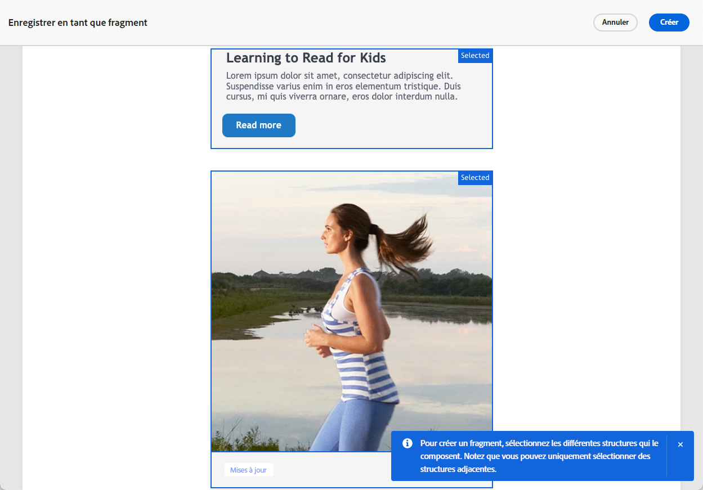
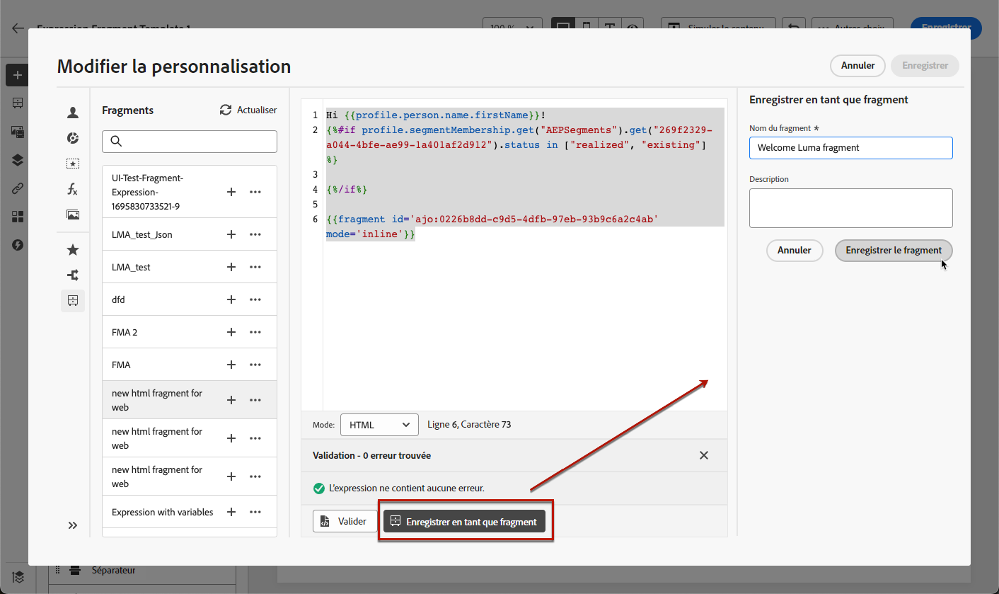

# Enregistrer du contenu en tant que fragment {#save-as-fragment}

Lors de la modification de contenu dans [!DNL Journey Optimizer], vous pouvez enregistrer tout ou une partie de votre contenu en tant que fragment pour une réutilisation ultérieure. Vous pouvez enregistrer du contenu en tant que fragment soit [depuis le concepteur d’e-mail](#save-as-visual-fragment), soit [depuis l’éditeur d’expression](#save-as-expression-fragment).

>[!NOTE]
>
>Lorsque le tracking est activé dans un parcours ou une campagne, si vous ajoutez des liens à un fragment et que ce fragment est utilisé dans un e-mail, ces liens sont trackés comme tous les autres liens inclus dans le message. [En savoir plus sur les liens et le tracking](../email/message-tracking.md)

## Enregistrer en tant que fragment visuel {#save-as-visual-fragment}

Pour enregistrer le contenu du concepteur d’e-mail en tant que fragment, procédez comme suit :

1. Dans le [concepteur d’e-mail](../email/get-started-email-design.md), cliquez sur les points de suspension en haut à droite de l’écran.

1. Sélectionnez **[!UICONTROL Enregistrer en tant que fragment]** dans le menu déroulant.

   

   >[!NOTE]
   >
   >Les fragments visuels ne peuvent pas dépasser 100KB.

1. L’écran **[!UICONTROL Enregistrer en tant que fragment]** s’affiche. Sélectionnez ensuite les éléments à inclure dans votre fragment, notamment les champs de personnalisation et le contenu dynamique. Notez que les attributs contextuels ne sont pas pris en charge dans les fragments.

   

   >[!CAUTION]
   >
   >Vous pouvez uniquement sélectionner des sections adjacentes. Vous ne pouvez pas sélectionner une structure vide ou un autre fragment.

1. Cliquez sur **[!UICONTROL Créer]** et renseignez le nom et la description du fragment (si nécessaire).

1. Pour attribuer des libellés d’utilisation des données personnalisés ou de base au fragment, sélectionnez le bouton **[!UICONTROL Gérer l’accès]** dans la partie supérieure de l’écran. [En savoir plus sur le contrôle d’accès au niveau de l’objet (OLAC)](../administration/object-based-access.md)

1. Sélectionnez ou créez des balises Adobe Experience Platform à partir du champ **Balises** pour classer votre modèle en vue d’une recherche améliorée. [En savoir plus](../start/search-filter-categorize.md#tags)

1. Cliquez sur **[!UICONTROL Créer]**. Votre fragment est ajouté à la [liste de fragments](#access-manage-fragments) avec le statut **Brouillon**. Il devient un fragment autonome qui peut être utilisé comme tout autre fragment visuel de cette liste.

   >[!NOTE]
   >
   >Toute modification apportée à ce nouveau fragment n’est pas propagée dans l’e-mail ou le modèle d’où il provient. De même, lorsque le contenu d’origine est modifié dans cet e-mail ou modèle, le nouveau fragment n’est pas modifié.

1. Pour pouvoir utiliser le fragment dans vos parcours et campagnes, vous devez le rendre actif. [Découvrir comment prévisualiser et publier un fragment](../content-management/create-fragments.md#publish)

## Enregistrer en tant que fragment d’expression {#save-as-expression-fragment}

>[!CONTEXTUALHELP]
>id="ajo_perso_library"
>title="Enregistrer en tant que fragment d’expression"
>abstract="L’éditeur de personnalisation de [!DNL Journey Optimizer] vous permet d’enregistrer du contenu en tant que fragments d’expression. Ces expressions sont ensuite disponibles pour créer du contenu personnalisé."

L’éditeur de personnalisation de [!DNL Journey Optimizer] vous permet d’enregistrer du contenu en tant que fragments d’expression. Ces expressions sont ensuite disponibles pour créer du contenu personnalisé.

Pour enregistrer du contenu en tant que fragment d’expression, procédez comme suit.

1. Dans l’interface de l’[éditeur de personnalisation](../personalization/personalization-build-expressions.md), créez une expression, puis cliquez sur **[!UICONTROL Enregistrer en tant que fragment]**.

   >[!NOTE]
   >
   >Les expressions ne doivent pas dépasser 200 Ko.

1. Dans le volet de droite, saisissez un nom et une description pour l’expression afin d’aider les personnes à la trouver plus facilement.

   

1. Cliquez sur **[!UICONTROL Enregistrer le fragment]**.

   <!--An expression fragment cannot be nested inside another fragment.-->

1. Le fragment est ajouté à la [liste des fragments](#access-manage-fragments) avec le statut **Brouillon**. Il devient un fragment autonome qui peut être utilisé comme tout autre fragment d’expression de cette liste.

1. Pour pouvoir utiliser le fragment dans vos parcours et campagnes, vous devez le rendre actif. [Découvrir comment prévisualiser et publier un fragment](../content-management/create-fragments.md#publish)
