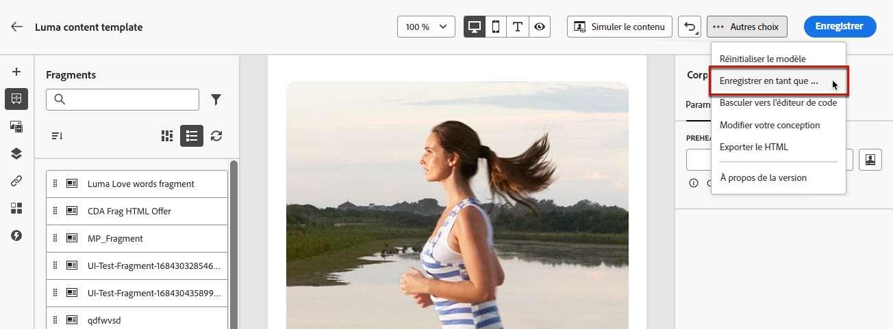

# Enregistrer du contenu en tant que fragment {#save-as-fragment}

Lors de la modification de contenu dans [!DNL Journey Optimizer], vous pouvez enregistrer tout ou une partie de votre contenu en tant que fragment pour une réutilisation ultérieure.

## Enregistrer du contenu en tant que fragment visuel {#save-as-visual-fragment}

Lors de la conception d’un [modèle de contenu](content-templates.md) ou d’un [e-mail](../email/get-started-email-design.md) dans une campagne ou un parcours, vous pouvez enregistrer une partie de votre contenu en tant que fragment visuel. Pour ce faire, suivez les étapes ci-après.

1. Dans le [concepteur d’e-mail](../email/get-started-email-design.md), cliquez sur les points de suspension en haut à droite de l’écran.

1. Sélectionnez **[!UICONTROL Enregistrer en tant que fragment]** dans le menu déroulant.

   

1. L’écran **[!UICONTROL Enregistrer en tant que fragment]** s’affiche. Sélectionnez ensuite les éléments à inclure dans votre fragment, notamment les champs de personnalisation et le contenu dynamique. Notez que les attributs contextuels ne sont pas pris en charge dans les fragments.

   >[!CAUTION]
   >
   >Vous pouvez uniquement sélectionner des sections adjacentes. Vous ne pouvez pas sélectionner une structure vide ou un autre fragment.

   

1. Cliquez sur **[!UICONTROL Créer]**. Renseignez les détails du fragment, c’est-à-dire le nom et la description (si nécessaire).

1. Pour attribuer des libellés d’utilisation des données personnalisés ou de base au fragment, sélectionnez **[!UICONTROL Gérer l’accès]**. [En savoir plus sur le contrôle d’accès au niveau de l’objet (OLAC)](../administration/object-based-access.md).

1. Sélectionnez ou créez des balises Adobe Experience Platform à partir du champ **Balises** pour classer votre modèle en vue d’une recherche améliorée. [En savoir plus](../start/search-filter-categorize.md#tags)

1. Cliquez de nouveau sur **[!UICONTROL Créer]**. Le fragment est enregistré dans la [liste de fragments](#access-manage-fragments), accessible à partir du menu dédié [!DNL Journey Optimizer].

   Il devient alors un modèle de contenu autonome [accessible](#access-manage-fragments) pouvant être [édité](#edit-fragments) et [archivé](#archive-fragments) comme tout autre élément de cette liste.

Ce fragment est maintenant prêt à être utilisé lors de la création d’un [e-mail](../email/get-started-email-design.md) ou [modèle de contenu](content-templates.md) dans [!DNL Journey Optimizer]. [Voici comment procéder.](../email/use-visual-fragments.md)

>[!NOTE]
>
>Toute modification apportée à ce nouveau fragment n’est pas propagée dans l’e-mail ou le modèle d’où il provient. De même, lorsque le contenu d’origine est modifié dans cet e-mail ou modèle, le nouveau fragment n’est pas modifié.

## Enregistrer du contenu en tant que fragment d’expression {#save-as-expression-fragment}

>[!CONTEXTUALHELP]
>id="ajo_perso_library"
>title="Enregistrer en tant que fragment d’expression"
>abstract="L’éditeur de personnalisation de [!DNL Journey Optimizer] vous permet d’enregistrer du contenu en tant que fragments d’expression. Ces expressions sont ensuite disponibles pour créer du contenu personnalisé."

L’éditeur de personnalisation de [!DNL Journey Optimizer] vous permet d’enregistrer du contenu en tant que fragments d’expression. Ces expressions sont ensuite disponibles pour créer du contenu personnalisé.

Pour enregistrer du contenu en tant que fragment d’expression, procédez comme suit.

1. Dans l’interface de l’[éditeur de personnalisation](../personalization/personalization-build-expressions.md), créez une expression, puis cliquez sur **[!UICONTROL Enregistrer en tant que fragment]**.

1. Dans le volet de droite, saisissez un nom et une description pour l’expression afin d’aider les personnes à la trouver plus facilement.

   

1. Cliquez sur **[!UICONTROL Enregistrer le fragment]**.

   <!--An expression fragment cannot be nested inside another fragment.-->

1. Le fragment d’expression est ajouté à la [liste de fragments](#access-manage-fragments). Vous pouvez désormais l’utiliser pour créer du contenu personnalisé.

>[!NOTE]
>
>Les expressions ne doivent pas dépasser 200 Ko.
