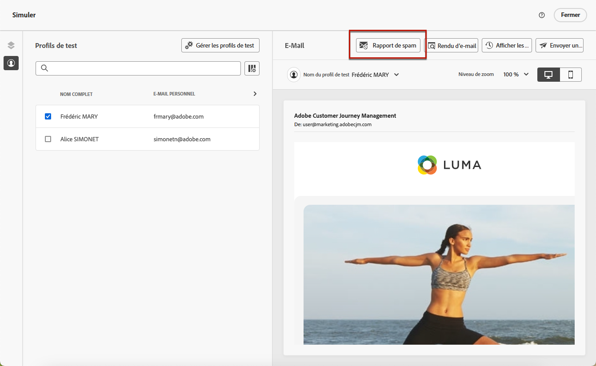
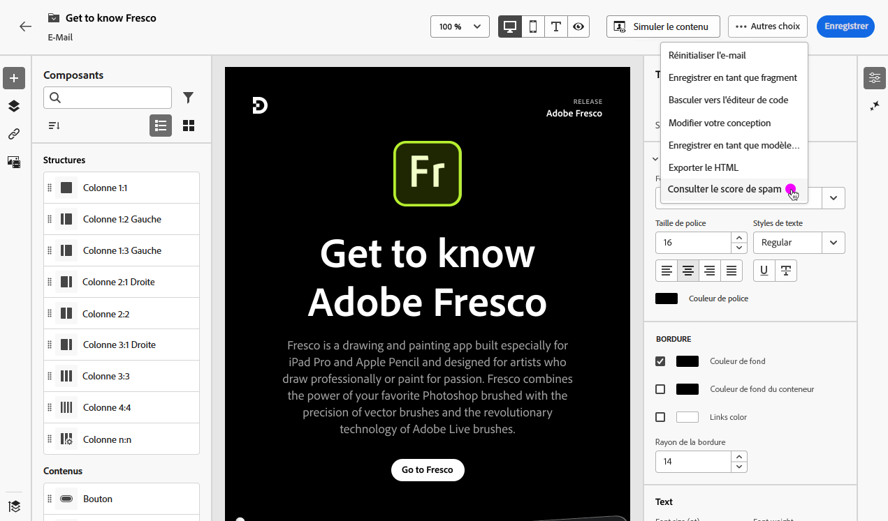
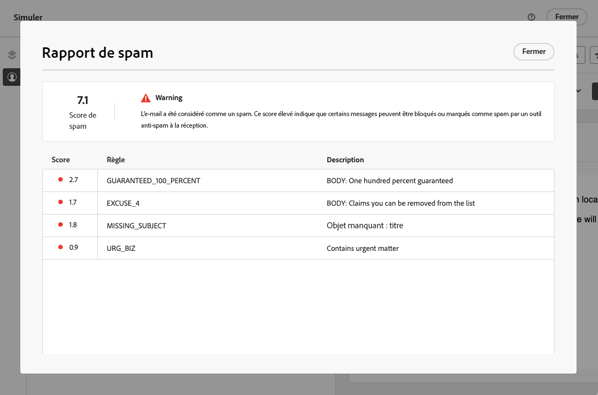
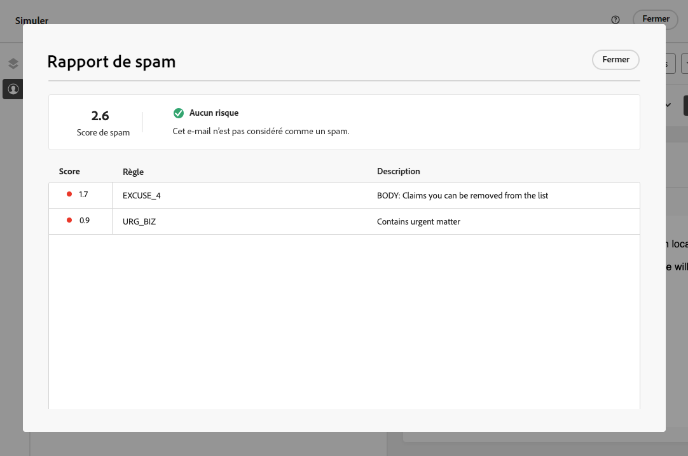
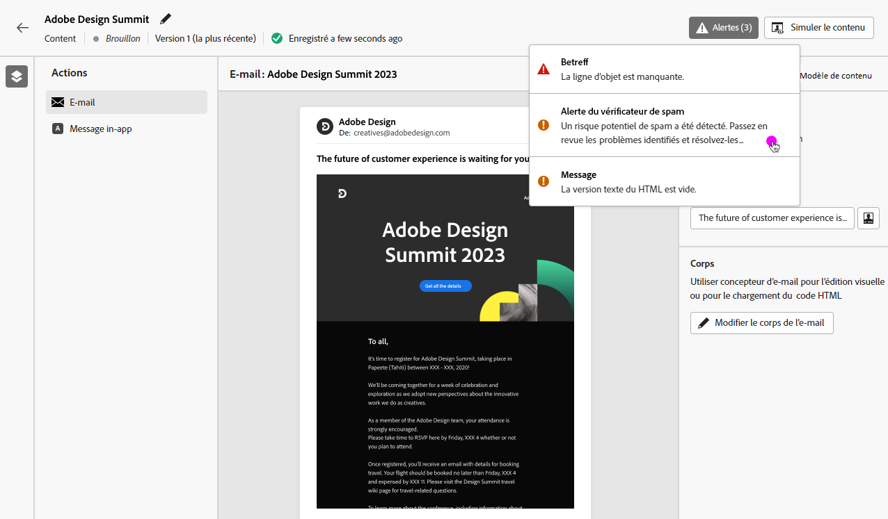

# Rapport Email spam {#spam-report}

>[!CONTEXTUALHELP]
>id="ajo_simulate_spam_report"
>title="Rapport Email spam"
>abstract="Le rapport Spam vous permet de vérifier le score de spam de votre contenu d&#39;email. Ce score indique si les FAI ou les fournisseurs de messagerie considèrent votre message comme un spam ou non. Plus le score est bas, mieux c&#39;est. Si le score de contenu de votre email est supérieur à 2, envisagez de résoudre les problèmes qui provoquent l’échec des tests."

Vous pouvez vérifier le score de spam de votre contenu d&#39;email dans un rapport de spam dédié. Utilisation [SpamAssassin](https://spamassassin.apache.org/){target="_blank"}, Adobe Journey Optimizer peut tester le contenu de votre email et lui attribuer un score pour indiquer si les FAI ou les fournisseurs de messagerie le considèrent comme un spam ou non.

>[!AVAILABILITY]
>
>Cette fonctionnalité est actuellement en version bêta et disponible uniquement pour les clients bêta. Pour rejoindre le programme Beta, contactez l’assistance clientèle d’Adobe.

Lors de l&#39;édition ou de la prévisualisation du contenu de votre email, la variable **[!UICONTROL Rapport Spam]** fournit une notation et des conseils pour améliorer les scores de chaque élément répertorié.

Cette fonctionnalité vous permet de déterminer si un message peut être considéré comme indésirable par les outils anti-spams utilisés à sa réception et d’agir si tel est le cas. De nombreux fournisseurs de messagerie utilisent des outils dans le cadre de leur processus de filtrage du spam. L’envoi d’emails avec un mauvais score peut considérablement affecter votre délivrabilité.

Pour accéder au **[!UICONTROL Rapport Spam]**, suivez les étapes ci-dessous.

1. Dans l’écran **[!UICONTROL Simuler]**, cliquez sur le bouton **[!UICONTROL Rapport de spam]**.

   

<!--
    You can also open the [Email Designer](../email/content-from-scratch.md), click the **[!UICONTROL More]** button and select **[!UICONTROL Check spam score]** from the menu.

    
-->

1. Une vérification anti-spam est automatiquement effectuée et la fenêtre **[!UICONTROL Rapport de spam]** affiche les résultats. Elle indique comment se comporte votre contenu en termes de disposition du corps, de structure, de taille d’image, de mots déclencheurs de spam, le cas échéant, etc.

   

1. Vérifiez les scores et les descriptions de chaque élément.

   Plus le score est bas, mieux c&#39;est. Si le score est supérieur à 5, un avertissement s&#39;affiche : il indique que certains messages peuvent être bloqués ou marqués comme spam à la réception. La bonne pratique consiste à obtenir un score inférieur à 2.

1. Selon cette notation, si vous considérez que certains éléments peuvent être améliorés, modifiez votre contenu dans la variable [Concepteur d&#39;email](../email/content-from-scratch.md) et effectuez les mises à jour nécessaires.

1. Une fois vos modifications effectuées, revenez à la **[!UICONTROL Rapport Spam]** pour vous assurer que votre score a été amélioré.

   

<!--You can also check the message's alerts for warnings on potential risk of spam detection. Follow the steps below.

1. Click the **[!UICONTROL Alerts]** button on top right of the screen. [Learn more on email alerts](../email/create-email.md#check-email-alerts)

1. If **[!UICONTROL Spam checker alert]** is displayed, you should check your content for a potential risk of spam using the **[!UICONTROL Spam report]** feature as detailed above.

    
-->
