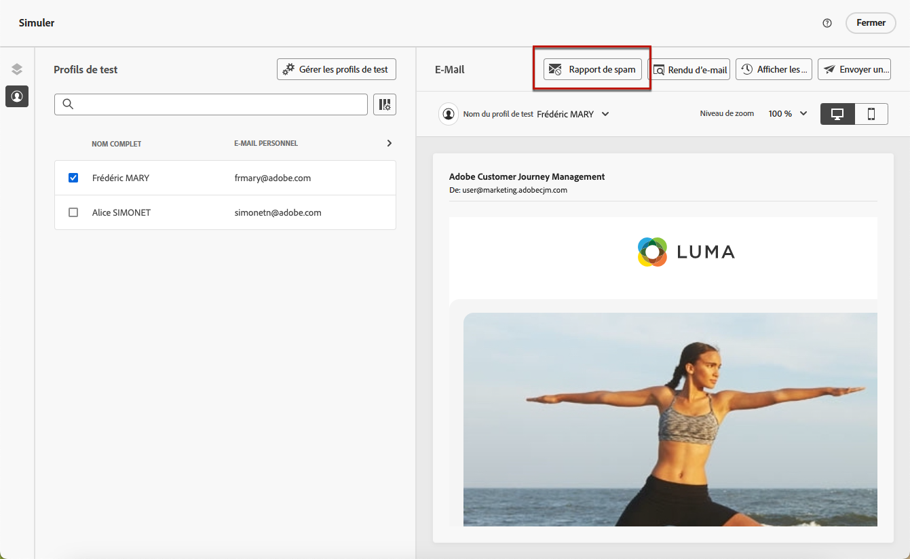
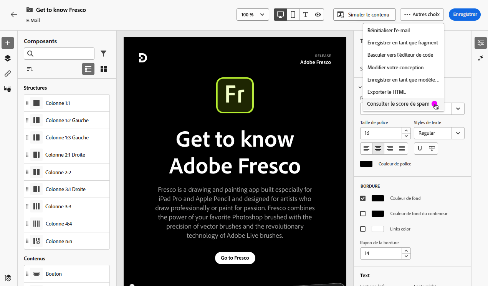
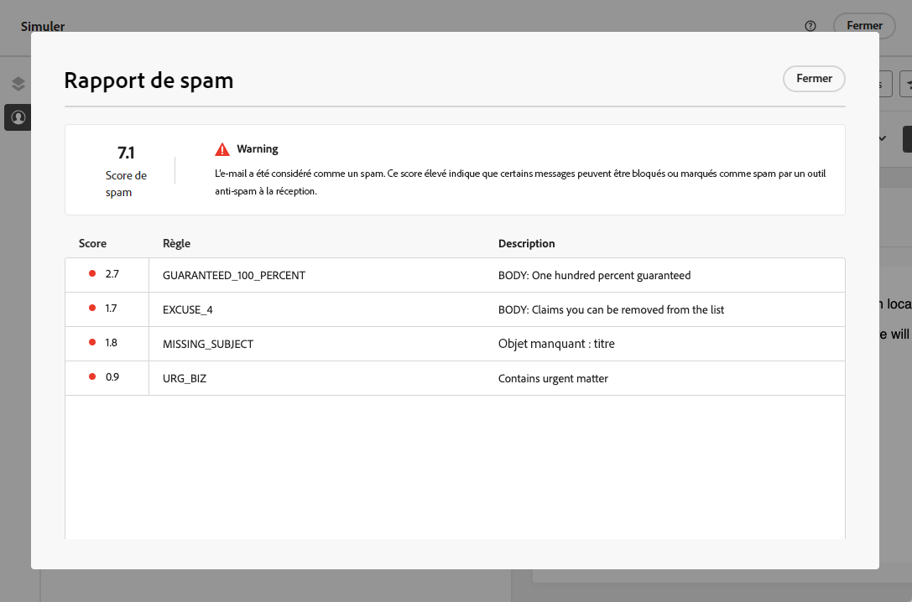
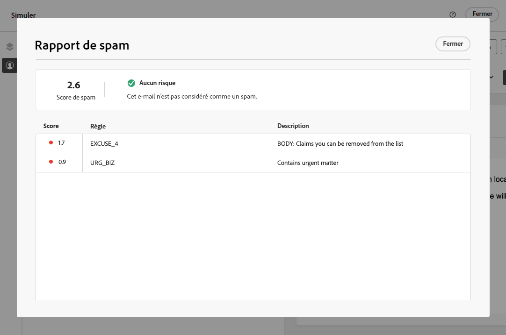
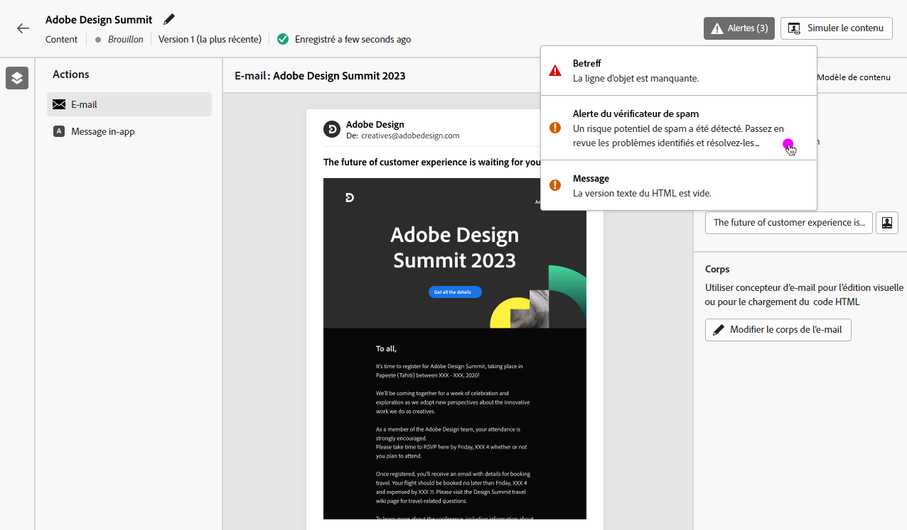

# Rapport de spam des e-mails {#spam-report}

>[!CONTEXTUALHELP]
>id="ajo_simulate_spam_report"
>title="Rapport de spam des e-mails"
>abstract="Le rapport de spam vous permet de vérifier la notation de spam du contenu de vos e-mails. Cette note indique si les FAI ou les fournisseurs de messagerie considèrent votre message comme un spam ou non. Plus la note est faible, mieux c’est. Si la note du contenu de votre e-mail est supérieure à 2, envisagez de résoudre les problèmes qui provoquent l’échec des tests."

Vous pouvez vérifier la note de spam du contenu de vos e-mails dans un rapport de spam dédié. À l’aide de [SpamAssassin](https://spamassassin.apache.org/){target="_blank"}, Adobe Journey Optimizer peut tester le contenu de votre email et lui attribuer un score indiquant si les FAI ou les fournisseurs de messagerie le considéreront comme du spam ou non.

Lors de la modification ou de la prévisualisation du contenu de votre e-mail, le bouton **[!UICONTROL Rapport de spam]** fournit une notation et des conseils afin d’améliorer les notes de chaque élément répertorié.

Cette fonctionnalité vous permet de déterminer si un message peut être considéré comme un spam par les outils anti-spam utilisés à sa réception et d’agir si tel est le cas. De nombreux fournisseurs de messagerie utilisent des outils dans le cadre de leur processus de filtrage des spams. L’envoi d’e-mails avec une mauvaise note peut considérablement affecter votre délivrabilité.

Pour accéder à la fonctionnalité **[!UICONTROL Rapport de spam]**, suivez les étapes ci-dessous.

1. Dans l’écran **[!UICONTROL Simuler]**, cliquez sur le bouton **[!UICONTROL Rapport de spam]**.

   

<!--
    You can also open the [Email Designer](../email/content-from-scratch.md), click the **[!UICONTROL More]** button and select **[!UICONTROL Check spam score]** from the menu.

    
-->

1. Une vérification anti-spam est automatiquement effectuée et la fenêtre **[!UICONTROL Rapport de spam]** affiche les résultats. Elle indique comment se comporte votre contenu en termes de disposition du corps, de structure, de taille d’image, de mots déclencheurs de spam, le cas échéant, etc.

   

1. Vérifiez les scores et les descriptions de chaque élément.

   Plus la note est faible, mieux c’est. Si la note est supérieure à 5, un avertissement s’affiche : il indique que certains messages peuvent être bloqués ou marqués comme spam lors de leur réception. La bonne pratique consiste à obtenir une note inférieure à 2.

   >[!NOTE]
   >
   >Le score de spam est dérivé de [SpamAssassin](https://spamassassin.apache.org/){target="_blank"} et les règles ne sont pas la propriété d&#39;Adobe. Pour plus d’informations sur ces règles, consultez la documentation de SpamAssassin.
   >

1. En fonction de cette note, si vous considérez que certains éléments peuvent être améliorés, modifiez votre contenu dans le [Concepteur d’e-mail](../email/content-from-scratch.md) et effectuez les mises à jour nécessaires.

1. Une fois les modifications effectuées, revenez à l’écran **[!UICONTROL Rapport de spam]** pour vous assurer de l’amélioration de votre note.

   

<!--
You can also check the message's alerts for warnings on potential risk of spam detection. Follow the steps below.

1. Click the **[!UICONTROL Alerts]** button on top right of the screen. [Learn more about email alerts](../email/create-email.md#check-email-alerts)

1. If **[!UICONTROL Spam checker alert]** is displayed, you should check your content for a potential risk of spam using the **[!UICONTROL Spam report]** feature as detailed above.

    
-->
