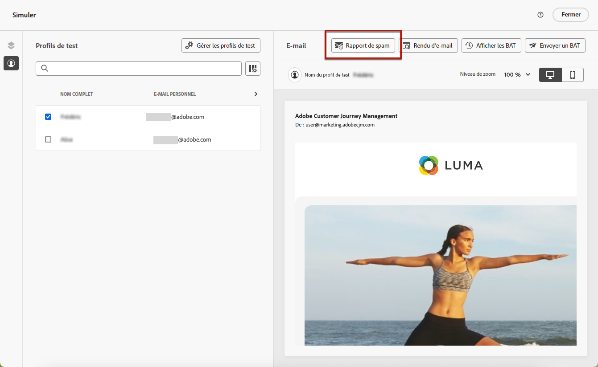

# Utiliser le rapport de spam {#spam-report}

>[!AVAILABILITY]
>
>La fonctionnalité de rapport de spam est actuellement disponible en version Beta pour certains utilisateurs ou certaines utilisatrices uniquement. Pour rejoindre le programme Beta, contactez l’assistance clientèle d’Adobe.

[!DNL Journey Optimizer] vous permet de vérifier les performances de votre contenu par rapport au filtrage du spam et de vous assurer que vos messages arrivent dans les boîtes de réception de vos clientes et clients, et non dans les spams.

>[!CAUTION]
>
>* Cette fonctionnalité est actuellement disponible uniquement pour le canal E-mail.
>
>* Pour l’instant, l’analyse du rapport de spam ne peut être effectuée que pour le contenu en anglais.

Lors de la modification ou de la prévisualisation de votre contenu, l’option **[!UICONTROL Rapport de spam]** fournit une notation et des conseils afin d’améliorer les scores de chaque élément répertorié.

Cela vous permet de déterminer si un message risque d’être considéré comme un spam par les outils anti-spam utilisés à sa réception et d’agir dans le cas contraire.

>[!CAUTION]
>
>Le rapport de spam ne fournit que des indications et des avertissements. Notez que l’envoi de messages n’est pas empêché si le rapport de spam indique que votre contenu est considéré comme un spam. Vous avez le choix d’agir en fonction du score et des améliorations suggérées.

Pour utiliser la fonctionnalité **[!UICONTROL Rapport de spam]**, suivez les étapes ci-dessous.

<!--For example spam scoring tool can tell that there are too many Images compared to the text. Retailers tend to do this even though the spam score gets worse because the content is more engaging.-->

<!--Michael, who is a marketer with NIKE works along with Tara from testing team to ensure that the emails being sent as part of the campaign/journey don't get categorised as SPAM.

They need an integration within AJO's marketing system to show how the curated content is doing against different SPAM compliance pillars like for SPAM trigger words, HTML Body content and layout, subject line etc.

They should be able to get scores for each individual items as shown by market standard SPAM filtering tools like Spam Assassin, Symantec etc.

They should also get suggestions on how to improve the score better to be confident that the messages don't get categorised as spam.-->

1. Dans l’écran **[!UICONTROL Simuler]**, cliquez sur le bouton **[!UICONTROL Rapport de spam]**.

   

<!--
    You can also open the [Email Designer](../email/content-from-scratch.md), click the **[!UICONTROL More]** button and select **[!UICONTROL Check spam score]** from the menu.

    
-->

1. Une vérification anti-spam est automatiquement effectuée et la fenêtre **[!UICONTROL Rapport de spam]** affiche les résultats. Elle indique comment se comporte votre contenu en termes de disposition du corps, de structure, de taille d’image, de mots déclencheurs de spam, le cas échéant, etc.

   

1. Vérifiez les scores et les descriptions de chaque élément.

   Si le score est supérieur à 5, un avertissement s’affiche. Il indique que certains messages peuvent être bloqués ou marqués comme spam par les outils anti-spam lors de leur réception.

1. En fonction de cette notation, si vous considérez que certains éléments peuvent être améliorés, accédez à votre contenu à l’aide du [Concepteur d’e-mail](../email/content-from-scratch.md) et effectuez les mises à jour nécessaires.

1. Une fois les modifications effectuées, revenez à l’écran **[!UICONTROL Rapport de spam]** pour vous assurer de l’amélioration de votre score.

   

<!--You can also check the message's alerts for warnings on potential risk of spam detection. Follow the steps below.

1. Click the **[!UICONTROL Alerts]** button on top right of the screen. [Learn more on email alerts](../email/create-email.md#check-email-alerts)

1. If **[!UICONTROL Spam checker alert]** is displayed, you should check your content for a potential risk of spam using the **[!UICONTROL Spam report]** feature as detailed above.

    
-->
