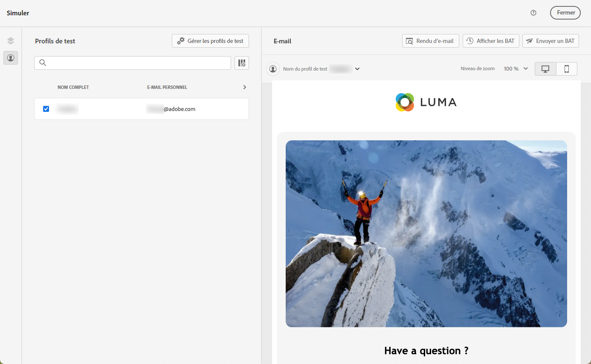
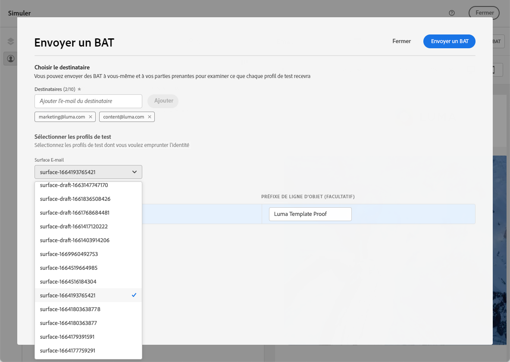

# Tester des modèles de contenu d’e-mail {#test-template}

Vous pouvez tester le rendu de certains de vos modèles d’e-mail, qu’ils aient été créés entièrement ou à partir d’un contenu existant. Pour ce faire, procédez comme suit :

1. Pour accéder à la liste des modèles de contenu, consultez le menu **[!UICONTROL Gestion de contenu]** > **[!UICONTROL Modèles de contenu]** et sélectionnez n’importe quel modèle d’e-mail.

1. Cliquez sur **[!UICONTROL Modifier le contenu]** dans les **[!UICONTROL Propriétés du modèle]**.

1. Cliquez sur **[!UICONTROL Simuler le contenu]** et sélectionnez un profil de test pour vérifier le rendu. [En savoir plus](../content-management/preview-test.md).

   

1. Vous pouvez envoyer un BAT pour tester votre contenu et le faire approuver par certains utilisateurs et utilisatrices internes avant de l’utiliser pour un parcours ou une campagne.

   * Pour ce faire, cliquez sur le bouton **[!UICONTROL Envoyer un BAT]** et suivez les étapes décrites dans [cette section](../content-management/proofs.md).

   * Avant d’envoyer le BAT, vous devez sélectionner la [surface d’e-mail](../configuration/channel-surfaces.md) qui sera utilisée pour tester votre contenu.

     

>[!CAUTION]
>
>Pour l’instant, le suivi n’est pas pris en charge lors du test des modèles de contenu d’e-mail. Dès lors, le suivi des événements, des paramètres UTM et des liens de page de destination n’est pas assuré dans les BAT envoyés à partir d’un modèle. Pour tester le suivi, [utilisez le modèle de contenu](../email/use-email-templates.md) d’un e-mail et [envoyez un BAT](../content-management/preview-test.md#send-proofs).
