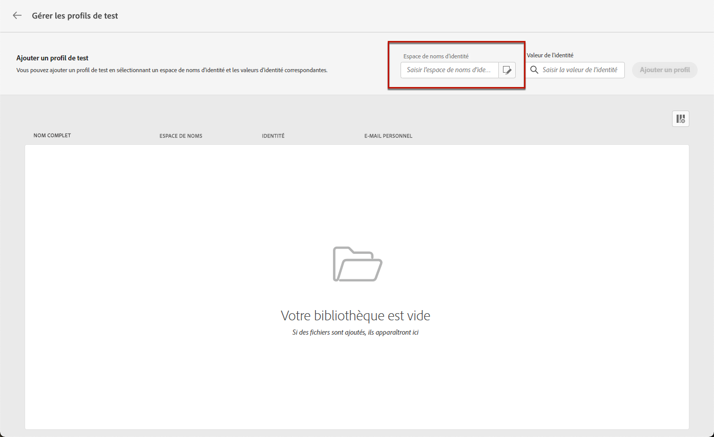
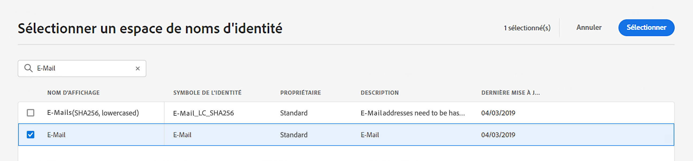
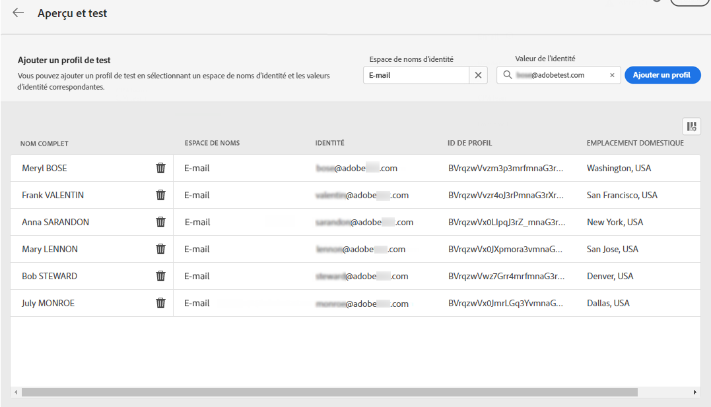

# Sélectionner des profils de test {#select-test-profiles}

>[!CONTEXTUALHELP]
>id="ajo_preview_test_profiles"
>title="Utiliser des profils de test pour vérifier votre contenu"
>abstract="Utilisez des profils de test pour prévisualiser et tester votre contenu. Si vous avez ajouté des champs personnalisés, vous pouvez vérifier leur affichage à l’aide des données de profil de test."

Avant de prévisualiser ou de tester votre contenu, vous devez d’abord sélectionner des profils de test, c’est-à-dire des destinataires supplémentaires qui ne correspondent pas aux critères de ciblage définis. [Découvrez comment créer des profils de test](../audience/creating-test-profiles.md).

>[!NOTE]
>
>En plus des profils de test, [!DNL Journey optimizer] vous permet également de tester différentes variantes de votre contenu en le prévisualisant et en envoyant des BAT à l’aide d’exemples de données d’entrée chargés à partir d’un fichier CSV/JSON ou ajoutés manuellement. [Découvrir comment tester votre contenu à l’aide d’exemples de données d’entrée](../test-approve/simulate-sample-input.md)

Pour sélectionner des profils de test, procédez comme suit :

1. Dans l’écran Modifier le contenu de votre message, ou dans le concepteur d’e-mail, cliquez sur le bouton **[!UICONTROL Simuler du contenu]**.

1. Cliquez sur le bouton **[!UICONTROL Gérer des profils de test]** puis sélectionnez l’espace de noms à utiliser pour identifier les profils de test en cliquant sur l’icône de sélection **[!UICONTROL Espace de noms d’identité]**. [Apprenez-en davantage sur les espaces de noms d’identité Adobe Experience Platform](../audience/get-started-identity.md).

   Dans l’exemple ci-dessous, nous utilisons l’espace de noms **E-mail**.

   

1. Utilisez le champ de recherche pour trouver l&#39;espace de noms, sélectionnez-le et cliquez sur **[!UICONTROL Sélectionner]**.

   

1. Dans le champ **[!UICONTROL Valeur d’identité]**, saisissez la valeur (l’adresse e-mail ici) permettant d’identifier le profil de test et cliquez sur **[!UICONTROL Ajouter un profil]**.

   <!---->

1. Si vous avez ajouté une personnalisation à votre message, ajoutez d’autres profils afin de pouvoir tester différentes variantes du message en fonction des données du profil. Une fois ajoutés, les profils sont répertoriés sous les champs sélectionnés.

   

   En fonction des éléments de personnalisation du message, cette liste affiche les données de chaque profil de test dans les colonnes associées.
