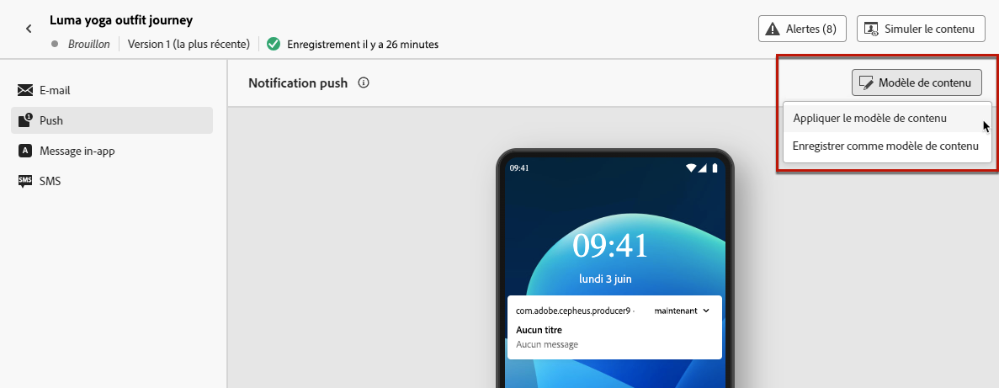

# Utiliser des modèles de contenu {#use-content-templates}

Lors de la création de contenu pour n’importe quel canal (à l’exception du canal web) dans [!DNL Journey Optimizer], vous pouvez utiliser un modèle personnalisé que :

* vous avez créé à l’aide du menu **[!UICONTROL Modèles de contenu]** ; [En savoir plus](#create-template-from-scratch).

* vous avez enregistré à partir d’un contenu existant dans un parcours ou une campagne à l’aide de l’option **[!UICONTROL Enregistrer en tant que modèle de contenu]**. [En savoir plus](#save-as-template)

Pour commencer à créer votre contenu avec l’un de ces modèles, procédez comme suit.

1. Dans une campagne ou un parcours, après avoir sélectionné **[!UICONTROL Modifier le contenu]**, cliquez sur le bouton **[!UICONTROL Modèle de contenu]**.

1. Sélectionnez **[!UICONTROL Appliquer le modèle de contenu]**.

   

1. Sélectionnez le modèle de votre choix dans la liste. Seuls les modèles compatibles avec le canal et/ou le type sélectionnés sont affichés.

   

   >[!NOTE]
   >
   >Depuis cet écran, vous pouvez également créer un modèle à partir du bouton dédié qui ouvre un nouvel onglet.

1. Cliquez sur **[!UICONTROL Confirmer]**. Le modèle est appliqué à votre contenu.

1. Continuez à modifier votre contenu selon vos besoins.

>[!NOTE]
>
>Pour commencer à concevoir un e-mail à partir d’un modèle de contenu à l’aide du [Concepteur d’e-mail](../email/get-started-email-design.md), suivez les étapes décrites dans [cette section](../email/use-email-templates.md).
