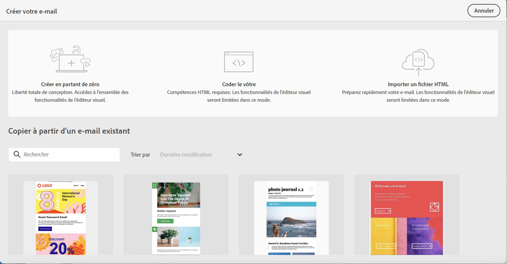
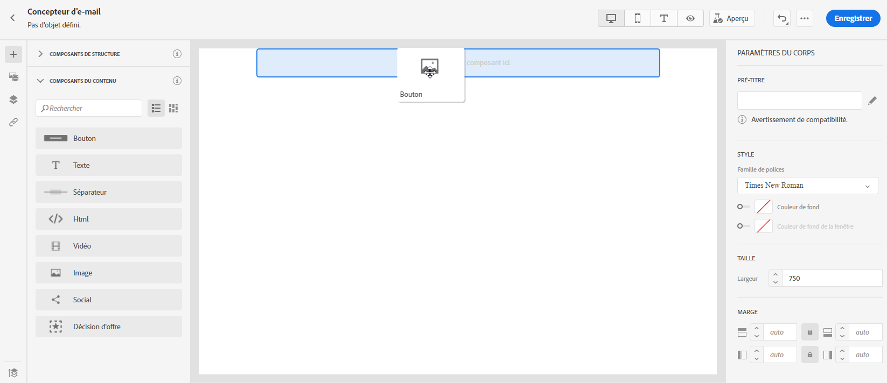
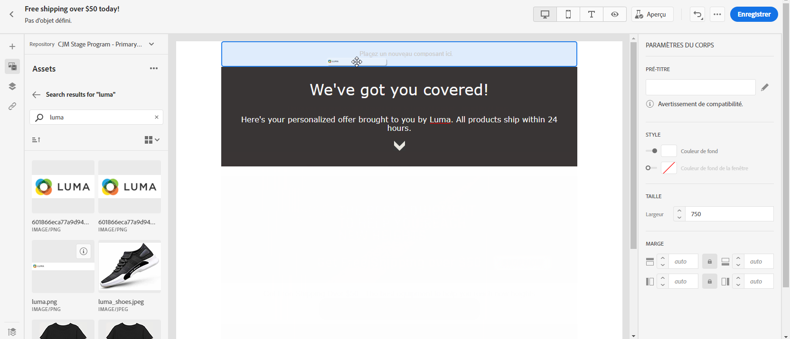
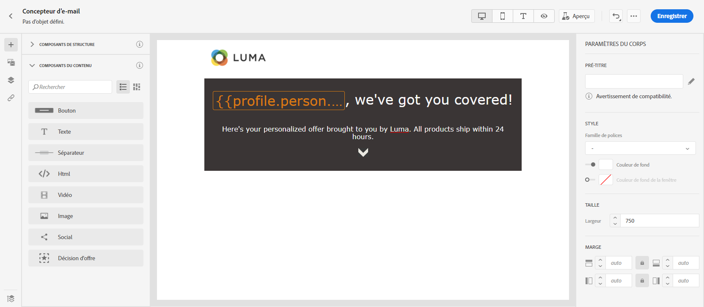
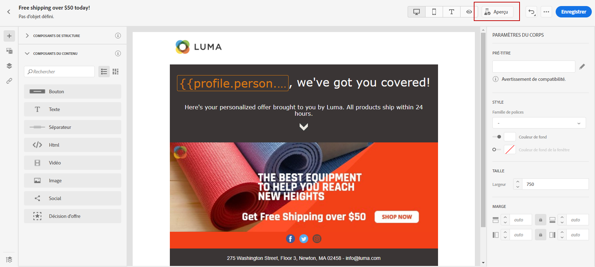
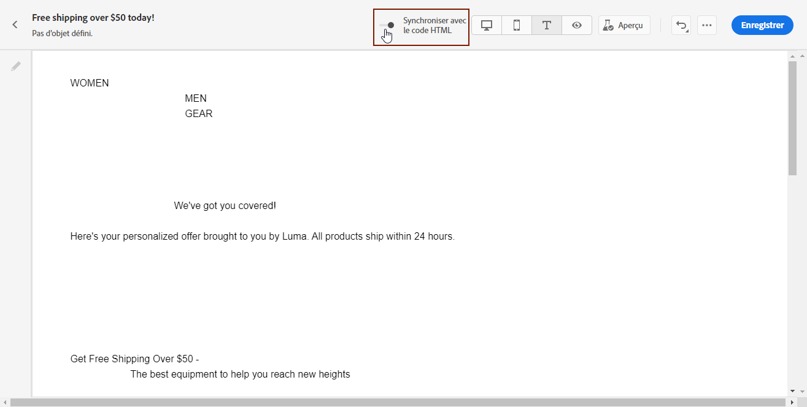
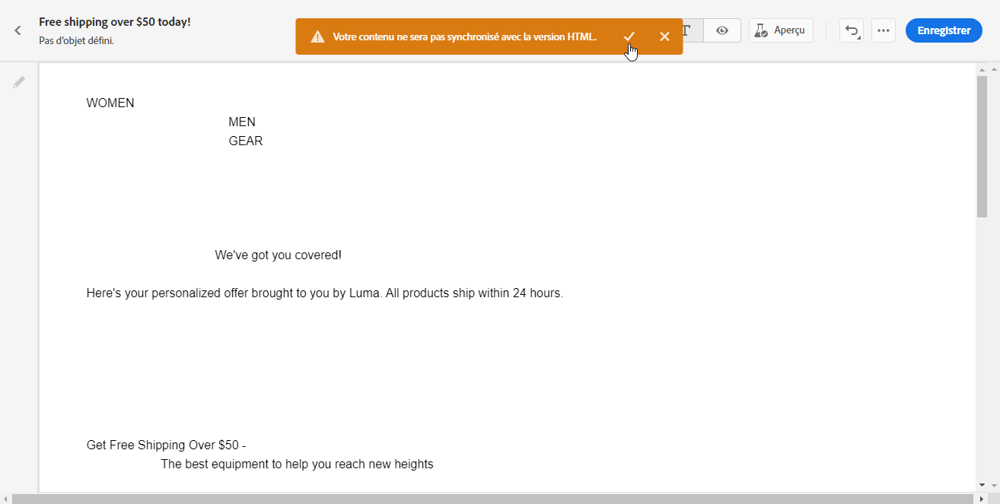

# Concevez votre contenu de courrier électronique dans l&#39;interface utilisateur {#create-email-content}

Une fois [créé votre message](create-message.md), vous pouvez début à créer votre contenu de courrier électronique.

1. Dans le message que vous venez de créer, sélectionnez **[!UICONTROL Concepteur de messages électroniques]** dans la section **[!UICONTROL Modifier le contenu]**.

   

1. Dans la page d&#39;accueil E-mail Designer, choisissez la manière de concevoir votre courrier électronique à l’aide des options suivantes :

   * Sélectionnez **[!UICONTROL Créer à partir de zéro]** pour utiliser les fonctionnalités de concepteur de courrier électronique pour créer votre contenu de courrier électronique.

   * Sélectionnez **[!UICONTROL Début à partir du modèle]** pour créer votre courrier électronique à partir d’une liste de modèles intégrée. Notez que vous ne pouvez pas créer d’autres modèles.

   * Sélectionnez **[!UICONTROL Code votre propre]** pour entrer ou coller du code HTML brut. [En savoir plus](existing-content.md#import-raw-html-code).

   * Sélectionnez **[!UICONTROL Importer HTML]** pour importer un fichier HTML ou un dossier .zip. [En savoir plus](existing-content.md#import-html-content-from-file).

   

## Créer à partir de zéro

Pour début de la création de votre contenu de courrier électronique avec le concepteur de courrier électronique, procédez comme suit :

1. Après avoir sélectionné l&#39;option **[!UICONTROL Concevoir à partir de zéro]**, début de concevoir le contenu de votre courrier électronique en faisant glisser et en déposant les **[!UICONTROL composants de structure]** pour définir la disposition de votre courrier électronique.

   

1. Dans la liste déroulante **[!UICONTROL Composants de contenu]**, vous pouvez ajouter autant de **[!UICONTROL composants de contenu]** que nécessaire dans votre composant de structure. [En savoir plus sur les composants](content-components.md) de contenu.

   

1. Chaque composant peut être personnalisé avec la section **[!UICONTROL Paramètres du composant]**. Par exemple, vous pouvez modifier le style de texte, le remplissage ou la marge de votre composant. [En savoir plus sur les styles dans l’éditeur](https://experienceleague.adobe.com/docs/campaign-standard/using/designing-content/styles.html) de courrier électronique.

   

1. A partir du sélecteur **[!UICONTROL Ressources]**, vous pouvez ajouter directement à votre adresse électronique des ressources stockées dans la **[!UICONTROL bibliothèque de ressources]**. [En savoir plus sur la gestion](assets-essentials.md) des ressources.

   Cliquez avec le doublon sur le dossier contenant vos ressources et faites glisser et déposez la ressource que vous souhaitez ajouter à votre courrier électronique.

   

1. Ajoutez des champs de personnalisation pour personnaliser le contenu à partir des données de vos profils. [En savoir plus sur la personnalisation](personalization/personalize.md) du contenu.

   

1. Dans l&#39;onglet **[!UICONTROL Liens]** du volet de gauche, vérifiez la liste de toutes les URL de votre contenu qui seront suivies. Si nécessaire, vous pouvez modifier leurs **[!UICONTROL Type de suivi]**, **[!UICONTROL Étiquette]** et **[!UICONTROL Balises]**.

   

1. Si nécessaire, vous pouvez passer à l’éditeur de code pour personnaliser davantage votre courrier électronique en cliquant sur **[!UICONTROL Passer à l’éditeur de code]** dans le menu avancé. Pour plus d&#39;informations sur l&#39;éditeur de code, consultez cette [page](existing-content.md#import-raw-html-code).

   >[!NOTE]
   >
   >Vous ne pourrez pas utiliser le concepteur visuel pour ce courrier électronique après avoir basculé vers l’éditeur de code.

   

1. Cliquez sur **[!UICONTROL Prévisualisation]** pour vérifier le rendu de votre courrier électronique. Vous pouvez choisir l’ordinateur de bureau ou la vue mobile.

   

1. Lorsque votre adresse électronique est prête, cliquez sur **[!UICONTROL Enregistrer et fermer]**.

Le contenu de votre courrier électronique peut désormais être utilisé dans un message. [Découvrez comment envoyer un message](publish-manage-message.md).

## Définir la structure de courriel {#defining-the-email-structure}

>[!CONTEXTUALHELP]
>id="ac_structure_components"
>title="À propos des composants Structure"
>abstract="Les composants de structure définissent la disposition de votre email."

>[!CONTEXTUALHELP]
>id="ac_edition_columns"
>title="Définition des colonnes de l’email"
>abstract="Le Concepteur d’email vous permet de définir facilement la disposition de votre email en définissant la structure des colonnes."

Le Concepteur d’email permet de définir facilement la structure de votre email. En ajoutant et en déplaçant des éléments structurels à l’aide de simples actions de glisser-déposer, vous pouvez concevoir la forme de votre email en quelques secondes.

Pour éditer la structure d’un email :

1. Ouvrez un contenu existant ou créez un contenu d’email.
1. Accédez aux **[!UICONTROL Composants de structure]** en sélectionnant l’icône **+** de gauche.
1. Faites glisser et déposez les composants de structure dont vous avez besoin pour façonner votre courrier électronique.
Une ligne bleue matérialise la position exacte des composants de structure avant de les déposer. Vous pouvez placer vos composants au-dessus, entre ou sous n’importe quel composant, mais pas à l’intérieur.

   >[!NOTE]
   >
   >Les colonnes empilées ne sont pas compatibles avec tous les programmes de messagerie. Lorsqu’elles ne sont pas prises en charge, les colonnes ne sont pas empilées.
   >
   >Une fois qu’ils ont été placés dans l’email, vous ne pouvez pas déplacer ni supprimer vos composants, à moins qu’un composant de contenu ou un fragment ne soit déjà placé à l’intérieur.

1. Plusieurs composants de structure constitués d’une ou de plusieurs colonnes sont disponibles.

   Sélectionnez le composant **[!UICONTROL n:n colonne]** pour définir le nombre de colonnes de votre choix (entre 3 et 10). Vous pouvez également définir la largeur de chaque colonne en déplaçant les flèches au bas de chaque colonne.

   >[!NOTE]
   >
   >La taille de chaque colonne ne peut pas être inférieure à 10 % de la largeur totale du composant de structure. Vous ne pouvez pas supprimer une colonne qui n’est pas vide.

Une fois la structure définie, vous pouvez ajouter des fragments de contenu et des composants à votre courrier électronique.

## Utiliser un préen-tête {#preheader}

>[!CONTEXTUALHELP]
>id="ac_edition_preheader"
>title="Utilisation d’un pré-titre "
>abstract="Le préen-tête vous permet de configurer un texte de résumé court qui peut vous aider à mieux suivre et personnaliser vos courriels."

Un préen-tête est un texte de résumé court qui suit la ligne d’objet lors de l’affichage d’un courrier électronique à partir de votre client de messagerie. Le préen-tête peut vous aider à mieux suivre et personnaliser vos courriels.

Sélectionnez la zone de modification **[!UICONTROL Préen-tête]** et ajoutez du contenu.

Vous pouvez ajouter un **[!UICONTROL bloc de contenu]**, un **[!UICONTROL contenu dynamique]** ou un **[!UICONTROL champ de personnalisation]** dans le contenu du pré-titre.

>[!NOTE]
>
>Notez que les en-têtes d’entrée ne sont pas compatibles avec tous les clients de messagerie. Si ce n’est pas le cas, le préen-tête ne s’affiche pas.

## Paramètres d’arrière-plan {#about-backgrounds}

>[!CONTEXTUALHELP]
>id="ac_edition_backgroundimage"
>title="Paramètres d’arrière-plan"
>abstract="Le concepteur de courrier électronique vous permet de personnaliser la couleur d&#39;arrière-plan ou l&#39;image d&#39;arrière-plan de votre contenu.Notez que l&#39;image d&#39;arrière-plan n&#39;est pas prise en charge par tous les clients de messagerie."
>additional-url="https://docs.google.com/spreadsheets/d/1TLo62YKm3tThUWDOIliCQFWs3dpNjpDfw6DdTr1oGOw/edit#gid=0" text="Informations supplémentaires"

Lorsqu’il s’agit de définir des arrière-plans avec le concepteur de courrier électronique, l’Adobe recommande ce qui suit :

1. Appliquez une couleur d’arrière-plan au corps de votre courrier électronique, si votre conception l’exige.
1. Dans la plupart des cas, définissez les couleurs d’arrière-plan au niveau de la colonne.
1. Essayez de ne pas utiliser de couleurs d’arrière-plan sur les composants d’image ou de texte, car ils sont difficiles à gérer.

Vous trouverez ci-dessous les paramètres d’arrière-plan disponibles que vous pouvez utiliser.

* Définissez une **[!UICONTROL Couleur de fond]** pour l&#39;ensemble de l&#39;email. Assurez-vous de sélectionner les paramètres du corps dans l&#39;arborescence de navigation accessible à partir de la palette gauche.

* Définissez la même couleur de fond pour tous les composants de structure en sélectionnant **[!UICONTROL Couleur de fond de la fenêtre]**. Cette option vous permet de sélectionner un autre paramètre dans la couleur d’arrière-plan.

* Définissez une couleur d’arrière-plan différente pour chaque composant de structure. Sélectionnez une structure dans l&#39;arborescence de navigation accessible à partir de la palette de gauche pour appliquer une couleur d&#39;arrière-plan spécifique uniquement à cette structure.

   Veillez à ne pas définir de couleur d’arrière-plan de fenêtre d’affichage, car elle peut masquer les couleurs d’arrière-plan de la structure.

* Définissez une **[!UICONTROL Image de fond]** pour le contenu d&#39;un composant de structure.

   >[!NOTE]
   >
   >Certains programmes électroniques ne prennent pas en charge les images d’arrière-plan. Si ces images ne sont pas prises en charge, la couleur d’arrière-plan de la ligne est utilisée à la place. Veillez à sélectionner une couleur d’arrière-plan de secours appropriée au cas où l’image ne s’afficherait pas.

* Définissez une couleur d’arrière-plan au niveau de la colonne.

   >[!NOTE]
   >
   >Il s’agit du cas d’utilisation le plus courant. L’Adobe recommande de définir les couleurs d’arrière-plan au niveau de la colonne, ce qui offre une plus grande souplesse lors de la modification de l’ensemble du contenu du courrier électronique.

   Vous pouvez également définir une image d’arrière-plan au niveau de la colonne, mais elle est rarement utilisée.

### Exemple : ajuster l’alignement vertical et le remplissage {#example--adjusting-vertical-alignment-and-padding}

Vous souhaitez ajuster la marge intérieure et l&#39;alignement vertical à l&#39;intérieur d&#39;un composant de structure composé de trois colonnes. Pour ce faire, procédez comme suit :

1. Sélectionnez le composant de structure directement dans le courrier électronique ou utilisez l&#39;arborescence de structure disponible à partir de la palette **gauche**.
1. Dans la **barre d&#39;outils contextuelle**, cliquez sur **[!UICONTROL Sélectionner une colonne]** et choisissez celle à éditer. Vous pouvez également la sélectionner dans l&#39;arborescence.

   Les paramètres éditables pour cette colonne sont affichés dans le volet **[!UICONTROL Paramètres]** situé à droite.

1. Sous **[!UICONTROL Alignement vertical]**, sélectionnez **[!UICONTROL Monter]**.

   Le composant de contenu s&#39;affiche au-dessus de la colonne.

1. Sous **[!UICONTROL Marge intérieure]**, définissez la marge intérieure supérieure à l&#39;intérieur de la colonne. Cliquez sur l’icône de verrouillage pour interrompre la synchronisation avec le remplissage inférieur.

   Définissez les marges de gauche et de droite pour cette colonne.

1. Procédez de la même façon pour ajuster l&#39;alignement et le remplissage des autres colonnes.

1. Enregistrez vos modifications.

## Définir un style pour les liens {#about-styling-links}

Vous pouvez souligner un lien et sélectionner sa couleur et sa cible dans le Concepteur d&#39;email.

1. Dans un composant dans lequel un lien est inséré, sélectionnez le texte du libellé du lien.

1. Dans les paramètres du composant, cochez la case **[!UICONTROL Souligner le lien]** pour souligner le texte du libellé de votre lien.

1. Pour sélectionner le contexte de navigation dans lequel votre lien sera ouvert, sélectionnez un attribut de **[!UICONTROL Cible]**.

1. Pour changer la couleur de votre lien, cliquez sur **[!UICONTROL Couleur du lien]**.

1. Choisissez la couleur dont vous avez besoin.

1. Enregistrez vos modifications.

## Ajouter les attributs de style en ligne {#adding-inline-styling-attributes}

Dans l’interface de Designer de messagerie, lorsque vous sélectionnez un élément et affichez ses paramètres sur le panneau latéral, vous pouvez personnaliser les attributs insérés et leur valeur pour cet élément spécifique.

1. Sélectionnez un élément de votre contenu.
1. Sur le panneau latéral, recherchez les paramètres de **[!UICONTROL styles intégrés]**.

1. Modifiez les valeurs des attributs existants ou ajoutez-en de nouveaux à l’aide du bouton **+**. Vous pouvez ajouter n’importe quel attribut et valeur compatible CSS.

La mise en forme est ensuite appliquée à l’élément sélectionné. Si aucun attribut de style spécifique n’est défini pour les éléments enfants, la mise en forme de l’élément parent est héritée.

## Créer la version textuelle d’un courrier électronique {#generate-text-version}

Il est recommandé de créer une version textuelle de votre corps de courrier électronique, qui est utilisée lorsque le contenu HTML ne peut pas être affiché.

Par défaut, le concepteur de courrier électronique crée une version de **[!UICONTROL texte simple]** de votre courrier électronique, y compris des champs de personnalisation. Cette version est automatiquement générée et synchronisée avec la version HTML de votre contenu.

Si vous préférez utiliser un contenu différent pour la version en texte brut, procédez comme suit :

1. Dans votre courrier électronique, sélectionnez l&#39;onglet **[!UICONTROL Texte simple]**.

1. Utilisez la bascule **[!UICONTROL Synchroniser avec HTML]** pour désactiver la synchronisation.

   

1. Cliquez sur la coche pour confirmer votre choix.

   

1. Vous pouvez ensuite éditer la version en texte brut comme vous le souhaitez.

>[!CAUTION]
>
>* Les modifications apportées à la vue **[!UICONTROL Texte simple]** ne sont pas reflétées dans la vue HTML.
   >
   >
* Si vous réactivez l’option **[!UICONTROL Synchroniser avec HTML]** après la mise à jour de votre contenu de texte brut, vos modifications seront perdues et remplacées par du contenu de texte généré à partir de la version HTML.

>

