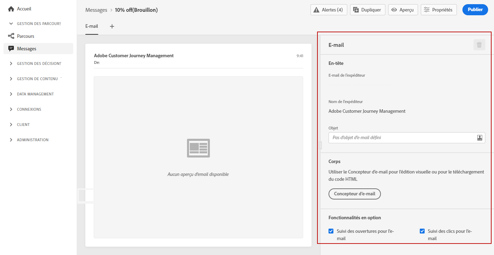

# Créer un email {#configure-email}

Une fois que vous avez [créé un message](create-message.md), utilisez l’onglet **[!UICONTROL Email]** pour définir les paramètres et le contenu du canal email.

>[!NOTE]
>
>L’**[!UICONTROL email de l’expéditeur]** et le **[!UICONTROL nom de l’expéditeur]** sont en lecture seule et déterminés par le **[!UICONTROL préréglage]** qui a été sélectionné lors de la [création du message](create-message.md).

Les étapes pour configurer un email sont les suivantes :

1. Spécifiez l&#39;**[!UICONTROL objet de l&#39;email]**. Pour ce faire, cliquez sur le bouton à droite pour ouvrir l’éditeur d’expression et composer l’objet de l&#39;email. Découvrez comment ajouter la personnalisation dans [cette section](personalization/personalization-aeras.md)

1. Cliquez sur le bouton **[!UICONTROL Concepteur d’email]** pour concevoir votre email. Découvrez comment concevoir des emails dans [cette section](design-emails.md).

1. Si vous souhaitez suivre le comportement de vos destinataires par le biais d’ouvertures et/ou de clics sur des liens, assurez-vous que les options **[!UICONTROL Suivi des ouvertures des emails]** et **[!UICONTROL Suivi des clics des emails]** sont activées. En savoir plus sur les suivi dans [cette section](message-tracking.md).
