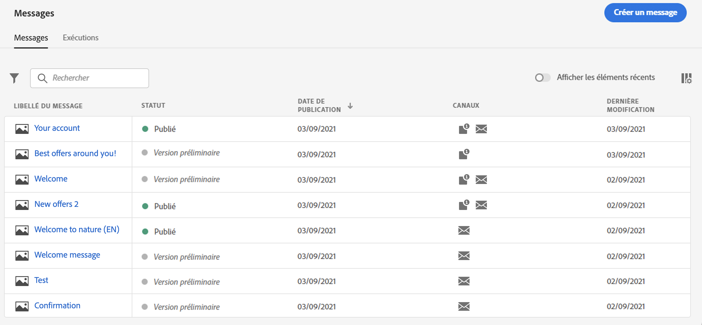
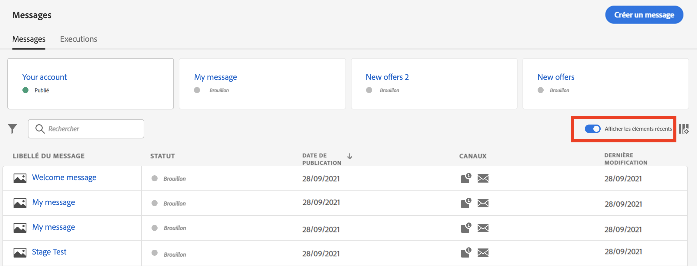
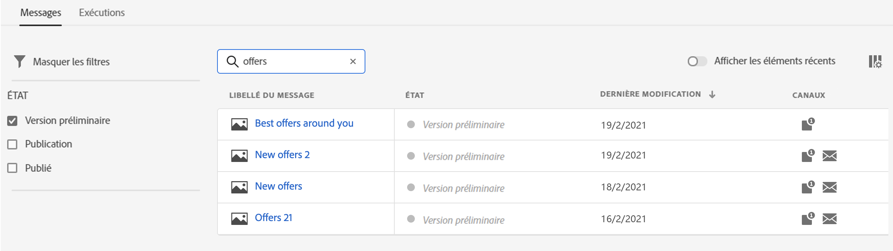
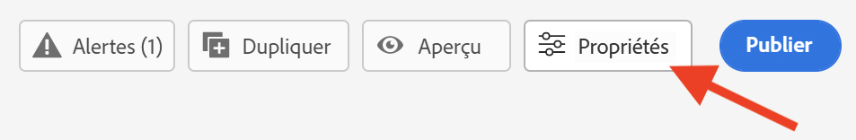
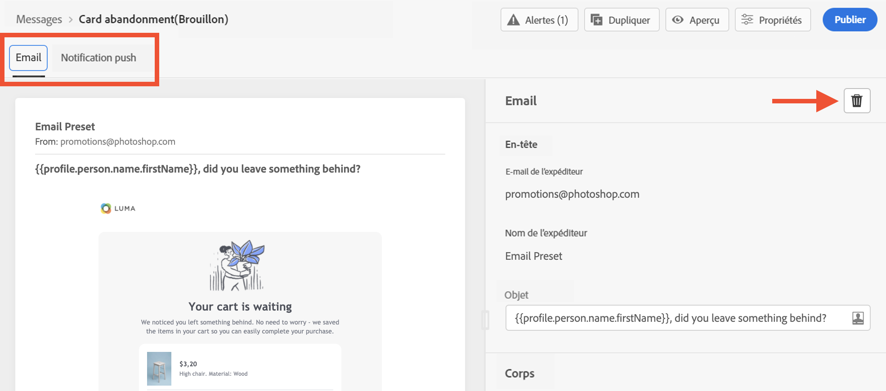
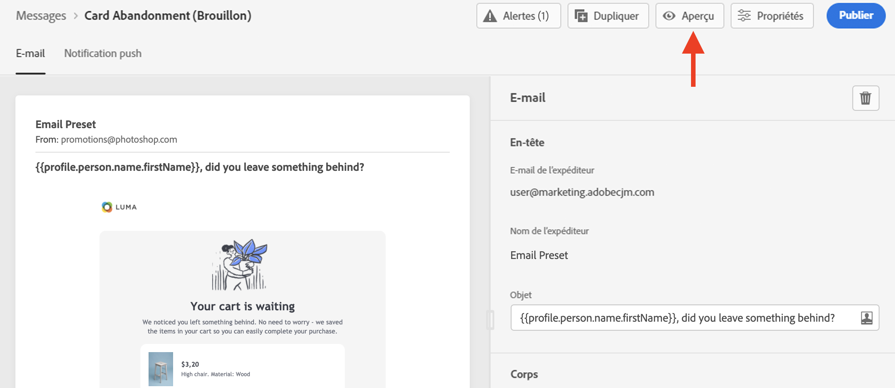
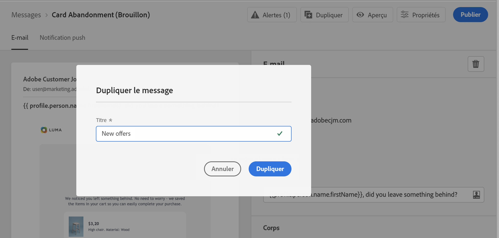
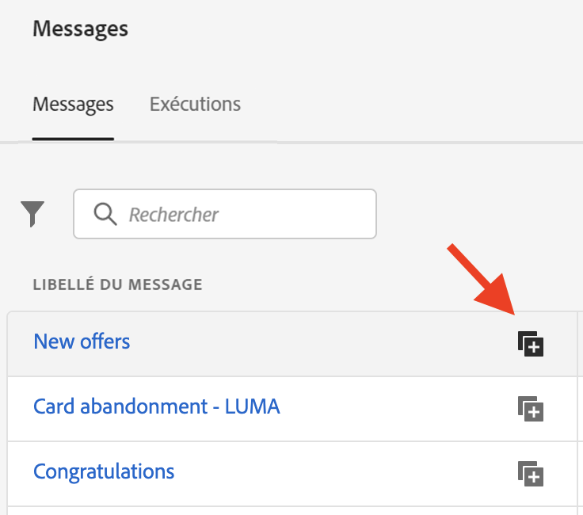

# Créer un message {#create-message}

Les messages sont disponibles à partir du raccourci **[!UICONTROL Messages]** sur le rail de gauche. Tous les messages sont répertoriés, triés par date de publication (pour les messages publiés) ou par date de création (pour les brouillons de messages).

>[!NOTE]
>
>Chaque utilisateur peut accéder aux messages, les créer, les modifier et les publier. Pour en savoir plus sur les autorisations d&#39;utilisateur [dans cette section](permissions.md).

Utilisez la bascule **[!UICONTROL Afficher les récents]** pour ajouter des liens directs aux messages que vous avez consultés au cours des 5 derniers jours.

Utilisez l&#39;icône de filtre pour afficher uniquement les messages rédigés, publiés ou en cours de publication. Vous pouvez également effectuer une recherche sur le libellé du message, comme suit :

## Créer un message

Pour créer un message, procédez comme suit :

1. Accédez à la liste de messages, puis cliquez sur **[!UICONTROL Créer un message]**.

1. Définissez les propriétés du message.

   

   * Saisissez un **[!UICONTROL Titre]** (obligatoire) et une **[!UICONTROL Description]**.

   * Sélectionnez le **[!UICONTROL paramètre prédéfini]** à utiliser pour le message.

      Les paramètres prédéfinis incluent tous les paramètres requis pour qu’une notification par courrier électronique et/ou push soit envoyée en fonction de votre marque. [En savoir plus sur l’identité graphique](configuration/about-subdomain-delegation.md).

   * Sélectionnez le ou les canaux à utiliser pour ce message : Courriel et/ou notification Push. Vous devez sélectionner au moins un canal pour pouvoir créer le message.
   Notez que vous pouvez accéder et modifier à tout moment le titre, la description et le paramètre prédéfini du message à l’aide du bouton **[!UICONTROL Propriétés]** de l’interface de message.

   

1. Cliquez sur **[!UICONTROL Créer]** pour confirmer la création du message. Votre message est ajouté dans la liste de messages, dans l’état **[!UICONTROL Brouillon]**.

   Un onglet est disponible pour chaque canal sélectionné. Utilisez ces onglets pour configurer le contenu pour chaque canal. Vous pouvez supprimer un onglet en le sélectionnant et en cliquant sur le bouton **[!UICONTROL Supprimer le canal]** à droite.

   

   Vous pouvez désormais créer le contenu du message et adapter les paramètres. Des informations détaillées sur la configuration des notifications par courrier électronique et Push sont disponibles dans les sections suivantes :

   * [Configurer les courriers électroniques](configure-email.md)
   * [Configuration des notifications Push](configure-push.md)

   >[!NOTE]
   >   
   >Vous pouvez personnaliser vos messages à l’aide des données des profils à l’aide de l’éditeur d’Expressions. Pour plus d&#39;informations sur la personnalisation, consultez [cette section](personalization/personalize.md).

1. Contrôlez le rendu de vos messages et vérifiez les paramètres de personnalisation avec les profils de test, en utilisant la section prévisualisation sur le côté gauche. Pour plus d&#39;informations à ce sujet, consultez [cette section](preview.md).

   

1. Vérifiez les alertes dans la section supérieure de l’éditeur.  Certains d&#39;entre eux sont de simples avertissements, mais d&#39;autres peuvent vous empêcher de publier le message. Pour en savoir plus, consultez [cette section](alerts.md).

1. Vous pouvez maintenant publier votre message en cliquant sur le bouton **[!UICONTROL Publier]**, ou le conserver en tant que brouillon et le publier ultérieurement. Pour plus d&#39;informations sur la façon de publier des messages, consultez [cette section](publish-manage-message.md).

## Duplicata d’un message

Pour créer un message à partir d’un message existant, utilisez le bouton **[!UICONTROL Duplicata]** de l’interface de message. Tous les paramètres et la configuration seront copiés dans le nouveau message.

Vous pouvez renommer le message avant de confirmer la duplication.

Un message de confirmation s’affiche au bas de la fenêtre une fois le nouveau message créé.

Vous pouvez également duplicata un message à partir de la liste de messages à l’aide de l’icône dédiée.

Le même processus de confirmation s&#39;applique.
