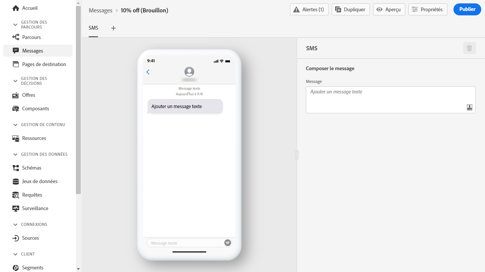
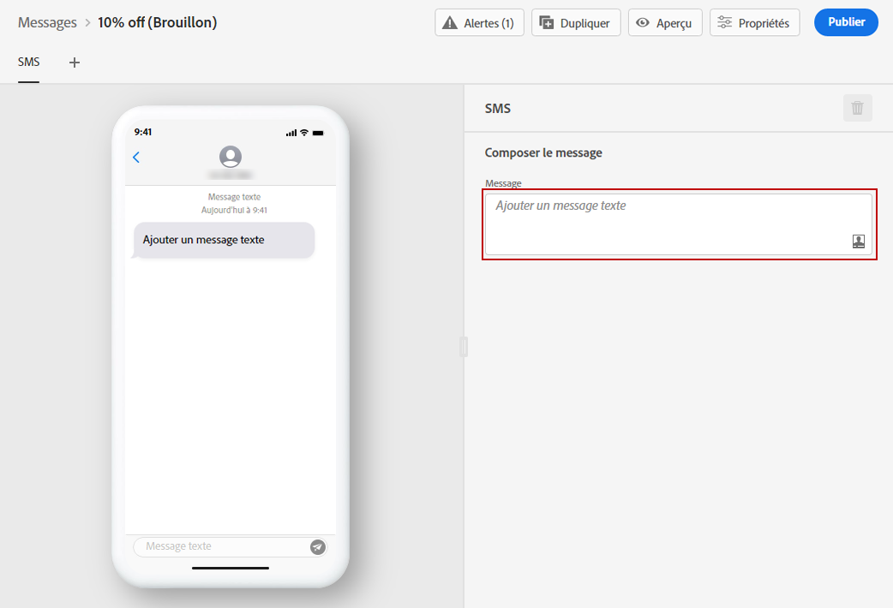
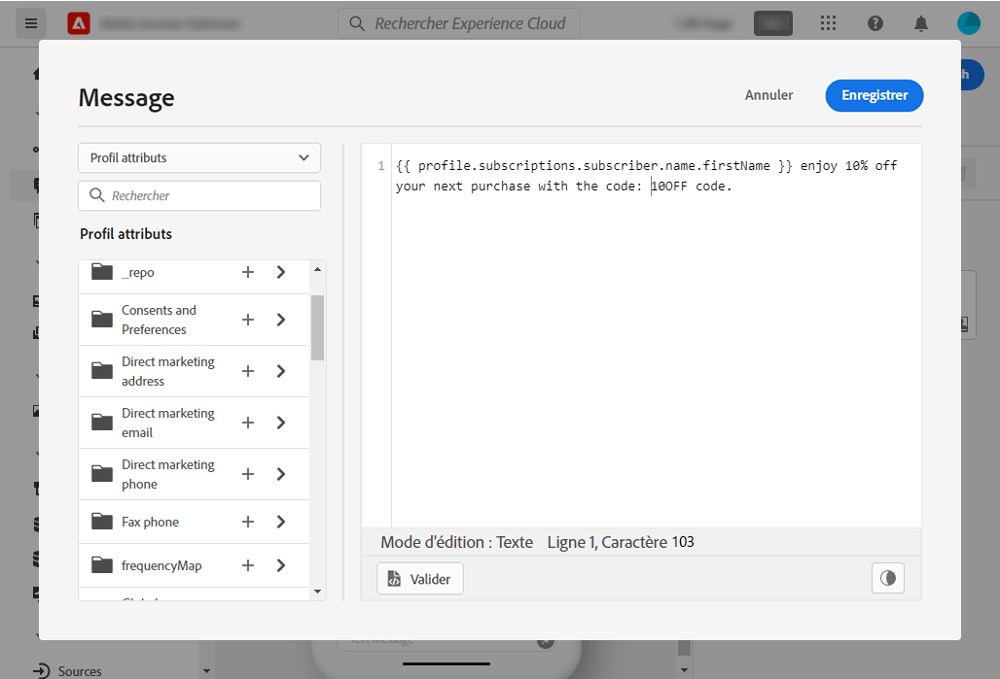

# Créer un SMS {#create-sms}

>[!CAUTION]
>
> L’utilisation du canal SMS est actuellement disponible en accès anticipé uniquement pour certains utilisateurs. Si vous souhaitez utiliser cette fonctionnalité, contactez votre chargé de compte d’Adobe.

Une fois que [création d’un message](create-message.md), utilisez le **[!UICONTROL SMS]** pour définir les paramètres et le contenu du canal SMS.

Pour commencer à personnaliser votre SMS, procédez comme suit :

1. Cliquez sur le bouton **[!UICONTROL Ajouter un message texte]** pour ouvrir l’éditeur d’expression.

   

1. Utilisez l&#39;éditeur d&#39;expression pour définir le contenu et les données de personnalisation. Consultez [cette section](personalization/personalize.md) pour en savoir plus sur la personnalisation dans l&#39;éditeur d&#39;expression.

   >[!NOTE]
   >
   > Les SMS sont limités à 160 caractères.

   

1. Cliquez sur **[!UICONTROL Enregistrer]** lorsque votre message personnalisé est prêt.

1. Cliquez sur **[!UICONTROL Aperçu]** pour visualiser l&#39;affichage de votre SMS sur les appareils mobiles. Voir à ce propos [cette section](preview.md).

1. Une fois votre message prêt, vous pouvez le publier afin de le rendre disponible pour exécution avec le **[!UICONTROL Publier]** bouton . Cette action publiera la nouvelle version du message qui sera utilisée pour les prochaines exécutions dans vos parcours.

Votre SMS peut maintenant être utilisé dans un parcours. [Découvrez comment créer des parcours](building-journeys/journey-gs.md).

**Rubrique connexe**

* [Configurer le canal SMS](configuration/sms-configuration.md)
* [Création d&#39;un nouveau message](create-message.md)
* [Ajout d&#39;un message dans un parcours](building-journeys/journeys-message.md)
