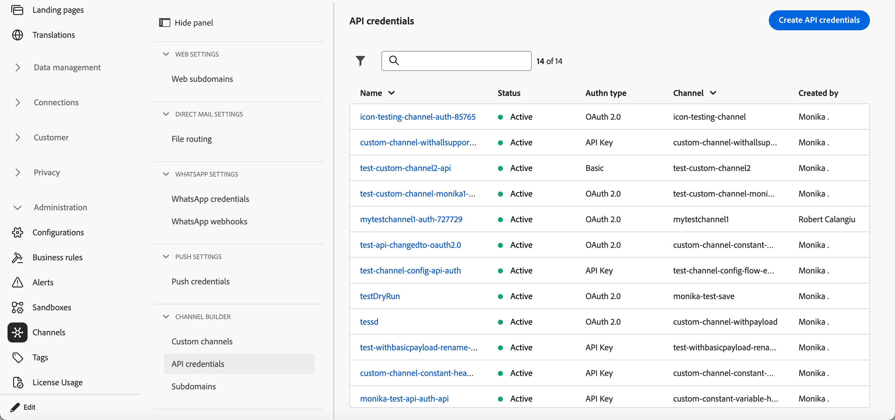

# Gestion des informations d’identification d’API {#api-credentials}

Lorsqu’un canal personnalisé est créé avec un type d’authentification autre que **Aucun**, un ensemble initial d’informations d’identification d’API est automatiquement généré lorsque le canal est activé.

Vous pouvez afficher, gérer et modifier les informations d’identification à partir de **[!UICONTROL Administration]** > **[!UICONTROL Canaux]** > **[!UICONTROL Créateur de canaux]** > **[!UICONTROL Informations d’identification d’API]**.

{width="100%"}

Disposer de plusieurs informations d’identification pour le même canal vous permet de joindre différentes valeurs d’authentification à différentes configurations de canal, par exemple pour différentes marques ou cas d’utilisation, sans dupliquer la définition de canal.

Pour modifier un jeu d&#39;informations d&#39;identification existant, cliquez sur un élément de la liste d&#39;inventaire. Tous les champs sont modifiables.

Pour créer des informations d’identification supplémentaires pour le même canal, procédez comme suit.

1. Dans la liste **[!UICONTROL Informations d’identification de l’API]**, cliquez sur **[!UICONTROL Créer des informations d’identification d’API]**.

1. Indiquez un nom et une description.

   {width="100%"}

1. Sélectionnez le **[!UICONTROL canal]** pour lequel vous créez des informations d’identification.

   >[!NOTE]
   >
   >Seuls les canaux personnalisés activés avec un type d’authentification autre que **Aucun** s’affichent dans la liste déroulante.

1. Sélectionnez le **[!UICONTROL Type d’authentification]** dans la liste.
1. Renseignez les champs spécifiques à l’authentification :
   * **[!UICONTROL Clé API]** - Indiquez le nom, la valeur et l’emplacement de la clé (paramètre de requête ou en-tête).
   * **[!UICONTROL Authentification de base]** - Indiquez un nom d’utilisateur et un mot de passe.
   * **[!UICONTROL OAuth 2.0]** - Configurez la payload pour l’authentification OAuth 2.0.
1. Cliquez sur **[!UICONTROL Enregistrer]**.

## Étapes suivantes {#next-steps}

* [Déléguer un sous-domaine](custom-channel-subdomains.md) (facultatif, obligatoire pour le suivi des liens)
* [Créer une configuration des canaux](custom-channel-configuration.md)
