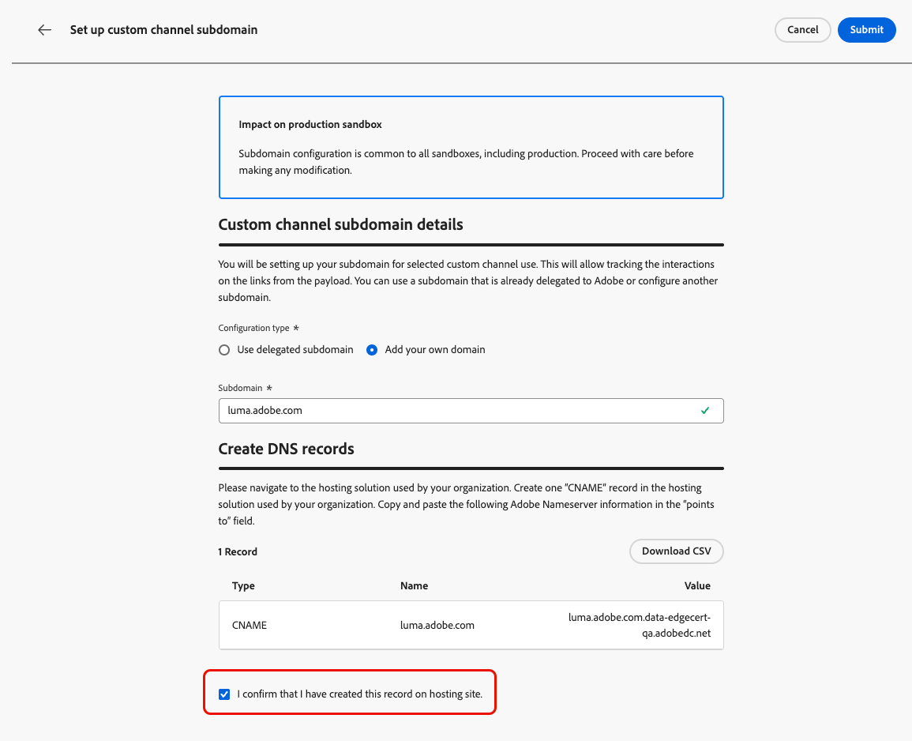

# Configurer des sous-domaines de canal personnalisés {#custom-channel-subdomains}

>[!BEGINSHADEBOX]

**Sur cette page :** découvrez comment configurer des sous-domaines de canal personnalisés dans Adobe Journey Optimizer pour activer le suivi des liens dans vos messages, soit à l’aide d’un sous-domaine délégué existant, soit en configurant un nouveau avec un enregistrement DNS.

>[!ENDSHADEBOX]

>[!CONTEXTUALHELP]
>id="ajo_admin_subdomain_custom_channel"
>title="Délégation d’un sous-domaine de canal personnalisé"
>abstract="Vous devez configurer un sous-domaine à utiliser pour vos messages de canal personnalisés, car vous avez besoin de ce sous-domaine pour créer une configuration de canal personnalisée. Vous pouvez utiliser un sous-domaine déjà délégué à Adobe ou en configurer un nouveau."
>additional-url="https://experienceleague.adobe.com/en/docs/journey-optimizer/using/custom-channel/custom-channel-configuration" text="Configuration d’un canal personnalisé"

>[!CONTEXTUALHELP]
>id="ajo_admin_config_custom_channel_subdomain"
>title="Sélectionner un sous-domaine de canal personnalisé"
>abstract="Avant de pouvoir créer une configuration de canal personnalisée, vous devez avoir configuré au moins un sous-domaine de canal personnalisé à sélectionner dans la liste Nom du sous-domaine ."
>additional-url="https://experienceleague.adobe.com/en/docs/journey-optimizer/using/custom-channel/custom-channel-configuration" text="Configuration d’un canal personnalisé"

## Prise en main des sous-domaines de canal personnalisés {#gs-custom-channel-subdomains}

Pour activer le suivi des liens dans vos messages de canal personnalisés, vous devez configurer le sous-domaine que vous sélectionnerez lors de la [création d’une configuration de canal personnalisée](custom-channel-configuration.md#subdomain-delegation).

Vous pouvez utiliser un sous-domaine déjà délégué à Adobe ou en configurer un autre. Pour en savoir plus sur la délégation de sous-domaines à Adobe, consultez [cette section](../configuration/delegate-subdomain.md).

La configuration de sous-domaine de canal personnalisé est partagée entre tous les environnements. Par conséquent, toute modification apportée à un sous-domaine de canal personnalisé a également un impact sur d’autres sandbox de production.

<!--
TBC
>[!NOTE]
>
>To access and edit custom channel subdomains, you must have the **[!UICONTROL Manage Custom Channel Subdomains]** permission on the production sandbox. Learn more about permissions in [this section](../administration/high-low-permissions.md).
-->
## Utiliser un sous-domaine existant {#custom-channel-use-existing-subdomain}

Pour utiliser un sous-domaine déjà délégué à Adobe, procédez comme suit.

1. Accédez au menu **[!UICONTROL Administration]** > **[!UICONTROL Canaux]** et sélectionnez **[!UICONTROL Créateur de canaux]** > **[!UICONTROL Sous-domaines]**.

   {width="100%"}

1. Cliquez sur **[!UICONTROL Créer un sous-domaine de canal personnalisé]**.

1. Sélectionnez **[!UICONTROL Utiliser le sous-domaine délégué]** dans la section **[!UICONTROL Type de configuration]**.

   {width="100%"}

1. Saisissez le préfixe qui s’affichera dans l’URL de votre canal personnalisé. Seuls les caractères alphanumériques et les tirets sont autorisés.

   Le préfixe est utilisé pour créer un sous-domaine unique pour ce canal personnalisé. Par exemple, si vous saisissez `promo` et sélectionnez le sous-domaine `luma.com`, le sous-domaine qui en résulte sera `promo.luma.com`.

   >[!CAUTION]
   >
   >N’utilisez pas les préfixes `cdn` ou `data`, car ils sont réservés à un usage interne. D’autres préfixes restreints ou réservés tels que `dmarc` ou `spf` doivent également être évités.

1. Sélectionnez un sous-domaine délégué dans la liste.

   Vous ne pouvez pas sélectionner un sous-domaine déjà utilisé comme sous-domaine de canal personnalisé.

   >[!CAUTION]
   >
   >Si vous sélectionnez un domaine qui a été délégué à Adobe à l’aide de la [méthode CNAME](../configuration/delegate-subdomain.md#cname-subdomain-setup), vous devez créer l’enregistrement DNS sur votre plateforme d’hébergement. Pour générer l’enregistrement DNS, le processus est le même que lorsque vous configurez un nouveau sous-domaine de canal personnalisé. Découvrez comment dans [cette section](#custom-channel-configure-new-subdomain).

1. Cliquez sur **[!UICONTROL Envoyer]**.

1. Une fois envoyé, le sous-domaine s’affiche dans la liste avec le statut du **[!UICONTROL Traitement]**. Pour en savoir plus sur les statuts des sous-domaines, consultez [cette section](../configuration/delegate-subdomain.md#access-delegated-subdomains).

   Avant de pouvoir utiliser ce sous-domaine pour envoyer des messages, vous devez attendre qu’Adobe effectue les vérifications nécessaires, ce qui peut prendre jusqu’**4 heures**.

1. Une fois les vérifications effectuées, le sous-domaine obtient le statut **[!UICONTROL Succès]**. Il est prêt à être utilisé pour créer des configurations de canal personnalisées.

## Configurer un nouveau sous-domaine {#custom-channel-configure-new-subdomain}

>[!CONTEXTUALHELP]
>id="ajo_admin_custom_channel_subdomain_dns"
>title="Générer l’enregistrement DNS correspondant"
>abstract="Pour configurer un nouveau sous-domaine de canal personnalisé, vous devez copier les informations du serveur de noms Adobe affichées dans l’interface Journey Optimizer et les coller dans votre solution d’hébergement de domaine pour générer l’enregistrement DNS correspondant. Une fois les vérifications effectuées, le sous-domaine est prêt à être utilisé pour créer des configurations de canal personnalisées."

Pour configurer un nouveau sous-domaine, procédez comme suit.

1. Accédez au menu **[!UICONTROL Administration]** > **[!UICONTROL Canaux]**, puis sélectionnez **[!UICONTROL Créateur de canaux]** > **[!UICONTROL Sous-domaines]**.

1. Cliquez sur **[!UICONTROL Créer un sous-domaine de canal personnalisé]**.

1. Sélectionnez **[!UICONTROL Ajouter votre propre domaine]** de la section **[!UICONTROL Type de configuration]**.

   {width="70%"}

1. Spécifiez le sous-domaine à déléguer.

   >[!CAUTION]
   >
   >* Vous ne pouvez pas utiliser un sous-domaine de canal personnalisé existant.
   >
   >* Les majuscules ne sont pas autorisées dans les sous-domaines.

   La délégation d’un sous-domaine non valide à Adobe n’est pas autorisée. Veillez à saisir un sous-domaine valide détenu par votre entreprise, tel que marketing.votre_entreprise.com.

   Les sous-domaines à plusieurs niveaux (du même domaine parent) sont pris en charge. Par exemple, vous pouvez utiliser « custom.marketing.yourcompany.com ».

1. L’enregistrement à placer dans les serveurs DNS s’affiche. Copiez cet enregistrement ou téléchargez un fichier CSV, puis accédez à votre solution d’hébergement de domaine pour générer l’enregistrement DNS correspondant.

1. Assurez-vous que l’enregistrement DNS a été généré dans votre solution d’hébergement de domaine. Si tout est correctement configuré, cochez la case « Je confirme... », puis cliquez sur **[!UICONTROL Envoyer]**.

   

   Lorsque vous configurez un nouveau sous-domaine de canal personnalisé, il pointe toujours vers un enregistrement CNAME.

1. Une fois la délégation de sous-domaine envoyée, le sous-domaine s&#39;affiche dans la liste avec le statut **[!UICONTROL Traitement]**. Pour en savoir plus sur les statuts des sous-domaines, consultez [cette section](../configuration/delegate-subdomain.md#access-delegated-subdomains).

Avant d’utiliser un sous-domaine pour envoyer des messages de canal personnalisés, vous devez attendre qu’Adobe effectue les vérifications nécessaires, ce qui peut prendre jusqu’à 4 heures. Une fois les vérifications effectuées, le sous-domaine obtient le statut **[!UICONTROL Succès]**. Il est prêt à être utilisé pour créer des configurations de canal personnalisées.

Le statut du sous-domaine sera marqué comme en **[!UICONTROL Échec]** si la création de lʼenregistrement de validation sur votre solution dʼhébergement nʼa pas réussi.

<!--

Any specific guardrails to add? If so, can we link to email subdomain guardrails? journey-optimizer.en/help/using/configuration/delegate-subdomain.md#guardrails

Otherwise use the following from SMS subdomains?

## Guardrails {#guardrails}

Currently, the [!DNL Journey Optimizer] user interface does not support the deletion or undelegation of custom channel subdomains once they have been set up.

However, when testing features within [!DNL Journey Optimizer], it may be necessary to create a custom channel subdomain. Once the testing is complete, this can lead to cluttered environments with unnecessary configurations as the UI does not allow for removing or undelegating custom channel subdomains.

Here are some recommended steps and considerations:

* As a best practice, maintain a tidy environment by only creating necessary components and configurations.
* In situations where there is a business impact, contact your Adobe representative who may be able to assist with the removal/undelegation of the custom channel subdomain. [Learn more](#undelegate-subdomain)
* If further assistance is required, reach out to Adobe for guidance on managing your instance effectively.

## Undelegate a subdomain {#undelegate-subdomain}

If you wish to undelegate a custom channel subdomain, reach out to your Adobe representative with the subdomain you want to undelegate.

If the custom channel subdomain points to a CNAME record, you can delete the CNAME DNS record that you created for the custom channel subdomain from your hosting solution (but do not delete the original email subdomain if any).

>[!NOTE]
>
>A custom channel subdomain can point to a CNAME record because it was either an [existing subdomain](#custom-channel-use-existing-subdomain) delegated to Adobe using the [CNAME method](../configuration/delegate-subdomain.md#cname-subdomain-setup), or a [new custom channel subdomain](#custom-channel-configure-new-subdomain) that you configured.

After your request is handled by Adobe, the undelegated domain is no longer displayed on the subdomain inventory page.
-->

## Étapes suivantes {#next-steps}

* [Créez une configuration de canal](custom-channel-configuration.md) pour lier votre canal personnalisé à un sous-domaine, des informations d’identification et des valeurs par défaut de la payload que les marketeurs sélectionneront dans les campagnes et les parcours.
