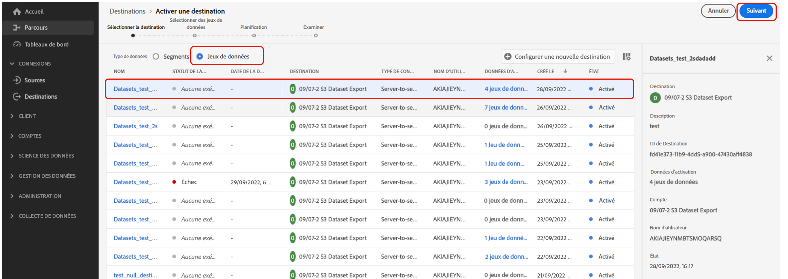
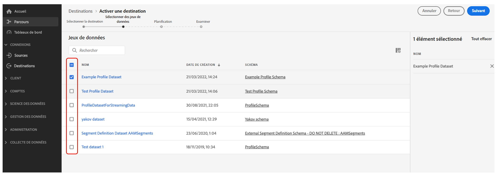
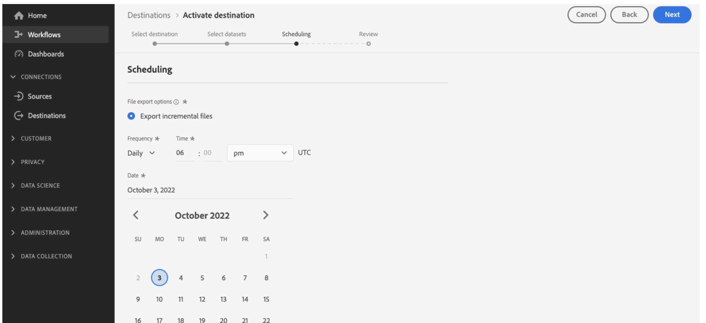

# Exporter des jeux de données vers des emplacements d’espace de stockage {#export-datasets}

Journey Optimizer vous permet d’établir une connexion active aux emplacements d’espace de stockage pour exporter le contenu de vos jeux de données.

En exportant régulièrement vos données, vous pouvez vous assurer que vous disposez d’un enregistrement complet et à jour des interactions de votre clientèle, ce qui vous permet de les rendre facilement disponibles à des fins de création de rapports, d’archivage ou d’analyse des données.

## Destinations d’espace de stockage disponibles {#destinations}

Vous pouvez exporter des jeux de données vers 6 destinations d’espace de stockage accessibles à partir du menu **[!UICONTROL Destinations]**, dans l’onglet **[!UICONTROL Catalogue]**.

Des informations détaillées sur chaque destination sont disponibles dans la documentation Adobe Experience Platform :

* [Amazon S3](https://experienceleague.adobe.com/docs/experience-platform/destinations/catalog/cloud-storage/amazon-s3.html?lang=fr){target="_blank"}
* [Azure Blob](https://experienceleague.adobe.com/docs/experience-platform/destinations/catalog/cloud-storage/azure-blob.html?lang=fr){target="_blank"}
* [Azure Data Lake Gen2](https://experienceleague.adobe.com/docs/experience-platform/destinations/catalog/cloud-storage/adls-gen2.html?lang=fr){target="_blank"}
* [Zone d’atterrissage des données](https://experienceleague.adobe.com/docs/experience-platform/destinations/catalog/cloud-storage/data-landing-zone.html?lang=fr){target="_blank"}
* [Google Cloud Storage](https://experienceleague.adobe.com/docs/experience-platform/destinations/catalog/cloud-storage/google-cloud-storage.html?lang=fr){target="_blank"}
* [SFTP](https://experienceleague.adobe.com/docs/experience-platform/destinations/catalog/cloud-storage/sftp.html?lang=fr){target="_blank"}

## Conditions préalables {#prerequisites}

Pour exporter des jeux de données, vous avez besoin des [autorisations de contrôle d’accès](https://experienceleague.adobe.com/docs/experience-platform/access-control/home.html?lang=fr#permissions){target="_blank"} répertoriées ci-dessous. Lisez la [présentation du contrôle d’accès](https://experienceleague.adobe.com/docs/experience-platform/access-control/ui/overview.html?lang=fr){target="_blank"} ou contactez votre administrateur ou administratrice du produit pour obtenir les autorisations requises.

| Catégorie | Autorisation |
|--|--|
| Destinations | Gérer et activer des destinations de jeu de données |
| Gestion des données | Affichage des jeux de données |
| Destinations | Affichage des destinations |

## Étapes clés pour exporter des jeux de données {#main-steps}

Les principales étapes pour exporter un jeu de données vers un emplacement d’espace de stockage sont les suivantes :

Des informations détaillées sur chaque étape sont disponibles dans la documentation de [Adobe Experience Platform](https://experienceleague.adobe.com/docs/experience-platform/destinations/ui/activate/export-datasets.html?lang=fr){target="_blank"}.

1. **Configurez votre destination d’espace de stockage**. Si ce n’est pas déjà fait, connectez-vous à une destination d’espace de stockage à partir du catalogue des destinations. Découvrez comment créer une connexion de destination dans la documentation de [Adobe Experience Platform](https://experienceleague.adobe.com/docs/experience-platform/destinations/ui/connect-destination.html?lang=fr#setup){target="_blank"}.

   <!---->

1. **Sélectionnez la destination d’espace de stockage** où vous souhaitez exporter vos jeux de données. Dans le catalogue des destinations, cliquez sur le bouton **[!UICONTROL Exporter les jeux de données]** sur la vignette souhaitée et sélectionnez la connexion à utiliser.

   <!---->

   >[!NOTE]
   >
   >Si vous utilisez Adobe Journey Optimizer avec des profils client ou cliente en temps réel, les cartes de destination affichent un bouton **Activer**. Ce bouton vous permet d’exporter des jeux de données et d’activer des audiences pour cette destination, en fonction des autorisations que vous avez activées.

1. **Sélectionnez le ou les jeux de données** que vous souhaitez exporter vers la destination sélectionnée. [En savoir plus sur les jeux de données Journey Optimizer disponibles pour l’export](#datasets)

   <!---->

1. **Planifiez l’exportation** de votre jeu de données. Indiquez à quel moment l’exportation doit commencer et à quelle fréquence elle doit se produire.

   <!---->

1. **Examinez et confirmez l’exportation** en vérifiant le résumé qui s’affiche à la fin de la configuration.

   <!---->

Une fois l’exportation terminée, le contenu de votre jeu de données est déposé dans votre emplacement d’espace de stockage selon le planning que vous avez configuré. [Découvrez comment vérifier la réussite de l’exportation d’un jeu de données](https://experienceleague.adobe.com/docs/experience-platform/destinations/ui/activate/export-datasets.html?lang=fr#verify){target="_blank"}.

## Jeux de données disponibles pour l’export {#datasets}

Découvrez dans le tableau ci-dessous les jeux de données Journey Optimizer que vous pouvez exporter.

| Jeu de données | Description |
| ------- | ------- | 
| Jeu de données d’événement de feedback en Cci AJO | Jeu de données d’événement de feedback en Cci AJO |
| Jeu de données de classification AJO | Jeu de données pour l’ingestion d’événements de feedback d’application push et d’e-mail à partir de Journey Optimizer. Créé via le SDK. |
| Jeu de données du service de consentement AJO | Stocke les informations de consentement d’un profil. |
| Jeu de données d’événement d’expérience de tracking d’e-mail AJO | Logs d’interaction pour le canal e-mail utilisé à des fins de création de rapports et d’audiences.  |
| Jeu de données d’entité AJO | Jeu de données permettant de stocker les métadonnées des entités pour les messages envoyés à l’utilisateur final ou à l’utilisatrice finale.  |
| Jeu de données d’événement d’activité entrante AJO | Jeu de données pour les canaux web et in-app Journey Optimizer pour les événements de diffusion et d’interaction. |
| Jeu de données de profil de messagerie interactive AJO | Stocke les profils créés pour prendre en charge les campagnes déclenchées par API. |
| Jeu de données d’événement de retour sur les messages AJO | Logs de diffusion des messages : Informations sur toutes les diffusions de messages à partir de Journey Optimizer à des fins de création de rapports et d’audiences. Les commentaires des FAI de messagerie sur les rebonds sont également enregistrés dans ce jeu de données. |
| Extension de compteurs de profils AJO | Contient un mappage d’objets contenant counter_value et expiryDate, saisi par counter_id. |
| Jeu de données de profil push AJO | Stocke les jetons de notifications push d’un profil. |
| Jeu de données d’événement d’expérience de tracking de notifications push AJO | Logs d’interaction pour le canal Notification push utilisé à des fins de création de rapports et d’audiences.  |
| Jeu de données d’événement d’expérience SMS AJO | Journaux d’interaction pour le canal SMS utilisé à des fins de création de rapports et d’audiences.  |
| Jeu de données de surfaces AJO | Jeu de données vide associé au schéma de surfaces entrantes Journey Optimizer. |
| AOOutputForUPSDataset | Contient toutes les appartenances à l’audience AO à réécrire dans UPS. |
| Jeu de données de profil Orchestration de lʼaudience | Généré par la composition d’audience pour les audiences provenant de la composition d’audience. Contient toutes les audiences de composition d’audience, leurs attributs et leurs données d’enrichissement. |
| Référentiel d’objets de décision - Activités | également appelé Décisions dans l’interface utilisateur. Mais ce sont les objets créés par un utilisateur ou une utilisatrice qui réunissent tous les blocs de création, y compris la logique de prise de décision. Par exemple, pour un emplacement particulier, dont les offres doivent être prises en compte (collection d’offres), et quelle méthode de classement utiliser sur ces offres. |
| Référentiel d’objets de décision - Offres de secours | il s’agit du référentiel pour l’autre type d’offre créé par un utilisateur ou une utilisatrice. Plus précisément, s’ils ne sont pas éligibles pour voir une offre personnalisée et qu’ils doivent voir quelque chose, ils verront au moins l’offre de secours. Ce jeu de données contient les attributs de ce type d’offre. |
| Référentiel d’objets de décision - Offres personnalisées | il s’agit du référentiel pour un type d’offre créé par un utilisateur ou une utilisatrice. Ce jeu de données contient donc les attributs relatifs à ce type d’offre. |
| Référentiel d’objets de décision - Emplacements | il s’agit du référentiel d’objets qui définissent l’emplacement d’affichage d’une offre. |
| Événements d’étape de parcours | Capturent tous les événements d’expérience d’étape de parcours générés à partir de Journey Optimizer pour être utilisés par des services tels que la création de rapports. |
| Parcours | Jeu de données de métadonnées contenant des informations sur chaque étape d’un parcours. |
| ODE DecisionEvents - Décisions de production | Chaque fois que nous prenons une décision basée sur une demande, nous la comptabilisons comme un événement de décision. |