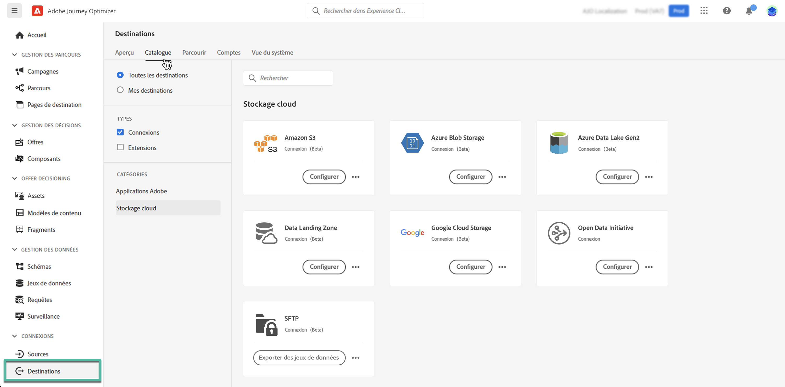

# Exportation des jeux de données vers des emplacements de stockage dans le cloud {#export-datasets}

>[!AVAILABILITY]
>
>La fonction d’exportation des jeux de données est actuellement en version bêta et disponible pour tous les utilisateurs de Adobe Journey Optimizer. Contactez votre représentant d’Adobe pour obtenir l’accès aux destinations si vous n’y avez pas déjà accès.

Journey Optimizer vous permet d’établir une connexion en direct avec les emplacements de stockage dans le cloud afin d’exporter le contenu de vos jeux de données.

En exportant régulièrement vos données, vous pouvez vous assurer que vous disposez d’un enregistrement complet et à jour de vos interactions client, utiliser ces informations à des fins de création de rapports ou d’analyse et maintenir la conformité aux exigences légales.

## Destinations de stockage dans le cloud disponibles {#destinations}

Vous pouvez exporter des jeux de données vers 6 destinations de stockage dans le cloud accessibles à partir de **[!UICONTROL Destinations]** , dans le **[!UICONTROL Catalogue]** .

>[!AVAILABILITY]
>
>Ces destinations sont toutes disponibles en version bêta et peuvent faire l’objet de modifications.

Des informations détaillées sur chaque destination sont disponibles dans la documentation Adobe Experience Platform :

* [Amazon S3](https://experienceleague.adobe.com/docs/experience-platform/destinations/catalog/cloud-storage/amazon-s3.html)
* [Azure Blob](https://experienceleague.adobe.com/docs/experience-platform/destinations/catalog/cloud-storage/azure-blob.html)
* [Azure Data Lake Gen 2](https://experienceleague.adobe.com/docs/experience-platform/destinations/catalog/cloud-storage/adls-gen2.html)
* [Data Landing Zone](https://experienceleague.adobe.com/docs/experience-platform/destinations/catalog/cloud-storage/data-landing-zone.html)
* [Google Cloud Storage](https://experienceleague.adobe.com/docs/experience-platform/destinations/catalog/cloud-storage/google-cloud-storage.html)
* [SFTP](https://experienceleague.adobe.com/docs/experience-platform/destinations/catalog/cloud-storage/sftp.html)

## Conditions préalables {#prerequisites}

Vérifiez les conditions préalables suivantes avant de commencer à exporter vos jeux de données :

* Pour exporter des jeux de données, vous avez besoin des [autorisations de contrôle d’accès](https://experienceleague.adobe.com/docs/experience-platform/access-control/home.html#permissions) **Gérer les destinations**, **Afficher les destinations**, **Activer des destinations**, et **Gérer et activer des destinations de jeu de données**. Lisez la [présentation du contrôle d’accès](https://experienceleague.adobe.com/docs/experience-platform/access-control/ui/overview.html) ou contactez votre administrateur de produit pour obtenir les autorisations requises.

* Cette fonctionnalité prend uniquement en charge l’exportation des données de première génération, c’est-à-dire les données brutes définies dans la variable [Description du produit Real-time Customer Data Platform](https://helpx.adobe.com/fr/legal/product-descriptions/real-time-customer-data-platform-b2c-edition-prime-and-ultimate-packages.html). Assurez-vous que le jeu de données que vous souhaitez exporter ne contient pas de données de deuxième génération.

## Étapes principales pour exporter des jeux de données {#main-steps}

Les principales étapes pour exporter un jeu de données vers un emplacement de stockage dans le cloud sont les suivantes :

Des informations détaillées sur chaque étape sont disponibles dans la documentation Adobe Experience Platform : [Exportation des jeux de données vers des destinations de stockage dans le cloud](https://experienceleague.adobe.com/docs/experience-platform/destinations/ui/activate/export-datasets.html?lang=en).

1. **Configuration de votre destination de stockage dans le cloud**. Si vous ne l’avez pas déjà fait, connectez-vous à une destination de stockage dans le cloud à partir du catalogue des destinations. [Découvrez comment créer une connexion de destination](https://experienceleague.adobe.com/docs/experience-platform/destinations/ui/connect-destination.html?lang=en#setup)

   <!---->

1. **Sélectionnez la destination de stockage dans le cloud** où vous souhaitez exporter vos jeux de données. Dans le catalogue des destinations, cliquez sur le **[!UICONTROL Exportation de jeux de données]** sur la carte souhaitée et sélectionnez la connexion à utiliser.

   <!---->

   >[!NOTE]
   >
   >Si vous utilisez Adobe Journey Optimizer avec des profils client en temps réel, les cartes de destination affichent un bouton &quot;Activer&quot;, ce qui vous permet d’exporter des jeux de données et d’activer des segments pour cette destination, en fonction des autorisations que vous avez activées.

1. **Sélectionner le ou les jeux de données** que vous souhaitez exporter vers la destination sélectionnée.

   <!---->

1. **Planification de l’exportation** de votre jeu de données. Indiquez à quel moment l’exportation doit commencer et à quelle fréquence elle doit se produire.

   <!---->

1. **Vérifier et confirmer l’exportation** en vérifiant le résumé qui s’affiche à la fin de la configuration.

   <!---->

Une fois l’exportation terminée, le contenu de votre jeu de données est déposé sur votre emplacement de stockage dans le cloud selon le planning que vous avez configuré. [Découvrez comment vérifier la réussite de l’exportation d’un jeu de données](https://experienceleague.adobe.com/docs/experience-platform/destinations/ui/activate/export-datasets.html#verify)
