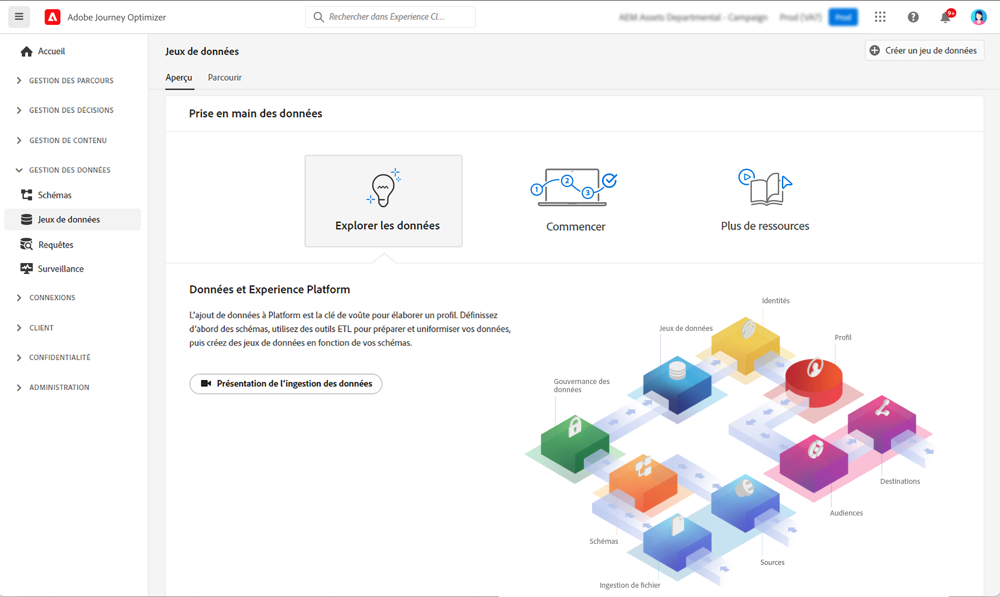
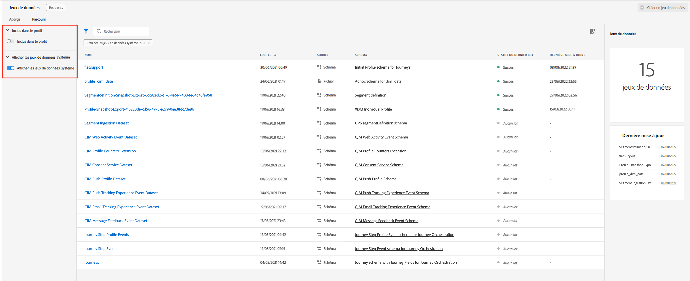
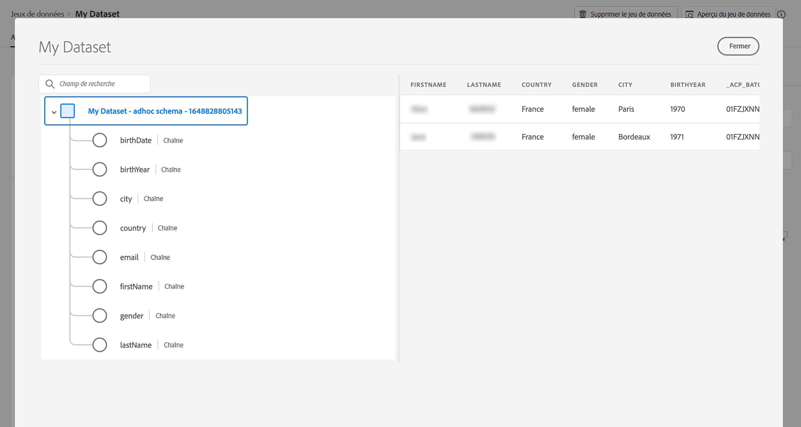

# Commencer avec les jeux de données {#datasets-gs}

Toutes les données correctement ingérées par Adobe Experience Platform sont conservées sous forme de jeux de données dans le lac de données. Un jeu de données est une structure de stockage et de gestion pour la collecte de données, généralement sous la forme d&#39;un tableau, qui contient un schéma (des colonnes) et des champs (des lignes).

## Mécanismes de sécurisation et limitations

* À compter du 1er novembre 2024, la segmentation du streaming ne prendra plus en charge l’utilisation des événements d’envoi et d’ouverture provenant des jeux de données de suivi et de feedback de [!DNL Journey Optimizer]. Pour l’implémentation d’un capping de fréquence ou d’une gestion de la lassitude, utilisez plutôt des règles métier. Vous trouverez plus d’informations dans [cette section](../conflict-prioritization/rule-sets.md), y compris une explication d’un cas d’utilisation pour un capping de fréquence quotidien [ici](https://experienceleaguecommunities.adobe.com/t5/journey-optimizer-blogs/elevate-customer-experience-with-daily-frequency-capping-in-ajo/ba-p/761510){target="_blank"}.

* Depuis février 2025, un mécanisme de sécurisation de durée de vie (TTL) est en cours de déploiement sur les jeux de données générés par le système Journey Optimizer. [En savoir plus](datasets-ttl.md)

## Accéder aux jeux de données {#access}

L’espace de travail **Jeux de données** de [!DNL Adobe Journey Optimizer]’interface utilisateur vous permet d’explorer les données et de créer des jeux de données. Pour ouvrir le tableau de bord Jeux de données, sélectionnez **Jeux de données** dans le volet de navigation de gauche.

Sélectionnez l’onglet **Parcourir** pour afficher la liste de tous les jeux de données disponibles pour votre organisation. Des détails s’affichent pour chaque jeu de données répertorié, notamment son nom, le schéma auquel le jeu de données adhère et le statut de l’exécution d’ingestion la plus récente. Par défaut, seuls les jeux de données que vous avez ingérés s’affichent. Si vous souhaitez afficher les jeux de données générés par le système, activez le bouton bascule **Afficher des jeux de données système** à partir du filtre.

Sélectionnez le nom d’un jeu de données pour accéder à l’écran Activité du jeu de données et consulter les détails du jeu de données que vous avez sélectionné. L’onglet activité contient un graphique qui permet de visualiser le taux de messages consommé ainsi qu’une liste des lots réussis et en échec.

Pour prévisualiser un jeu de données, sélectionnez **Prévisualiser le jeu de données** près du coin supérieur droit de l’écran pour prévisualiser le lot le plus récent ayant réussi dans ce jeu de données. Lorsqu’un jeu de données est vide, le lien de prévisualisation est désactivé.

## [!DNL Journey Optimizer] des jeux de données système {#system-datasets}

Cette section répertorie les jeux de données système utilisés par [!DNL Journey Optimizer]. Pour consulter la liste complète des champs et attributs de chaque schéma, consultez le [dictionnaire de schémas de Journey Optimizer](https://experienceleague.adobe.com/tools/ajo-schemas/schema-dictionary.html){target="_blank"}.

>[!CAUTION]
>
> Les jeux de données système **ne doivent pas être modifiés**. Toute modification est automatiquement annulée à chaque mise à jour du produit.

* Création de rapports

   * _Création de rapports - Jeu de données d’événement de retour de message_ : logs de diffusion des messages. Informations sur toutes les diffusions de messages à partir de Journey Optimizer à des fins de création de rapports et d’audiences. Les commentaires des FAI de messagerie sur les rebonds sont également enregistrés dans ce jeu de données.
   * _Création de rapports - Jeu de données d’événement d’expérience de tracking e-mail_ : logs d’interaction pour le canal e-mail utilisé à des fins de création de rapports et d’audiences. Les informations stockées renseignent sur les actions effectuées par la personne utilisatrice finale dans un e-mail (ouvertures, clics, etc.).
   * _Création de rapports - Jeu de données d’événement d’expérience de tracking de notification push_ : logs d’interaction pour le canal de notification push utilisé à des fins de création de rapports et d’audiences. Les informations stockées renseignent sur les actions effectuées par l’utilisateur final dans les notifications push.
   * _Création de rapports - Événement d’étape de parcours_ : capture tous les événements d’expérience d’étape de parcours générés à partir de Journey Optimizer pour être utilisés par des services tels que la création de rapports. Également essentiel pour la création de rapports dans Customer Journey Analytics pour l’analyse YoY. Associé à des métadonnées de parcours.
   * _Création de rapports - Parcours_ : jeu de données de métadonnées contenant des informations sur chaque étape d’un parcours.
   * _Création de rapports - Cci_ : jeu de données d’événement de retour qui stocke les logs de diffusion pour les emails envoyés en copie (Cci). À utiliser à des fins de création de rapports.

* Consentement

  _Jeu de données du service de consentement_ : stocke les informations de consentement d’un profil.

* Services intelligents

  _Scores d’optimisation de l’heure d’envoi / Scores d’engagement_ : scores de sortie de l’IA dédiée au parcours.

## Création de jeux de données{#create-datasets}

L’ajout de données à [!DNL Adobe Experience Platform] est la base de la création d’un profil. Vous pouvez ensuite exploiter les profils dans [!DNL Adobe Journey Optimizer]. Commencez par définir des schémas, utilisez les outils ETL pour préparer et normaliser vos données, puis créez des jeux de données basés sur vos schémas.

Vous pouvez créer un jeu de données à partir d’un schéma ou d’un fichier CSV. Des informations détaillées sur la création de jeux de données sont disponibles dans la documentation [!DNL Adobe Experience Platform] :

* [Créer un jeu de données avec un schéma existant](https://experienceleague.adobe.com/en/docs/experience-platform/catalog/datasets/user-guide#schema){target="_blank"}
* [Mapper un fichier CSV à un schéma XDM existant](https://experienceleague.adobe.com/en/docs/experience-platform/ingestion/tutorials/map-csv/existing-schema){target="_blank"}

Regardez cette vidéo pour découvrir comment créer un jeu de données, le mapper à un schéma, y ajouter des données et confirmer que les données ont été ingérées.

>[!VIDEO](https://video.tv.adobe.com/v/334293?quality=12)

## Gouvernance des données

Dans un jeu de données, parcourez l’onglet **Gouvernance des données** pour vérifier les libellés au niveau du jeu de données et du champ. La gouvernance des données classe les données en fonction du type de politiques qui s’applique.

L’une des principales fonctionnalités de [!DNL Adobe Experience Platform] est de rassembler des données issues de plusieurs systèmes d’entreprise afin de permettre aux spécialistes marketing d’identifier, de comprendre et d’impliquer les clients avec plus d’efficacité. Ces données peuvent être soumises à des restrictions d’utilisation définies par votre organisation ou par des réglementations juridiques. Il est donc important de s’assurer que vos opérations de données sont conformes aux politiques d’utilisation des données.

[!DNL Adobe Experience Platform Data Governance] vous permet de gérer les données clients et de garantir la conformité aux réglementations, aux restrictions et aux politiques applicables à l’utilisation des données. Elle joue un rôle clé dans Experience Platform à différents niveaux, notamment dans le catalogage, la traçabilité des données, l’étiquetage de l’utilisation des données, les politiques d’utilisation des données et le contrôle de l’utilisation des données lors d’actions marketing.

En savoir plus sur la gouvernance des données et les libellés d’utilisation des données dans la [documentation sur la gouvernance des données](https://experienceleague.adobe.com/docs/experience-platform/data-governance/labels/user-guide.html?lang=fr){target="_blank"}

## Exemples et cas d’utilisation {#samples}

* [Tutoriel - Ingestion de données dans Adobe Experience Platform](https://experienceleague.adobe.com/docs/experience-platform/ingestion/tutorials/ingest-batch-data.html?lang=fr){target="_blank"}
* [Cas pratique de bout en bout](../audience/creating-test-profiles.md) - Créez un schéma, un jeu de données et ingérez des données pour ajouter des profils de test dans [!DNL Adobe Journey Optimizer]
* [Exemples de requête](../data/datasets-query-examples.md) - Jeux de données [!DNL Adobe Journey Optimizer] et cas d’utilisation associés.

>[!MORELIKETHIS]
>
>* [Documentation relative aux jeux de données](https://experienceleague.adobe.com/docs/experience-platform/catalog/datasets/overview.html?lang=fr){target="_blank"}
>* [Documentation sur l’ingestion des données](https://experienceleague.adobe.com/docs/experience-platform/ingestion/home.html?lang=fr){target="_blank"}.
>* [Bonnes pratiques relatives aux droits de licence de gestion des données](https://experienceleague.adobe.com/en/docs/experience-platform/landing/license/data-management-best-practices#data-management-best-practices){target="_blank"}
