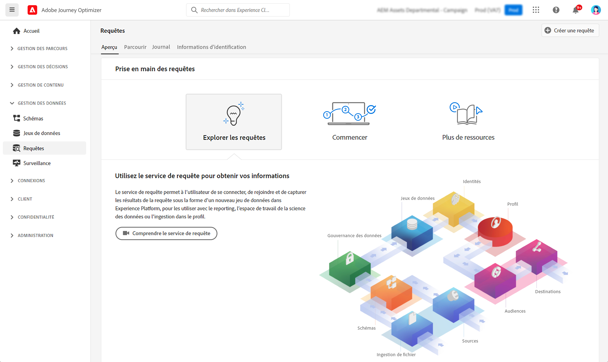

# Commencer avec les requêtes {#queries-gs}

Le requêteur est un outil interactif fourni par le service de requête Adobe Experience Platform. Il permet d’écrire, de valider et d’exécuter des requêtes pour les données d’expérience client dans l’interface utilisateur dans [!DNL Adobe Journey Optimizer].

Le requêteur prend en charge le développement de requête pour l’analyse et l’exploration de données. Il vous permet également d’exécuter des requêtes interactives à des fins de développement, ainsi que des requêtes non interactives pour renseigner des [jeux de données](get-started-datasets.md).

Découvrez comment utiliser le Requêteur dans [cette documentation](https://experienceleague.adobe.com/docs/experience-platform/query/ui/user-guide.html?lang=fr){target="_blank"}.

>[!MORELIKETHIS]
>
>* [Documentation du service de requête](https://experienceleague.adobe.com/docs/experience-platform/query/home.html?lang=fr){target="_blank"}
>* [Vidéo de présentation du service de requête](https://experienceleague.adobe.com/docs/platform-learn/tutorials/queries/understanding-query-service.html?lang=fr){target="_blank"}
