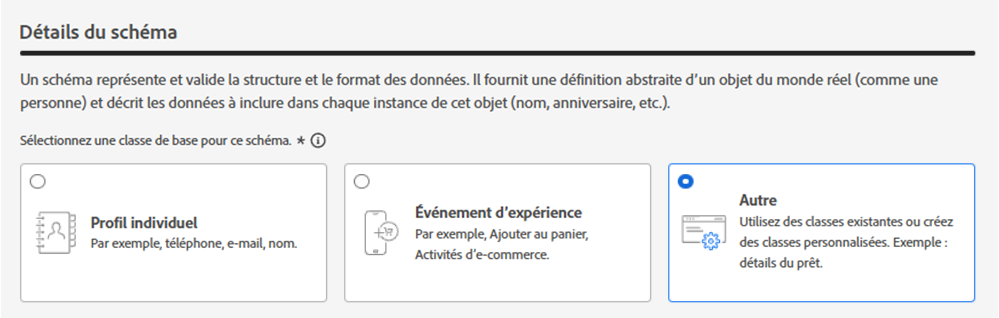
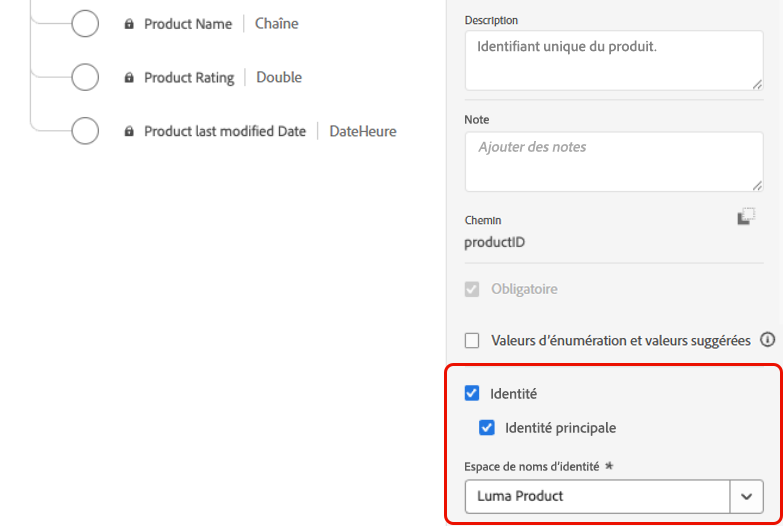
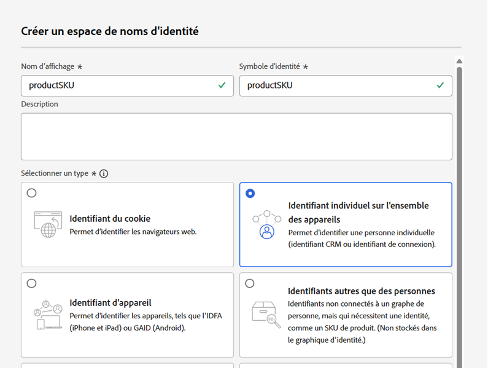
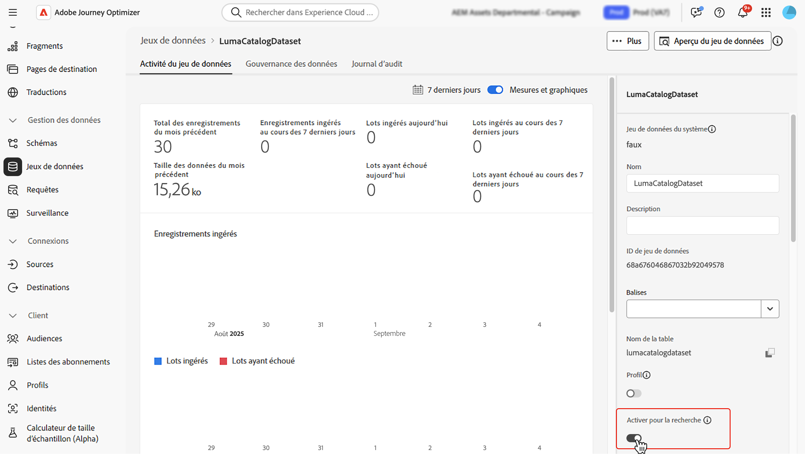
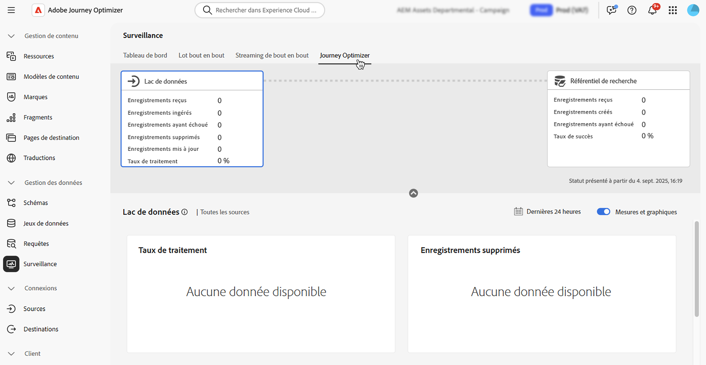

# Utiliser des données Adobe Experience Platform {#aep-data}

>[!CONTEXTUALHELP]
>id="lookup-aep-data"
>title="Activer pour la recherche"
>abstract="Activer un jeu de données pour la recherche vous permet d’utiliser ses données avec les fonctionnalités de personnalisation, de prise de décision et d’orchestration de parcours de Journey Optimizer."

[!DNL Journey Optimizer] vous permet d’utiliser les données d’[!DNL Adobe Experience Platform] avec les fonctionnalités de personnalisation, de prise de décision et d’orchestration de parcours. Pour ce faire, les jeux de données basés sur des enregistrements nécessaires à la personnalisation de la recherche doivent d’abord être activés pour le service de recherche, comme décrit ci-dessous.

>[!NOTE]
>
>La fonctionnalité de recherche de données n’est disponible que pour un ensemble d’organisations (disponibilité limitée). Pour en bénéficier, contactez votre représentant ou représentante Adobe. En savoir plus sur les [libellés de disponibilité](../rn/releases.md#availability-labels).

Découvrez comment accéder aux jeux de données et comment les utiliser dans cette section : [Commencer avec les jeux de données](../data/get-started-datasets.md).

## À lire absolument

### Mécanismes de sécurisation et directives {#guidelines}

Avant de commencer, consultez les restrictions et les directives suivantes :

* **Pas de DCP dans les jeux de données** : les jeux de données activés pour la recherche ne doivent contenir aucune donnée à caractère personnel (DCP).

* **Risque de suppression** : les jeux de données utilisés dans la personnalisation ne sont pas protégés contre la suppression. Vous devez effectuer le suivi des jeux de données utilisés pour vous assurer qu’ils ne sont pas supprimés.

* **Type de schéma** : les jeux de données doivent être associés à un schéma qui n’est **PAS** de type Profil ou Événement.

* **Maintenir le bouton (bascule) de recherche activé** : évitez d’activer et de désactiver les jeux de données de manière répétée. Cela peut entraîner un comportement d’indexation inattendu. La bonne pratique consiste à laisser le jeu de données activé tant que vous prévoyez de l’utiliser pour les recherches.

* **Région d’activation d’Edge** - Les jeux de données activés pour la recherche ne sont disponibles pour l’activation entrante basée sur les serveurs Edge que dans la région où réside le sandbox du jeu de données (par exemple, NLD2 ou VA7). La région du sandbox s’affiche dans l’interface utilisateur en regard du nom du sandbox.

* **Suppression d’un lot de données** : la suppression d’un lot de données de votre jeu de données supprime complètement toutes les clés correspondantes du service de recherche. Par exemple :

  **Lot 1** : Sku1, Sku2, Sku3\
  **Lot 2** : Sku1, Sku2, Sku3, Sku4, Sku5, Sku6\
  **Lot 3** : Sku7, Sku8, Sku9, Sku10

  Si vous supprimez le **lot 1**, les Sku1, Sku2 et Sku3 sont supprimés du stockage de la recherche. Les données de recherche résultantes contiendront alors : Sku4, Sku5, Sku6, Sku7, Sku8, Sku9, Sku10.

* **Aucune recherche liée** : les recherches de jeux de données ne peuvent pas être liées. En d’autres termes, vous ne pouvez pas utiliser le résultat d’une recherche comme variable pour devenir la clé permettant d’effectuer une seconde recherche.

### Droit pour le service de recherche

| Composant de fonctionnalité | Limites | Remarques |
| ------- | ------- | ------- |
| Jeux de données de recherche activés | Max. 10 par organisation | Nombre maximal de jeux de données pouvant être configurés pour la recherche à un moment donné. Cette limite s’applique au nombre total cumulé de jeux de données de recherche dans les sandbox de production et de développement au sein de l’instance client. |
| Nombre d’enregistrements de jeux de données | Jusqu’à 2 millions d’enregistrements par jeu de données | Nombre maximal d’enregistrements autorisés dans un seul jeu de données, calculé comme le nombre total de tous les lots de ce jeu de données. |
| Taille des enregistrements | Jusqu’à 2 Ko par enregistrement | Taille maximale d’enregistrement par défaut prise en charge. |
| Taille des jeux de données | Jusqu’à 4 Go | Taille maximale d’un jeu de données, et non la taille cumulée de tous les jeux de données d’un sandbox. Les limites de nombre d’enregistrements et de taille des jeux de données sont des mécanismes de sécurisation indépendants, et les deux doivent être respectées. |
| Mises à jour de la fréquence des jeux de données | Jusqu’à 5 mises à jour par jour et par jeu de données | Fréquence maximale des opérations de mise à jour autorisée pour un seul jeu de données par jour. |

>[!NOTE]
>
>Si vous avez besoin de volumes supplémentaires au-delà des mécanismes de sécurisation répertoriés ci-dessus, contactez votre représentant ou représentante Adobe.

## Activer un jeu de données pour la recherche de données {#enable}

Pour utiliser les données d’un jeu de données à des fins de personnalisation, vous devez l’activer pour la recherche.

### Conditions préalables {#prerequisites-enable}

Le schéma associé au jeu de données que vous souhaitez activer pour la recherche doit être de type Enregistrement. Le schéma NE doit PAS appartenir à une classe Profil ou Événement.

+++Exemple



+++

Une identité principale doit être définie pour le schéma.

+++Exemple



+++

Si aucun espace de noms personnalisé n’a été défini, assurez-vous que l’identité est un identifiant qui ne concerne pas une personne.

+++Exemple



+++

### Activer le jeu de données pour la recherche dans l’interface de gestion des jeux de données

Dans l’interface d’utilisation de la gestion des jeux de données, utilisez le bouton (bascule) pour activer le jeu de données pour la recherche.



### Méthode API

Suivez les instructions détaillées dans [cette documentation](https://developer.adobe.com/journey-optimizer-apis/references/authentication/) pour configurer votre environnement afin d’envoyer des commandes d’API.

#### Conditions préalables

* Les API Adobe Journey Optimizer et Adobe Experience Platform doivent être ajoutées au projet de développement.

  

* Vous devez disposer de l’autorisation « Gérer des jeux de données » dans le cadre de votre rôle.

* Le schéma sur lequel le jeu de données est basé doit contenir une identité principale pouvant servir de clé de recherche.

#### Structure de l’appel API

```shell
curl -s -XPATCH "https://platform.adobe.io/data/core/entity/lookup/dataSets/${DATASET_ID}/${ACTION}" \ -H "Authorization: Bearer ${ACCESS_TOKEN}" \ -H "x-api-key: ${API_KEY}" \ -H "x-gw-ims-org-id: ${IMS_ORG}" \ -H "x-sandbox-name: ${SANDBOX_NAME}" 
```

Où :

* L’URL est `https://platform.adobe.io/data/core/entity/lookup/dataSets/${DATASET_ID}/${ACTION}`.
* L’ID du jeu de données est le jeu de données que vous souhaitez activer.
* L’action est Activer OU Désactiver.
* Le jeton d’accès peut être récupéré à partir de Developer Console.
* La clé d’API peut être récupérée à partir de Developer Console.
* L’ID d’organisation IMS est votre organisation Adobe.
* Le nom du sandbox est celui du sandbox dans lequel se trouve le jeu de données (c’est-à-dire prod, dev, etc.).

>[!NOTE]
>
>Si vous rencontrez l’erreur ci-dessous lors d’une tentative d’appel API pour activer des jeux de données, essayez de supprimer les API Adobe Journey Optimizer de votre projet Developer Console, puis de les rajouter :
>
>`"error_code": "403003",`
>`"message": "Api Key is invalid"`

## Surveillance du jeu de données

Une fois qu’un jeu de données a été activé pour la recherche, vous pouvez consulter le statut de l’ingestion dans le service de recherche en accédant au menu **[!UICONTROL Surveillance]** et en sélectionnant l’onglet **[!UICONTROL Journey Optimizer]**.

Cet indicateur de processus permet de déterminer quand de nouveaux lots de données sont disponibles dans le service de recherche.



## Étapes suivantes

Une fois qu’un jeu de données a été activé pour la recherche à l’aide d’un appel API, vous pouvez utiliser ses données dans les fonctionnalités de personnalisation et de prise de décision de [!DNL Journey Optimizer]. Pour plus d’informations, consultez les sections suivantes :

* [Utiliser des données Adobe Experience Platform à des fins de personnalisation](../personalization/aep-data-perso.md)
* [Utiliser des données Adobe Experience Platform à des fins de prise de décision](../experience-decisioning/aep-data-exd.md)
* [Utiliser des données Adobe Experience Platform à des fins d’orchestration de parcours](../building-journeys/dataset-lookup.md)
