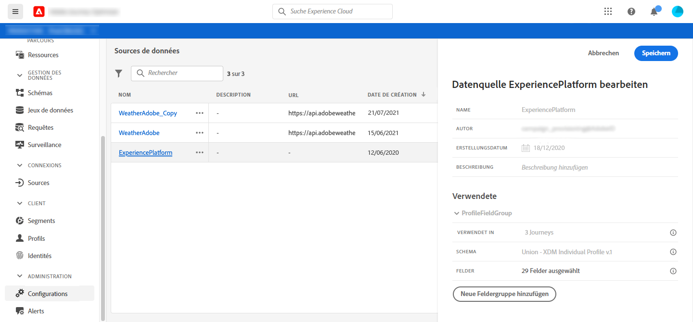
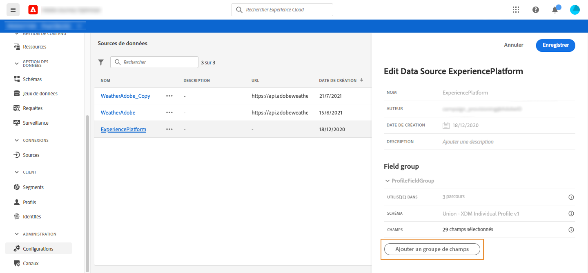

# Source de données Adobe Experience Platform {#concept_zrb_nqt_52b}

La source de données Adobe Experience Platform définit la connexion au service de Profil client en temps réel. Cette source de données est intégrée et préconfigurée. Il ne peut pas être supprimé. Cette source de données est conçue pour récupérer et utiliser les données du service de Profil client en temps réel (par exemple, vérifier si la personne qui a saisi un parcours est une femme). Il vous permet d’utiliser des données de Profil et des données de Événements d’expérience. Pour plus d&#39;informations sur le service de Profil client en temps réel, consultez cette [page](https://experienceleague.adobe.com/docs/experience-platform/profile/home.html).

>[!NOTE]
>
>Vous pouvez récupérer les 1 000 derniers événements d’expérience créés il y a moins d’un an.

Pour permettre la connexion au service de Profil client en temps réel, nous devons utiliser une clé pour identifier une personne et un espace de nommage qui contextualise la clé. Par conséquent, vous ne pouvez utiliser cette source de données que si vos parcours début avec un événement contenant une clé et un espace de nommage. Voir [cette page](../building-journeys/journey.md).

Vous pouvez modifier le groupe de champs préconfiguré nommé &quot;ProfileFieldGroup&quot;, en ajouter de nouveaux et en supprimer ceux qui ne sont pas utilisés dans les parcours préliminaires ou actifs. Voir [cette page](../datasource/configure-data-sources.md#define-field-groups).

Voici les étapes principales pour ajouter des groupes de champs à la source de données intégrée.

1. Dans la liste des sources de données, sélectionnez la source de données Adobe Experience Platform intégrée.

   Le volet de configuration de la source de données s’ouvre alors sur le côté droit de l’écran.

   

1. Cliquez sur **[!UICONTROL Ajouter un nouveau groupe de champs]** pour définir une nouvelle série de champs à récupérer. Voir [cette page](../datasource/configure-data-sources.md#define-field-groups).

   

1. Sélectionnez un schéma dans la liste déroulante **[!UICONTROL Schéma]**. Ce champ liste les schémas Profil et Événements d’expérience disponibles dans Adobe Experience Platform. La création de schéma n&#39;est pas effectuée dans [!DNL Journey Optimizer]. Il est exécuté à Adobe Experience Platform.
1. Sélectionnez les champs à utiliser.
1. Définissez la durée du cache.
1. Cliquez sur **[!UICONTROL Enregistrer]**.

Lorsque vous placez le curseur sur le nom d’un groupe de champs, deux icônes s’affichent à droite. Ils vous permettent de supprimer et de duplicata le groupe de champs. Notez que l&#39;icône **[!UICONTROL Supprimer]** n&#39;est disponible que si le groupe de champs n&#39;est utilisé dans aucun parcours actif ou préliminaire (informations affichées dans le champ **[!UICONTROL Utilisé dans]**).
