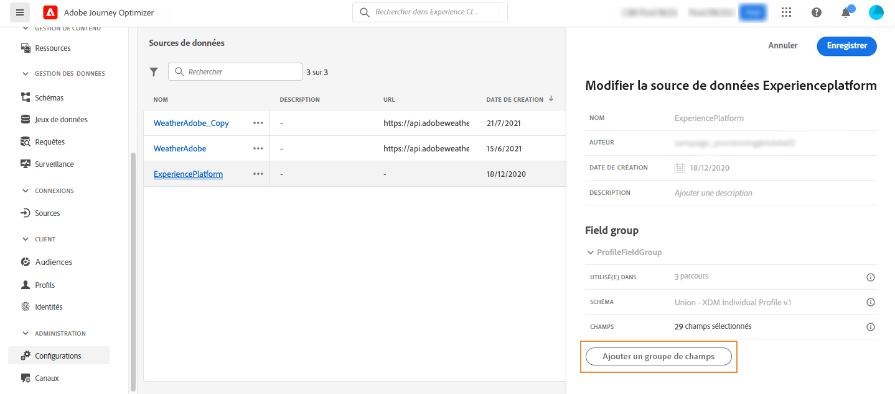

# Source de données Adobe Experience Platform {#adobe-experience-platform-data-source}

>[!CONTEXTUALHELP]
>id="ajo_journey_data_source_built_in"
>title="Source de données Adobe Experience Platform"
>abstract="La source de données Adobe Experience Platform définit la connexion au profil client en temps réel d’Adobe. Cette source de données est intégrée et préconfigurée et ne peut pas être supprimée. Elle a été conçue pour récupérer et utiliser des données du service de profil client en temps réel (par exemple, pour vérifier si la personne qui a rejoint le parcours est de sexe féminin)."

La source de données Adobe Experience Platform définit la connexion au profil client en temps réel d’Adobe. Cette source de données est intégrée et préconfigurée et ne peut pas être supprimée. Cette source de données a été conçue pour récupérer et utiliser des données du service de profil client en temps réel (par exemple, vérifier si la personne qui a rejoint un parcours est de sexe féminin). Pour plus d’informations sur le profil client en temps réel d’Adobe, consultez la [documentation d’Adobe Experience Platform](https://experienceleague.adobe.com/docs/experience-platform/profile/home.html?lang=fr){target="_blank"}.

Pour autoriser la connexion au service de profil client en temps réel, nous devons utiliser une clé afin d’identifier une personne, ainsi qu’un espace de noms qui contextualise la clé. Par conséquent, vous ne pouvez utiliser cette source de données que si vos parcours commencent par un événement contenant une clé et un espace de noms. [En savoir plus](../building-journeys/journey.md).

Vous pouvez modifier le groupe de champs préconfiguré nommé « ProfileFieldGroup », en ajouter de nouveaux et supprimer ceux qui ne sont pas utilisés dans les parcours actifs ou dans un état de brouillon. [En savoir plus](../datasource/configure-data-sources.md#define-field-groups).

>[!CAUTION]
>
>L’utilisation d’événements d’expérience dans des expressions/conditions de parcours n’est pas prise en charge. Si votre cas d’utilisation nécessite l’utilisation d’événements d’expérience, envisagez d’utiliser d’autres méthodes. [En savoir plus](../building-journeys/exp-event-lookup.md)

Voici les étapes principales pour ajouter des groupes de champs à la source de données intégrée :

1. Dans la liste des sources de données, sélectionnez la source de données **Adobe Experience Platform** intégrée.

   Le volet de configuration de la source de données s’ouvre alors dans la partie droite de l’écran.

   

1. Cliquez sur **[!UICONTROL Ajouter un nouveau groupe de champs]** pour définir une [nouvelle série de champs à récupérer](../datasource/configure-data-sources.md#define-field-groups).

   

1. Sélectionnez un schéma dans la liste déroulante **[!UICONTROL Schéma]**. La création du schéma est effectuée dans Adobe Experience Platform, mais pas dans Adobe Journey Optimizer.
1. Sélectionnez les champs à utiliser et enregistrez vos modifications.

>[!TIP]
>
>Pointez sur le nom d’un groupe de champs pour afficher deux icônes à droite. Utilisez-les pour **dupliquer** ou **supprimer** le groupe de champs. Notez que l’icône **[!UICONTROL Supprimer]** n’est disponible que si le groupe de champs n’est utilisé dans aucun parcours en version **Actif**, **Brouillon** ou **Terminé**. Reportez-vous au champ **[!UICONTROL Utilisé dans]** pour vérifier si c’est le cas.
