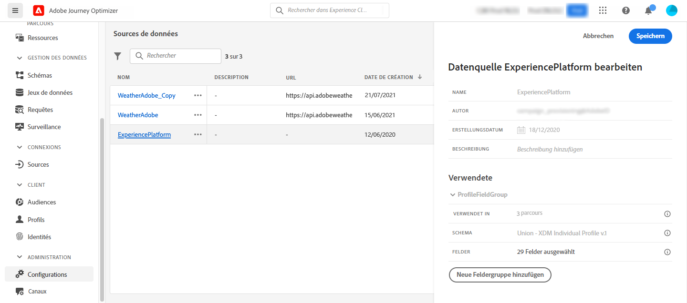

# Source de données Adobe Experience Platform {#adobe-experience-platform-data-source}

>[!CONTEXTUALHELP]
>id="ajo_journey_data_source_built_in"
>title="Source de données Adobe Experience Platform"
>abstract="La source de données Adobe Experience Platform définit la connexion à Adobe Real-time Customer Profile. Cette source de données est intégrée et préconfigurée et ne peut pas être supprimée. Il est conçu pour récupérer et utiliser les données du service de profil client en temps réel (par exemple, vérifier si la personne qui est entrée dans un parcours est une femme). Il vous permet d’utiliser les données de profil et les données d’événements d’expérience."

La source de données Adobe Experience Platform définit la connexion à Adobe Real-time Customer Profile. Cette source de données est intégrée et préconfigurée et ne peut pas être supprimée. Cette source de données est conçue pour récupérer et utiliser les données du service de profil client en temps réel (par exemple, vérifier si la personne qui est entrée dans un parcours est une femme). Il vous permet d’utiliser les données de profil et les données d’événements d’expérience. Pour plus d’informations sur le profil client en temps réel d’Adobe, reportez-vous à la section [Documentation d’Adobe Experience Platform](https://experienceleague.adobe.com/docs/experience-platform/profile/home.html){target=&quot;_blank&quot;}.

Pour permettre la connexion au service de profil client en temps réel, nous devons utiliser une clé pour identifier une personne, ainsi qu’un espace de noms qui contextualise la clé. Par conséquent, vous ne pouvez utiliser cette source de données que si vos parcours commencent par un événement contenant une clé et un espace de noms. [En savoir plus](../building-journeys/journey.md).

Vous pouvez modifier le groupe de champs préconfiguré nommé &quot;ProfileFieldGroup&quot;, en ajouter de nouveaux et supprimer ceux qui ne sont utilisés dans aucun parcours actif ou dans un état de brouillon. [En savoir plus](../datasource/configure-data-sources.md#define-field-groups).

>[!NOTE]
>
>Vous pouvez récupérer les 1 000 derniers événements d’expérience créés il y a moins d’un an.

Voici les principales étapes pour ajouter des groupes de champs à la source de données intégrée.

1. Dans la liste des sources de données, sélectionnez la source de données Adobe Experience Platform intégrée.

   Le volet de configuration de la source de données s’ouvre alors dans la partie droite de l’écran.

   

1. Cliquez sur **[!UICONTROL Add a New Field Group]** pour définir une nouvelle série de champs à récupérer. [En savoir plus](../datasource/configure-data-sources.md#define-field-groups).

   

1. Sélectionnez un schéma dans le **[!UICONTROL Schema]** menu déroulant. Ce champ répertorie les schémas de profil et d’événements d’expérience disponibles dans Adobe Experience Platform. La création du schéma n’est pas effectuée dans [!DNL Journey Optimizer]. Il est exécuté dans Adobe Experience Platform.
1. Sélectionnez les champs à utiliser.
1. Cliquez sur **[!UICONTROL Save]**.

Lorsque vous placez le curseur sur le nom d’un groupe de champs, deux icônes s’affichent à droite. Ils vous permettent de supprimer et de dupliquer le groupe de champs. Notez que la variable **[!UICONTROL Delete]** Cette icône n’est disponible que si le groupe de champs n’est utilisé dans aucun parcours actif ou dans un état de brouillon (informations affichées dans la variable **[!UICONTROL Used in]** ).
