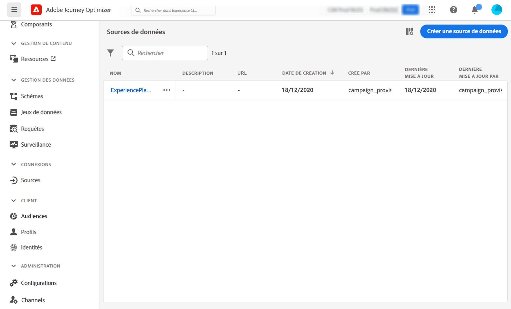
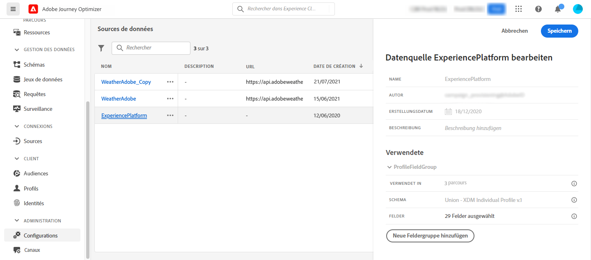
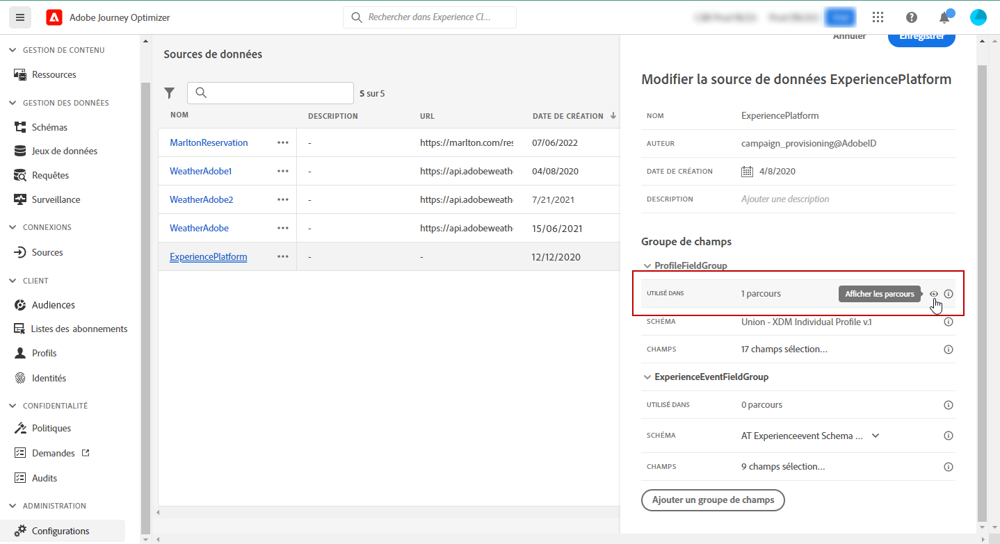

# Configurer une source de données {#configure-data-source}

>[!NOTE]
>
>La configuration d’une source de données est toujours effectuée par un **utilisateur ou une utilisatrice technique**.

Pour configurer une source de données, procédez comme suit :

1. Dans la section du menu ADMINISTRATION, sélectionnez **[!UICONTROL Configurations]**. Dans la section **[!UICONTROL Sources de données]**, cliquez sur **[!UICONTROL Gérer]**. La liste des sources de données s’affiche. Pour plus d&#39;informations sur l&#39;interface, voir [cette page](../start/user-interface.md)

   

1. Ensuite, vous pouvez soit ajouter des groupes de champs à la source de données intégrée (voir [cette page](../datasource/adobe-experience-platform-data-source.md)), soit créer une source de données externe (voir [cette page](../datasource/external-data-sources.md)) et les groupes de champs associés (voir [cette page](../datasource/configure-data-sources.md#define-field-groups)).

   

1. Cliquez sur **[!UICONTROL Enregistrer]**.

   La source de données est maintenant configurée et prête à être utilisée dans vos parcours.

## Définir des groupes de champs {#define-field-groups}

Les groupes de champs sont des ensembles de champs que vous pouvez récupérer d’une source de données et utiliser dans un parcours.

Pour chaque source de données, vous pouvez définir plusieurs groupes de champs.

Vous pouvez, par exemple, créer un groupe de champs avec le numéro de téléphone, l’adresse e-mail, le prénom et l’adresse du profil. Vous pourrez alors utiliser ces données dans votre parcours afin de créer des conditions. Par exemple, vous pouvez décider d’envoyer une notification push uniquement si le client a installé l’application mobile. Si le champ est vide, vous pouvez envoyer un e-mail.

Bien qu’un nom par défaut soit automatiquement ajouté à votre groupe de champs, nous vous recommandons d’attribuer un nom personnalisé. En effet, ce nom sera visible par d’autres utilisateurs de [!DNL Journey Optimizer]. Il est conseillé d’attribuer au groupe un nom pertinent.

Lorsqu’un champ de source de données est utilisé dans un parcours, le système récupère tous ceux qui sont définis pour ce groupe. Par conséquent, il est recommandé de ne sélectionner que les champs dont vous avez besoin pour vos parcours. Cela permettra de réduire la latence des requêtes dans vos parcours et d’améliorer les performances. Notez que vous pourrez facilement ajouter d’autres champs dans les groupes ultérieurement.

Le nombre de parcours qui font appel à un groupe de champs est affiché dans le champ **[!UICONTROL Utilisé(e) dans]**. Vous pouvez cliquer sur le bouton **[!UICONTROL Afficher les parcours]** pour faire apparaître la liste des parcours utilisant ce groupe de champs.

>[!NOTE]
>
>Notez que si un groupe de champs ne contient aucun champ, il ne s’affiche pas dans l’éditeur d’expression.

## Cycle de vie du groupe de champs {#field-group-lifecycle}

Vous pouvez ajouter ou supprimer des champs d‘un groupe de champs qui n’est utilisé dans aucun parcours actif ou à l’état de brouillon.

Si le groupe de champs est utilisé dans un ou plusieurs parcours actifs ou à l’état de brouillon, vous pouvez ajouter de nouveaux champs de manière incrémentielle à partir du schéma sélectionné, mais vous ne pouvez pas désélectionner/supprimer/modifier des champs qui ont déjà été sélectionnés. Il est impossible de mettre à jour un groupe de champs si des champs existants d’un schéma déjà utilisé par des parcours actifs ou à l’état de brouillon sont modifiés, par exemple, si vous modifiez le type de données d’un champ. Cela permet d’éviter l’interruption des parcours.

Pour supprimer un champ d’un groupe de champs utilisé dans un ou plusieurs parcours, procédez comme suit. Prenons l’exemple d’un groupe de champs appelé « Groupe de champs A ».

1. Dans la liste des groupes de champs, placez le curseur sur « Groupe de champs A » et cliquez ensuite sur l’icône **[!UICONTROL Dupliquer]** située à droite. Appelez le groupe de champs dupliqué « Groupe de champs B », par exemple.
1. Dans « Groupe de champs B », supprimez les champs dont vous n’avez plus besoin.
1. Dans « Groupe de champs A », vérifiez à quel emplacement ce groupe de champs est utilisé. Ces informations sont affichées dans le champ **[!UICONTROL Utilisation dans]**.
1. Ouvrez tous les parcours qui utilisent « Groupe de champs A ».
1. Créez de nouvelles versions de chacun de ces parcours. Modifiez toutes les activités qui utilisent « Groupe de champs A » et sélectionnez « Groupe de champs B ».
1. Arrêtez les anciennes versions des parcours qui utilisent « Groupe de champs A ». Normalement, il ne devrait plus y avoir de parcours qui utilisent « Groupe de champs A ».
1. Supprimez « Groupe de champs A », car il n’est plus utilisé.
