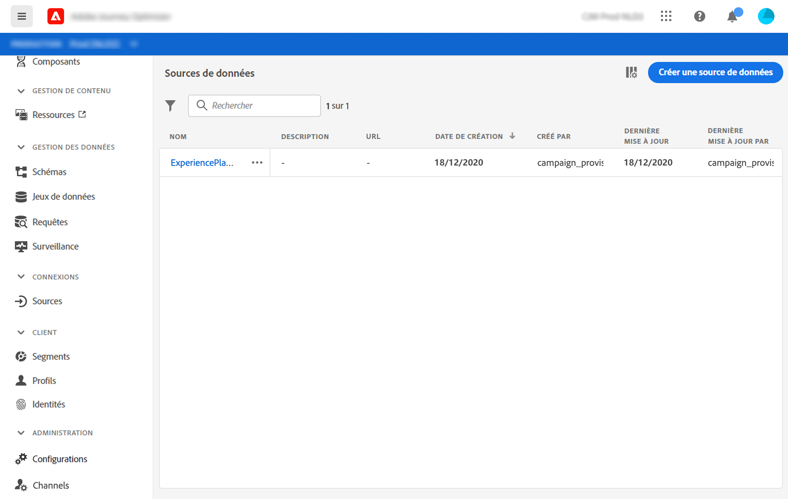

# Configurer une source de données {#configure-data-source}

Voici les principales étapes de configuration de la source de données :

>[!NOTE]
>
>La configuration de la source de données est toujours effectuée par un **utilisateur technique**.

1. Sélectionnez le menu **[!UICONTROL Admin]** / **[!UICONTROL Sources de données]**.

   La liste des sources de données s’affiche. Voir [cette page](../user-interface.md) pour plus d&#39;informations sur l&#39;interface.

   

1. Vous pouvez ensuite ajouter des groupes de champs à la source de données intégrée (voir [cette page](../datasource/adobe-experience-platform-data-source.md)) ou créer une nouvelle source de données externe (voir [cette page](../datasource/external-data-sources.md)) et les groupes de champs associés (voir [cette page](../datasource/configure-data-sources.md#define-field-groups)).

   

1. Cliquez sur **[!UICONTROL Enregistrer]**.

   La source de données est maintenant configurée et prête à être utilisée dans vos parcours.

## Définir des groupes de champs {#define-field-groups}

Les groupes de champs sont des ensembles de champs que vous pouvez récupérer à partir d’une source de données et utiliser dans un parcours.

Pour chaque source de données, vous pouvez définir plusieurs groupes de champs, chacun avec une durée de cache spécifique.

Par exemple, vous pouvez créer un groupe de champs avec le numéro de téléphone, le courriel, le prénom et l’adresse du profil. Vous pourrez alors utiliser ces données dans votre parcours pour créer des conditions. Par exemple, vous pouvez décider d&#39;envoyer un SMS uniquement si le numéro de téléphone du profil n&#39;est pas vide. S’il est vide, vous pouvez envoyer un courriel.

Même si un nom par défaut est automatiquement ajouté, nous vous recommandons de donner un nom à votre groupe de champs. En effet, le nom du groupe de champs sera visible pour les autres utilisateurs dans [!DNL Journey Optimizer]. Il est recommandé de donner un nom approprié aux groupes de champs.

Lorsqu’un champ de source de données est utilisé dans un parcours, le système récupère tous les champs définis pour ce groupe de champs. Par conséquent, il est recommandé de ne sélectionner que les champs dont vous avez besoin pour vos parcours. Cela réduira la latence des requêtes dans vos parcours, augmentant ainsi les performances. Notez que vous pourrez facilement ajouter d’autres champs dans les groupes de champs ultérieurement.

**[!UICONTROL La]** durée du cache est également importante car elle vous aidera à optimiser les performances. La durée du cache signifie que, dans un parcours, si les données d’un groupe de champs sont récupérées une fois, le système les met temporairement en cache. Si les mêmes données sont requises ultérieurement dans le même parcours, le système n’envoie pas d’autre requête à la source de données. La configuration de la durée du cache doit être adaptée à chaque cas d&#39;utilisation. Si vous devez récupérer des données en temps réel telles que l’état de réservation d’hôtel, les informations météorologiques ou le nombre de points de fidélité, vous associerez le groupe de champs contenant ces champs à une courte durée de cache (1 seconde, par exemple). Pour les champs mis à jour moins fréquemment (nom, sexe), vous allez créer un second groupe de champs avec une durée de cache plus longue (5 jours, par exemple).

Le nombre de parcours qui utilisent un groupe de champs s’affiche dans le champ **[!UICONTROL Utilisé dans]**. Vous pouvez cliquer sur le bouton **[!UICONTROL parcours de Vue]** pour afficher la liste des parcours utilisant ce groupe de champs.

>[!NOTE]
>
>Notez que si un groupe de champs n’a pas de champ, il ne s’affichera pas dans l’éditeur d’expressions.

## Cycle de vie du groupe de champs {#field-group-lifecycle}

Vous pouvez ajouter ou supprimer des champs d’un groupe de champs qui n’est utilisé dans aucun brouillon ou parcours actif.

Vous pouvez ajouter mais vous ne pouvez pas supprimer un champ d’un groupe de champs utilisé dans un ou plusieurs parcours préliminaires ou actifs. Cela évitera de briser les parcours.

Pour supprimer un champ d’un groupe de champs utilisé dans un ou plusieurs parcours, procédez comme suit. Utilisons un exemple de groupe de champs nommé &quot;Groupe de champs A&quot;.

1. Dans la liste des groupes de champs, placez le curseur sur &quot;Groupe de champs A&quot; et cliquez sur l&#39;icône **[!UICONTROL Duplicata]** située à droite. Nommez le groupe de champs dupliqué &quot;Groupe de champs B&quot;, par exemple.
1. Dans &quot;Groupe de champs B&quot;, supprimez les champs dont vous ne souhaitez plus.
1. Dans &quot;Groupe de champs A&quot;, vérifiez où ce groupe de champs est utilisé. Ces informations s’affichent dans le champ **[!UICONTROL Utilisé dans]**.
1. Ouvrez tous les parcours qui utilisent &quot;Groupe de champs A&quot;.
1. Créez de nouvelles versions de chacun de ces parcours. Modifiez toutes les activités à l’aide du &quot;Groupe de champs A&quot; et sélectionnez &quot;Groupe de champs B&quot;.
1. Arrêtez les anciennes versions des parcours qui utilisent &quot;Groupe de champs A&quot;. Vous ne devriez alors pas avoir de parcours utilisant &quot;Groupe de champs A&quot;.
1. Supprimez &quot;Groupe de champs A&quot; tel qu’il n’est plus utilisé.
