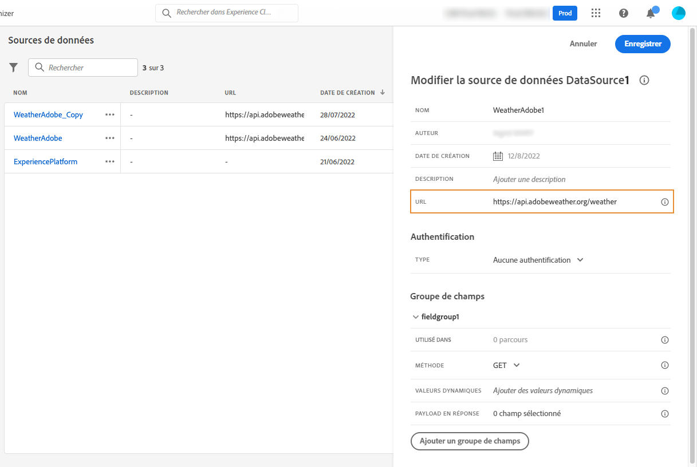

# Sources de données externes {#external-data-sources}

>[!CONTEXTUALHELP]
>id="ajo_journey_data_source_custom"
>title="Sources de données externes"
>abstract="Les sources de données externes vous permettent de définir une connexion à des systèmes tiers, par exemple si vous utilisez un système de réservation d’hôtels pour vérifier si la personne a enregistré une chambre. Contrairement à la source de données Adobe Experience Platform intégrée, vous pouvez créer autant de sources de données externes que nécessaire."

Les sources de données externes vous permettent de définir une connexion à des systèmes tiers, par exemple si vous utilisez un système de réservation d’hôtels pour vérifier si la personne a enregistré une chambre. Contrairement à la source de données Adobe Experience Platform intégrée, vous pouvez créer autant de sources de données externes que nécessaire.

>[!NOTE]
>
>Les barrières de sécurité lorsque vous utilisez des systèmes externes sont répertoriées dans [cette page](../configuration/external-systems.md).

Les API REST utilisant POST ou GET et renvoyant JSON sont prises en charge. Les modes d’authentification par clé API, de base et personnalisé sont pris en charge.

Prenons l’exemple d’un service API météorologique que je souhaite utiliser pour personnaliser les comportements de mon parcours en fonction des données météorologiques en temps réel.

Voici deux exemples d’appel API :

* _https://api.adobeweather.org/weather?city=London,uk&amp;appid=1234_
* _https://api.adobeweather.org/weather?lat=35&amp;lon=139&amp;appid=1234_

L’appel est composé d’une URL principale (_https://api.adobeweather.org/weather_), deux jeux de paramètres (&quot;city&quot; pour la ville et &quot;lat/long&quot; pour la latitude et la longitude) et la clé API (appid).

Les principales étapes de création et de configuration d’une source de données externe sont les suivantes :

1. Dans la liste des sources de données, cliquez sur **[!UICONTROL Create Data Source]** pour créer une source de données externe.

   

   Le volet de configuration de la source de données s’ouvre alors dans la partie droite de l’écran.

   

1. Saisissez un nom pour votre source de données.

   >[!NOTE]
   >
   >N’utilisez ni espaces ni caractères spéciaux. N’utilisez pas plus de 30 caractères.

1. Ajoutez une description à votre source de données. Cette étape est facultative.
1. Ajoutez l’URL du service externe. Dans notre exemple : _https://api.adobeweather.org/weather_.

   >[!CAUTION]
   >
   >Nous vous recommandons vivement d’utiliser HTTPS pour des raisons de sécurité. Notez également que nous n’autorisons pas l’utilisation d’adresses Adobe qui ne sont pas disponibles publiquement et d’adresses IP.

   

1. Configurez l&#39;authentification en fonction de la configuration du service externe : **[!UICONTROL No authentication]**, **[!UICONTROL Basic]**, **[!UICONTROL Custom]** ou **[!UICONTROL API key]**. Pour plus d’informations sur le mode d’authentification personnalisé, voir [cette section](../datasource/external-data-sources.md#custom-authentication-mode). Dans notre exemple, nous choisissons :

   * **[!UICONTROL Type]**: &quot;Clé API&quot;
   * **[!UICONTROL Name]**: &quot;appid&quot; (il s’agit du nom du paramètre de clé API)
   * **[!UICONTROL Value]**: &quot;1234&quot; (valeur de notre clé API)
   * **[!UICONTROL Location]**: &quot;Paramètre de requête&quot; (la clé API se trouve dans l’URL)

   

1. Ajoutez un nouveau groupe de champs pour chaque jeu de paramètres d’API en cliquant sur **[!UICONTROL Add a New Field Group]**. N’utilisez ni espaces ni caractères spéciaux dans le nom du groupe de champs. Dans notre exemple, nous devons créer deux groupes de champs, un pour chaque jeu de paramètres (city et long/lat).

Pour le jeu de paramètres &quot;long/lat&quot;, nous créons un groupe de champs avec les informations suivantes :

* **[!UICONTROL Used in]**: affiche le nombre de parcours qui utilisent un groupe de champs. Vous pouvez cliquer sur le bouton **[!UICONTROL View journeys]** pour afficher la liste des parcours utilisant ce groupe de champs.
* **[!UICONTROL Method]**: sélectionnez la méthode POST ou GET . Dans notre cas, nous sélectionnons la méthode GET.
* **[!UICONTROL Dynamic Values]**: saisissez les différents paramètres séparés par une virgule, &quot;long,lat&quot; dans notre exemple. Les valeurs des paramètres dépendant du contexte d’exécution, elles seront définies dans les parcours. [En savoir plus](../building-journeys/expression/expressionadvanced.md)
* **[!UICONTROL Response Payload]**: cliquez dans le **[!UICONTROL Payload]** et collez un exemple de la payload renvoyée par l’appel . Dans notre exemple, nous avons utilisé une payload trouvée sur un site web d’API météorologique. Vérifiez que les types de champ sont corrects. Chaque fois que l’API est appelée, le système récupère tous les champs inclus dans l’exemple de payload. Notez que vous pouvez cliquer sur **[!UICONTROL Paste a new payload]** si vous souhaitez modifier la payload actuellement transmise.
* **[!UICONTROL Sent Payload]**: ce champ n&#39;apparaît pas dans notre exemple. Elle n’est disponible que si vous sélectionnez la méthode POST. Collez la payload qui sera envoyée au système tiers.

Dans le cas d’un appel GET nécessitant un ou plusieurs paramètres, vous saisissez le(s) paramètre(s) dans la variable **[!UICONTROL Dynamic Values]** et ils sont automatiquement ajoutés à la fin de l’appel . Dans le cas d’un appel POST, vous devez :

* répertorie les paramètres à transmettre au moment de l’appel dans la variable **[!UICONTROL Dynamic Values]** (dans l’exemple ci-dessous : &quot;identifier&quot;).
* spécifiez-les également avec la même syntaxe dans le corps de la payload envoyée. Pour ce faire, vous devez ajouter : &quot;param&quot;: &quot;nom de votre paramètre&quot; (dans l’exemple ci-dessous : &quot;identifier&quot;). Suivez la syntaxe ci-dessous :

   ```
   {"id":{"param":"identifier"}}
   ```


Cliquez sur **[!UICONTROL Save]**.

La source de données est maintenant configurée et prête à être utilisée dans vos parcours, par exemple dans vos conditions ou pour personnaliser un email. Si la température est supérieure à 30°C, vous pouvez choisir d’envoyer une communication spécifique.

## Mode d’authentification personnalisé{#custom-authentication-mode}

>[!CONTEXTUALHELP]
>id="jo_authentication_payload"
>title="A propos de l’authentification personnalisée"
>abstract="Le mode d’authentification personnalisé est utilisé pour l’authentification complexe afin d’appeler les protocoles d’encapsulage d’API tels qu’OAuth2. L’exécution de l’action est un processus en deux étapes. Tout d’abord, un appel au point de terminaison est effectué pour générer le jeton d’accès. Ensuite, le jeton d’accès est injecté dans la requête HTTP de l’action."

Ce mode d’authentification est utilisé pour une authentification complexe, fréquemment utilisée pour appeler les protocoles d’encapsulage d’API tels que OAuth2, afin de récupérer un jeton d’accès à injecter dans la requête HTTP réelle pour l’action.

Lorsque vous configurez l’authentification personnalisée, vous pouvez cliquer sur le bouton ci-dessous pour vérifier si la payload de l’authentification personnalisée est correctement configurée.


Si le test est réussi, le bouton devient vert.


Avec cette authentification, l’exécution de l’action est un processus en deux étapes :

1. Appelez le point de terminaison pour générer le jeton d’accès.
1. Appelez l’API REST en injectant correctement le jeton d’accès.

Cette authentification comporte deux parties.

La définition du point d’entrée à appeler pour générer le jeton d’accès :

* endpoint : URL à utiliser pour générer le point de terminaison
* de la requête HTTP sur le point de terminaison (GET ou POST) ;
* headers : paires clé-valeur à injecter en tant qu’en-têtes dans cet appel, le cas échéant
* body: décrit le corps de l’appel si la méthode est POST. Nous prenons en charge une structure de corps limitée, définie dans bodyParams (paires clé-valeur). bodyType décrit le format et le codage du corps dans l’appel :
   * &#39;form&#39; : Cela signifie que le type de contenu sera application/x-www-form-urlencoded (jeu de caractères UTF-8) et que les paires clé-valeur seront sérialisées telles quelles : key1=value1&amp;key2=value2&amp;...
   * &#39;json&#39; : Cela signifie que le type de contenu sera application/json (jeu de caractères UTF-8) et que les paires clé-valeur seront sérialisées sous la forme d’un objet json en l’état : _{ &quot;key1&quot;: &quot;value1&quot;, &quot;key2&quot;: &quot;value2&quot;, ...}_

La définition de la manière dont le jeton d’accès doit être injecté dans la requête HTTP de l’action :

* authorizationType : définit la manière dont le jeton d’accès généré doit être injecté dans l’appel HTTP de l’action. Les valeurs possibles sont les suivantes :

   * bearer : indique que le jeton d’accès doit être injecté dans l’en-tête Authorization, par exemple : _Authorization: Porteur &lt;access token=&quot;&quot;>_
   * header: indique que le jeton d’accès doit être injecté en tant qu’en-tête, le nom de l’en-tête défini par la propriété tokenTarget. Par exemple, si tokenTarget est myHeader, le jeton d’accès est injecté sous la forme d’un en-tête : _myHeader : &lt;access token=&quot;&quot;>_
   * queryParam : indique que le jeton d’accès doit être injecté en tant que queryParam, nom du paramètre de requête défini par la propriété tokenTarget. Par exemple, si tokenTarget est myQueryParam, l’URL de l’appel d’action est : _&lt;url>?myQueryParam=&lt;access token=&quot;&quot;>_

* tokenInResponse: indique comment extraire le jeton d’accès de l’appel d’authentification. Cette propriété peut être :
   * &#39;response&#39; : indique que la réponse HTTP est le jeton d’accès
   * un sélecteur dans un fichier json (en supposant que la réponse soit un fichier json, nous ne prenons pas en charge d’autres formats tels que XML). Le format de ce sélecteur est _json://&lt;path to=&quot;&quot; the=&quot;&quot; access=&quot;&quot; token=&quot;&quot; property=&quot;&quot;>_. Par exemple, si la réponse de l’appel est : _{ &quot;access_token&quot;: &quot;theToken&quot;, &quot;timestamp&quot;: 12323445656 }_, tokenInResponse sera : _json : //access_token_

Le format de cette authentification est le suivant :

```
{
    "type": "customAuthorization",
    "authorizationType": "<value in 'bearer', 'header' or 'queryParam'>",
    (optional, mandatory if authorizationType is 'header' or 'queryParam') "tokenTarget": "<name of the header or queryParam if the authorizationType is 'header' or 'queryParam'>",
    "endpoint": "<URL of the authentication endpoint>",
    "method": "<HTTP method to call the authentication endpoint, in 'GET' or 'POST'>",
    (optional) "headers": {
        "<header name>": "<header value>",
        ...
    },
    (optional, mandatory if method is 'POST') "body": {
        "bodyType": "<'form'or 'json'>,
        "bodyParams": {
            "param1": value1,
            ...

        }
    },
    "tokenInResponse": "<'response' or json selector in format 'json://<field path to access token>'"
}
```

Vous pouvez modifier la durée de mise en cache du jeton pour une source de données d’authentification personnalisée. Vous trouverez ci-dessous un exemple de payload d’authentification personnalisée. La durée du cache est définie dans le paramètre &quot;cacheDuration&quot;. Il spécifie la durée de conservation du jeton généré dans le cache. L’unité peut être de quelques millisecondes, secondes, minutes, heures, jours, mois, années.

```
"authentication": {
    "type":"customAuthorization",
    "authorizationType":"Bearer",
    "endpoint":"http://localhost:${port}/epsilon/oauth2/access_token",
    "method":"POST",
    "headers": {
        "Authorization":"Basic EncodeBase64(${epsilonClientId}:${epsilonClientSecret})"
        },
    "body": {
        "bodyType":"form",
        "bodyParams": {
             "scope":"cn mail givenname uid employeeNumber",
             "grant_type":"password",
             "username":"${epsilonUserName}",
             "password":"${epsilonUserPassword}"
             }
        },
    "tokenInResponse":"json://access_token",
    "cacheDuration":
             { "duration":5, "timeUnit":"seconds" }
    }
```

>[!NOTE]
>
>La durée de mise en cache permet d’éviter un trop grand nombre d’appels aux points de terminaison d’authentification. La rétention des jetons d’authentification est mise en cache dans les services, il n’y a aucune persistance. Si un service est redémarré, il commence par un cache propre. Par défaut, la durée du cache est de 1 heure. Dans la payload d’authentification personnalisée, elle peut être adaptée en spécifiant une autre durée de rétention.
