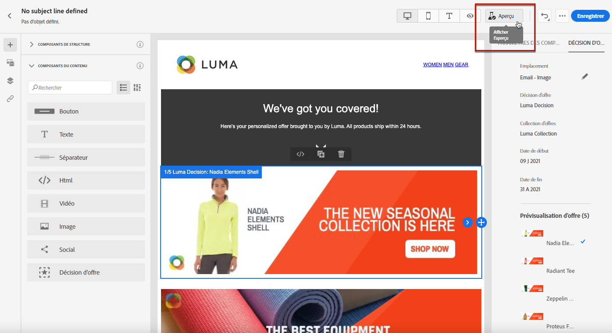
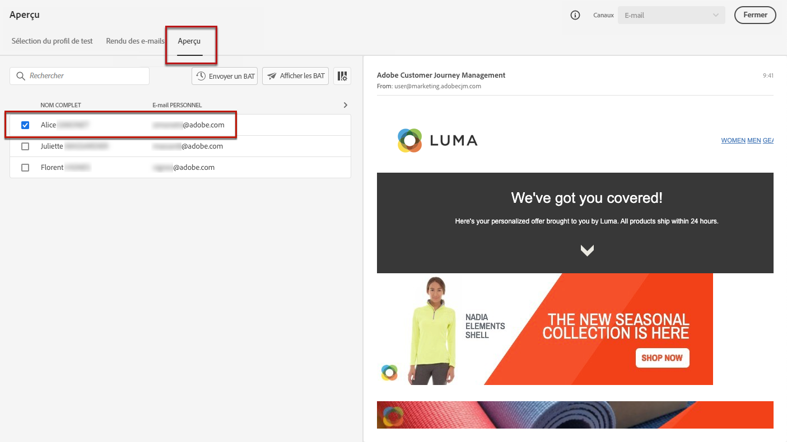

# Ajout d’offres personnalisées {#deliver-personalized-offers}

Dans [!DNL Journey Optimizer] e-mail, vous pouvez insérer des décisions (précédemment appelées &quot;activités d’offre&quot;) qui exploiteront le moteur de décision d’offre afin de sélectionner la meilleure offre à diffuser à vos clients.

Par exemple, vous pouvez ajouter une décision qui affichera dans votre email une offre de remise spéciale qui variera en fonction du niveau de fidélité du destinataire.

Pour plus d’informations sur la façon de créer et gérer des offres, reportez-vous à [cette section](offers/get-started/starting-offer-decisioning.md).

Pour un **exemple complet** montrant comment configurer des offres, les utiliser dans une décision et exploiter cette décision dans un email, consultez [cette section](offers/offers-e2e.md#insert-decision-in-email).

 [Découvrez comment ajouter des offres en tant que personnalisation dans cette vidéo](#video-offers)

## Insérer une décision dans un email {#insert-offers}

>[!CAUTION]
>
>Avant de commencer, vous devez [définir une décision d’offre](offers/offer-activities/create-offer-activities.md).

Pour insérer une décision dans un email, procédez comme suit :

1. Créez votre email, puis ouvrez le Concepteur d&#39;email pour configurer son contenu.

1. Ajoutez un composant de contenu **[!UICONTROL Décision d’offre]** .

   

   Découvrez comment utiliser les composants de contenu dans [cette section](content-components.md).

1. L’onglet **[!UICONTROL Décision de l’offre]** s’affiche dans la palette de droite. Cliquez sur **[!UICONTROL Sélectionner la décision d’offre]**.

   

1. Dans la fenêtre qui s’affiche, sélectionnez l’emplacement correspondant aux offres que vous souhaitez afficher.

   [Les placements sont des conteneurs utilisés pour présenter vos offres. ](offers/offer-library/creating-placements.md) Dans cet exemple, nous utiliserons l’emplacement « image en haut de l&#39;email ». Cet emplacement a été créé dans la bibliothèque des offres pour afficher les offres de type image situées en haut des messages.

1. Sélectionnez l’activité d’offre à utiliser dans le composant de contenu, puis cliquez sur **[!UICONTROL Ajouter]**.

   >[!NOTE]
   >
   >Seules les décisions compatibles avec l’emplacement sélectionné s’affichent dans la liste. Dans cet exemple, une seule activité d’offre correspond à l’emplacement « image en haut de l&#39;email ».

   

L’activité d’offre est alors ajoutée au composant.

## Prévisualiser des offres dans un email {#preview-offers-in-email}

Vous pouvez prévisualiser les différentes offres qui font partie de la décision ajoutée à l’email à l’aide de la section **[!UICONTROL Offres]** ou des flèches de composants de contenu.

Pour afficher les différentes offres qui font partie de la décision avec un profil client, procédez comme suit.

1. Cliquez sur **[!UICONTROL Aperçu]**.  

   

   >[!NOTE]
   >
   >Vous devez disposer de profils de test pour pouvoir prévisualiser vos messages. Découvrez comment [créer des profils de test](building-journeys/creating-test-profiles.md).

1. Pour choisir l’espace de noms à utiliser pour identifier les profils de test, sélectionnez **[!UICONTROL Email]** dans le champ **[!UICONTROL Identity namespace]** .

   >[!NOTE]
   >
   >Dans cet exemple, nous utiliserons l’espace de noms **Email**. Apprenez-en davantage sur les espaces de noms d&#39;identité d&#39;Adobe Experience Platform [dans cette section](https://experienceleague.adobe.com/docs/experience-platform/identity/namespaces.html?lang=fr#getting-started).

1. Dans la liste des espaces de noms d’identité, sélectionnez **[!UICONTROL Email]** et cliquez sur **[!UICONTROL Sélectionner]**.

1. Dans le champ **[!UICONTROL Valeur d’identité]** , saisissez la valeur pour identifier le profil de test. Dans cet exemple, saisissez l&#39;adresse email d&#39;un profil de test.

   <!--For example enter smith@adobe.com and click the **[!UICONTROL Add profile]** button.-->

1. Ajoutez d&#39;autres profils afin de pouvoir tester différentes variantes du message en fonction des données de profil.

   

1. Cliquez sur l&#39;onglet **[!UICONTROL Prévisualisation]** pour tester votre message.

1. Sélectionnez un profil de test. L&#39;offre correspondant au profil sélectionné (une femme) s&#39;affiche.

   

1. Sélectionnez d&#39;autres profils de test pour prévisualiser le contenu de l&#39;email pour chaque variante de votre message. Dans le contenu du message, l&#39;offre correspondant au profil de test sélectionné (désormais un homme) s&#39;affiche désormais.

   

Pour en savoir plus sur les étapes détaillées pour vérifier l’aperçu du message, consultez [cette section](#preview-your-messages).

## Vidéo pratique{#video-offers}

Découvrez comment ajouter un composant offer decisioning aux messages dans [!DNL Journey Optimizer].

>[!VIDEO](https://video.tv.adobe.com/v/334088?quality=12)
