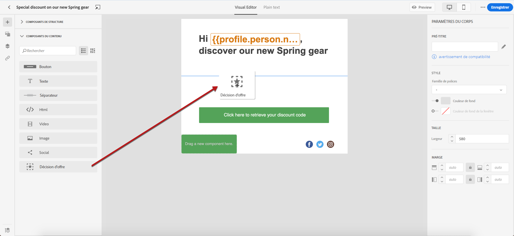
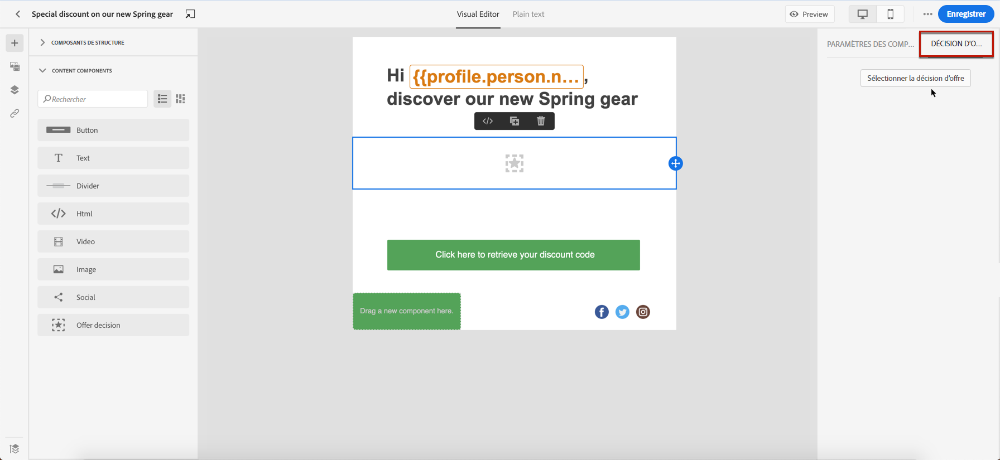
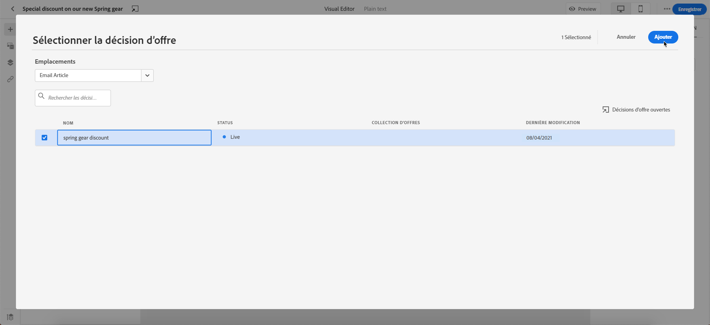

# Offres personnalisées d&#39;Ajoute {#deliver-personalized-offers}

## À propos de la gestion des décisions {#about-offer-decisioning}

Avec [!DNL Journey Optimizer], vous pouvez insérer dans vos décisions de messagerie électronique (précédemment connues sous le nom d&#39;activités d&#39;offre) des informations qui exploiteront le moteur de décision d&#39;Offre afin de sélectionner la meilleure offre à fournir à vos clients.

Par exemple, vous pouvez ajouter une décision qui affichera dans votre courriel une offre de remise spéciale qui variera en fonction du niveau de fidélité du destinataire.

Pour plus d&#39;informations sur la création et la gestion des offres, consultez [cette section](offers/get-started/starting-offer-decisioning.md).

## Insérer une décision dans un courrier électronique {#insert-offers}

Pour insérer une décision dans un message électronique, procédez comme suit :

1. Créez votre adresse électronique, puis ouvrez le concepteur de messagerie pour configurer son contenu.

1. Ajouter un composant de contenu **[!UICONTROL décision d&#39;Offre]** (voir [Utiliser les composants de contenu](content-components.md)).

   

1. Un onglet **[!UICONTROL décision d&#39;Offre]** est ajouté au composant. Cliquez sur **[!UICONTROL Personnalisation de l&#39;Ajoute - décision d&#39;Offre]** pour ajouter une activité d&#39;offre.

   

1. Sélectionnez l&#39;emplacement correspondant aux offres à afficher.

   Les placements sont des conteneurs utilisés pour présenter vos offres. Dans cet exemple, nous utiliserons l’emplacement &quot;Image de début de courrier électronique&quot;. Cet emplacement a été créé dans la bibliothèque d’Offres pour afficher les offres de type image situées en haut des messages.

1. Sélectionnez l’activité d’offre à utiliser dans le composant de contenu, puis cliquez sur **[!UICONTROL Ajouter]**.

   >[!NOTE]
   >
   >Notez que seules les décisions compatibles avec l&#39;emplacement sélectionné s&#39;affichent dans la liste. Dans cet exemple, une seule activité d’offre correspond à l’emplacement de l’&quot;image de l’en-tête du courrier électronique&quot;.

   

1. L’activité d’offre est maintenant ajoutée au composant. Vous pouvez prévisualisation les différentes offres qui font partie de la décision en utilisant la section **[!UICONTROL Offres]** ou les flèches des composants de contenu.

   
