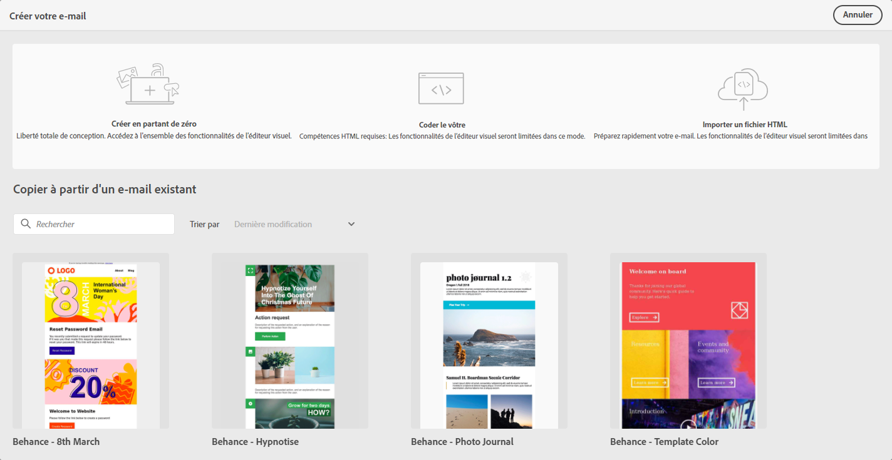

# Commencer la conception de courrier électronique {#get-started-content-design}

Lors de la création de contenu de courrier électronique avec [!DNL Journey Optimizer], vous pouvez :

* **Concevez vos e-mails à** partir de rien dans l&#39;interface du concepteur de vos e-mails et tirez parti des images de  [Adobe Experience Manager Assets Essentials](assets-essentials.md). Découvrez comment concevoir votre contenu de messagerie ou utiliser des modèles intégrés [dans cette section](create-email-content.md).

* **Code ou collez** du code HTML brut directement dans le concepteur de courrier électronique. Découvrez comment coder votre propre contenu [dans cette section](existing-content.md#import-raw-html-code).

* **Importez du** contenu HTML existant à partir d’un fichier ou d’un dossier .zip. Découvrez comment importer un contenu de courriel [dans cette section](existing-content.md#import-html-content-from-file).

Ces fonctionnalités sont toutes disponibles lors de l’accès au Concepteur de courriers électroniques à partir de l’écran de création de messages. [En savoir plus sur la création](create-message.md) de messages.

>[!NOTE]
>
>Notez que les modèles de la zone inférieure sont statiques et ne peuvent pas être modifiés. Elles ne sont disponibles qu&#39;à titre d&#39;illustration.
