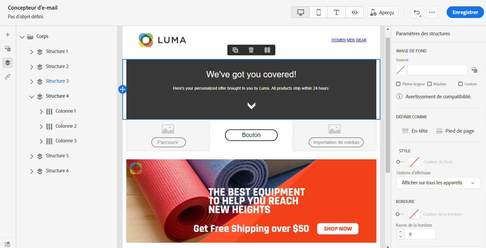
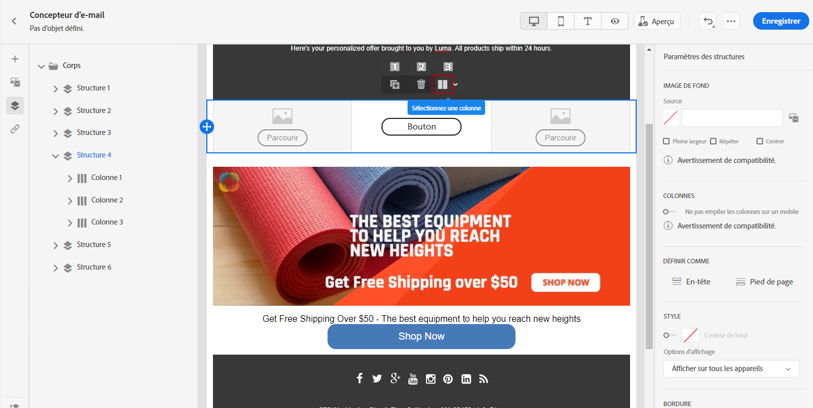

# Ajustement de l&#39;alignement vertical et la marge intérieure {#adjusting-vertical-alignment-and-padding}

Dans cet exemple, nous allons ajuster la marge intérieure et l&#39;alignement vertical à l&#39;intérieur d&#39;un composant de structure composé de trois colonnes.

1. Sélectionnez le composant de structure directement dans l’email ou à l’aide de l’**[!UICONTROL arborescence de navigation]** disponible dans le menu de gauche.

   

1. Dans la barre d&#39;outils, cliquez sur **[!UICONTROL Sélectionner une colonne]** et choisissez celle à modifier. Vous pouvez également la sélectionner dans l&#39;arborescence.

   Les paramètres modifiables pour cette colonne sont affichés dans le menu **[!UICONTROL Paramètres de colonne]**.

   

1. Sous **[!UICONTROL Alignement vertical]**, sélectionnez **[!UICONTROL Bas]**.

   Le composant de contenu se déplace en bas de la colonne.

   

1. Sous **[!UICONTROL Marge intérieure]**, définissez la marge intérieure supérieure à l&#39;intérieur de la colonne. Cliquez sur l’icône de verrou pour interrompre la synchronisation avec la marge intérieure inférieure.

   Définissez la marge intérieure gauche et droite de cette colonne.

   

1. Procédez de la même façon pour ajuster l’alignement et la marge intérieure des autres colonnes.

1. Enregistrez vos modifications.
