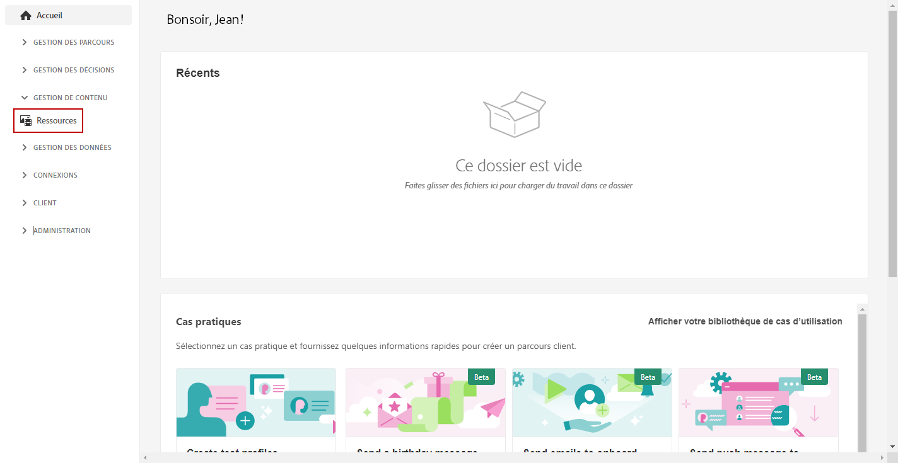
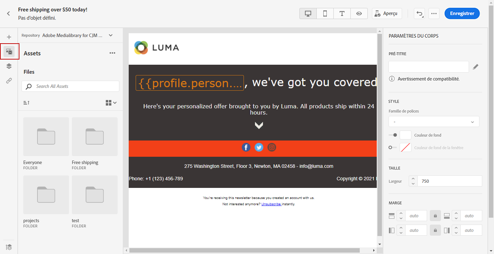
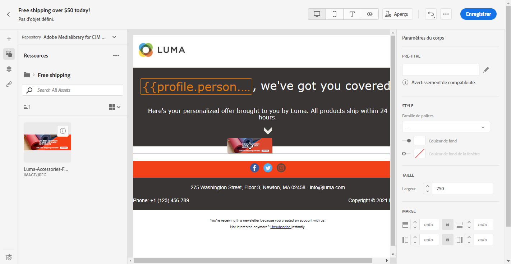
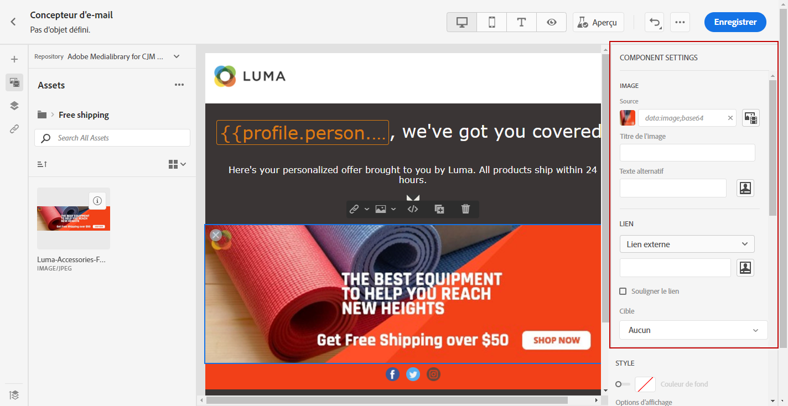

# Création et gestion des ressources. {#experience-manager-assets}

## Commencer avec [!DNL Assets Essentials]  {#get-started-assets-essentials}

[!DNL Adobe Experience Manager Assets Essentials] fournit un référentiel de ressources unique et centralisé que vous pouvez utiliser pour renseigner vos messages. Il est accessible directement à partir de [!DNL Adobe Journey Optimizer] via la section **[!UICONTROL Ressources]**. Vous pouvez également accéder aux ressources et aux dossiers lors de la conception d’un contenu d’e-mail. [En savoir plus sur la conception des e-mails](design-emails.md).

Avant d’utiliser [!DNL Adobe Experience Manager Assets Essentials], vous devez ajouter des utilisateurs aux profils de produit **Utilisateurs clients dʼAssets Essentials** ou/et **Utilisateurs dʼAssets Essentials**. [Pour en savoir plus, consultez la documentation sur Assets Essentials](https://experienceleague.adobe.com/docs/experience-manager-assets-essentials/help/deploy-administer.html?lang=fr){target=&quot;_blank&quot;}.

>[!NOTE]
>Pour les produits Journey Optimizer obtenus avant le 6 janvier 2022, vous devez déployer [!DNL Adobe Experience Manager Assets Essentials] pour votre organisation. Pour en savoir plus, consultez la section [Déploiement d’Assets Essentials](https://experienceleague.adobe.com/docs/experience-manager-assets-essentials/help/deploy-administer.html){target=&quot;_blank&quot;}.

## Téléchargement et ajout de ressources{#add-asset}

Pour importer des fichiers dans [!DNL Assets Essentials], vous devez d&#39;abord parcourir ou créer le dossier dans lequel il sera stocké. Vous pourrez alors les insérer dans le contenu de votre e-mail.

Pour plus d’informations sur le téléchargement de ressources, consultez la documentation [Adobe Experience Manager Assets Essentials](https://experienceleague.adobe.com/docs/experience-manager-assets-essentials/help/add-delete.html?lang=fr){target=&quot;_blank&quot;}.

1. Sur la page d’accueil de [!DNL Adobe Journey Optimizer], sélectionnez l’onglet **[!UICONTROL Ressources]** dans le menu **[!UICONTROL Gestion de contenu]** pour accéder à [!DNL Assets Essentials].

   

1. Double-cliquez sur un dossier dans la section centrale ou dans l’arborescence pour l’ouvrir.

   Vous pouvez également cliquer sur **[!UICONTROL Créer un dossier]** pour créer un nouveau dossier.

   

1. Une fois dans le dossier sélectionné ou créé, cliquez sur **[!UICONTROL Ajouter des ressources]** pour télécharger une nouvelle ressource dans votre dossier.

   

1. Dans la section **[!UICONTROL Téléchargement de fichiers]**, cliquez sur **[!UICONTROL Parcourir]** et choisissez si vous souhaitez **[!UICONTROL Parcourir les fichiers]** ou **[!UICONTROL Parcourir les dossiers]**.

   

1. Sélectionnez le fichier que vous souhaitez télécharger. Lorsque vous avez terminé, cliquez sur **[!UICONTROL Télécharger]**.

   Pour en savoir plus sur la gestion de vos ressources, consultez à ce sujet cette [page](https://experienceleague.adobe.com/docs/experience-manager-assets-essentials/help/manage-organize.html?lang=fr).

1. Une fois votre ressource téléchargée, vous pouvez désormais insérer vos ressources dans l’un de vos messages via le Concepteur d’e-mail.

   Votre ressource peut également être modifiée plus en détail à l’aide du mode d’**édition** de [!DNL Assets Essentials]. [En savoir plus](https://experienceleague.adobe.com/docs/experience-manager-assets-essentials/help/edit-images.html?lang=fr){target=&quot;_blank&quot;}.

   

1. Dans [!DNL Adobe Journey Optimizer], sélectionnez **[!UICONTROL Sélecteur de ressources]** dans le volet gauche du Concepteur d’e-mail.

   

1. Sélectionnez votre dossier Ressources. Vous pouvez également rechercher votre ressource ou votre dossier dans la barre de recherche.

1. Glissez-déposez votre ressource dans le contenu de votre e-mail.

   

1. Vous pouvez personnaliser davantage vos ressources, par exemple en ajoutant un lien externe ou du texte avec les **[!UICONTROL Paramètres des composants]**. [En savoir plus sur les paramètres des composants](content-components.md)

   

Une fois votre message créé et personnalisé, vous pouvez le publier pour le rendre disponible pour exécution. [En savoir plus](../messages/publish-manage-message.md)
