# Utiliser les composants de contenu du Concepteur d’email {#content-components}

>[!CONTEXTUALHELP]
>id="ac_content_components"
>title="À propos des composants de contenu"
>abstract="Les composants de contenu sont des espaces réservés de contenu vides que vous pouvez utiliser pour créer la disposition d&#39;un email."

Lorsque vous créez à partir de zéro votre contenu d&#39;e-mail, les **[!UICONTROL composants de contenu]** vous permettent de personnaliser davantage votre e-mail à l’aide de composants bruts et vides que vous pouvez utiliser une fois placés dans un e-mail.
Vous pouvez ajouter autant de **[!UICONTROL composants de contenu]** que nécessaire dans un **[!UICONTROL composant de structure]** qui définit la disposition de votre e-mail.

## Bouton {#buttons}

Utilisez le composant **[!UICONTROL Bouton]** pour insérer plusieurs boutons dans votre e-mail et rediriger votre audience d&#39;e-mail vers une autre page.

1. À partir de **[!UICONTROL Composants de contenu]**, faites glisser-déposer **[!UICONTROL Bouton]** dans un **[!UICONTROL composant de structure]**.

   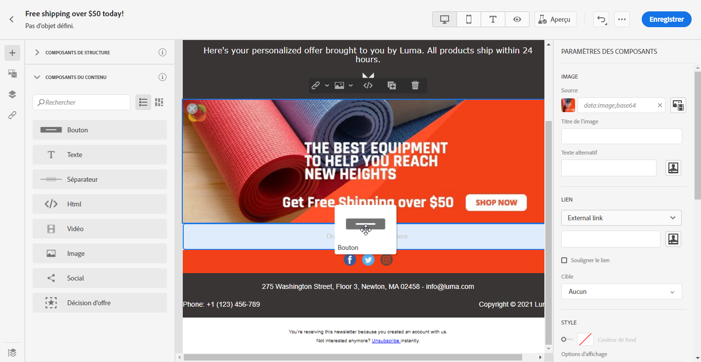

1. Cliquez sur votre bouton nouvellement ajouté pour personnaliser le texte et accéder aux **[!UICONTROL Paramètres des composants]** dans le volet droit du Concepteur d&#39;email.

   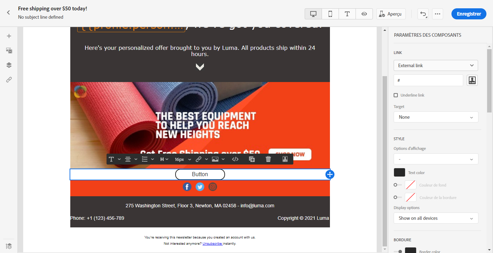

1. Dans le champ **[!UICONTROL Lien]** des **[!UICONTROL Paramètres des composants]**, ajoutez l’URL vers laquelle vous souhaitez que votre audience soit redirigée lorsqu&#39;elle clique sur le bouton.

1. Choisissez comment votre audience sera redirigée avec la liste déroulante **[!UICONTROL Cible]** :

   * **[!UICONTROL Aucune]** : ouvre le lien dans le même cadre que celui sur lequel l’utilisateur a cliqué (par défaut).
   * **[!UICONTROL Vierge]** : ouvre le lien dans une nouvelle fenêtre ou un nouvel onglet.
   * **[!UICONTROL Self]** : ouvre le lien dans le même cadre que celui sur lequel l’utilisateur a cliqué.
   * **[!UICONTROL Parent]** : ouvre le lien dans le cadre parent.
   * **[!UICONTROL Haut]** : ouvre le lien dans le corps complet de la fenêtre.

   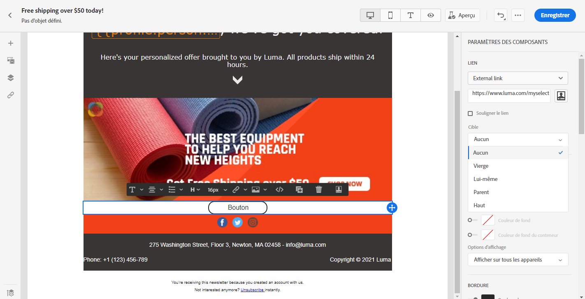

1. Vous pouvez désormais personnaliser davantage votre bouton en modifiant, par exemple, **[!UICONTROL Style]**, **[!UICONTROL Marge]** et **[!UICONTROL Bordure]**.

## Texte {#text}

Utilisez le composant **[!UICONTROL Texte]** pour insérer du texte dans votre email. Vous pouvez ajuster la couleur, le style et la taille de votre texte dans **[!UICONTROL Paramètres des composants]**.

1. Dans **[!UICONTROL Composants de contenu]**, faites glisser-déposer **[!UICONTROL Texte]** dans un composant **[!UICONTROL Structure]**.

   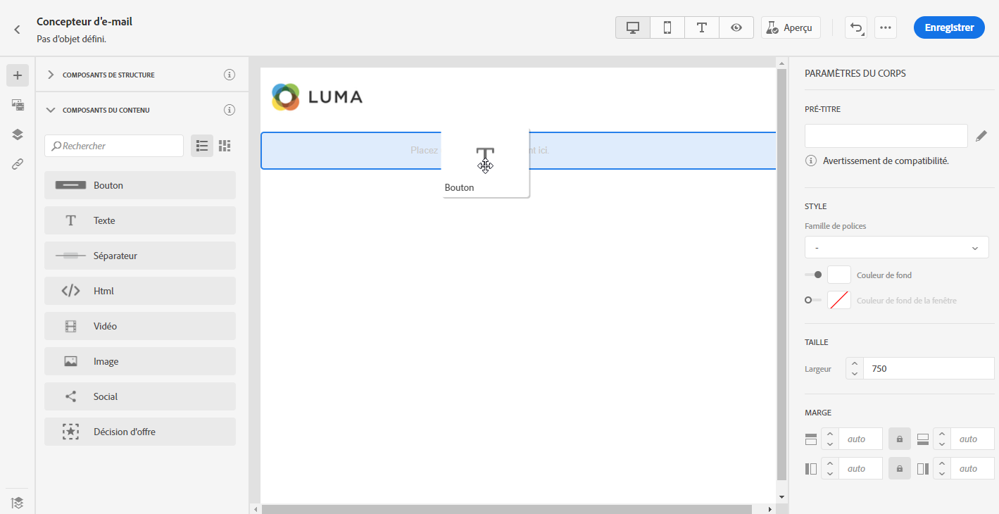

1. Cliquez sur votre composant nouvellement ajouté pour personnaliser le texte et accéder aux **[!UICONTROL Paramètres des composants]** dans le volet droit du Concepteur d&#39;email.

1. Modifiez votre texte à l’aide des options suivantes disponibles dans la barre d’outils :

   

   * **[!UICONTROL Modifier le style de texte]** : appliquez des caractères gras, italiques, soulignés ou barrés à votre texte.
   * **Modifier l&#39;alignement** : choisissez entre l’alignement à gauche, à droite, centré ou justifié pour votre texte.
   * **[!UICONTROL Créer une liste]** : ajoutez une puce ou une liste numérique à votre texte.
   * **[!UICONTROL Définir le titre]** : ajoutez jusqu&#39;à six niveaux d&#39;en-tête à votre texte.
   * **Taille de police** : sélectionnez la taille de police de votre texte en pixels.
   * **[!UICONTROL Modifier l&#39;image]** : ajoutez une image ou une ressource à votre composant de texte. [En savoir plus sur la gestion des ressources numériques](assets-essentials.md).
   * **[!UICONTROL Afficher le code source]** : affichez le code source de votre texte. Ceci ne peut pas être modifié.
   * **[!UICONTROL Dupliquer]** : ajoutez une copie de votre composant de texte.
   * **[!UICONTROL Supprimer]** : supprimez le composant de texte sélectionné de votre e-mail.
   * **[!UICONTROL Ajouter une personnalisation]** : ajoutez des champs de personnalisation pour personnaliser le contenu à partir des données de vos profils. [En savoir plus sur la personnalisation de contenu](../personalization/personalize.md).

1. Pour optimiser l’expérience utilisateur, vous pouvez ajouter des champs de personnalisation pour cibler votre audience. Pour plus d’informations à ce sujet, consultez cette [section](../personalization/personalize.md).

1. Ajustez la **[!UICONTROL couleur du texte]**, **[!UICONTROL famille de polices]** et **[!UICONTROL taille]** dans les **[!UICONTROL paramètres des composants]**.

   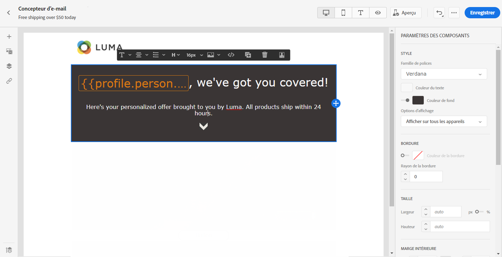

## Diviseur {#divider}

Utilisez le composant **[!UICONTROL Diviseur]** pour insérer une ligne de séparation afin d’organiser la disposition et le contenu de votre e-mail.
Vous pouvez sélectionner la couleur, le style et la taille de la ligne de rupture dans **[!UICONTROL Paramètres des composants]**.

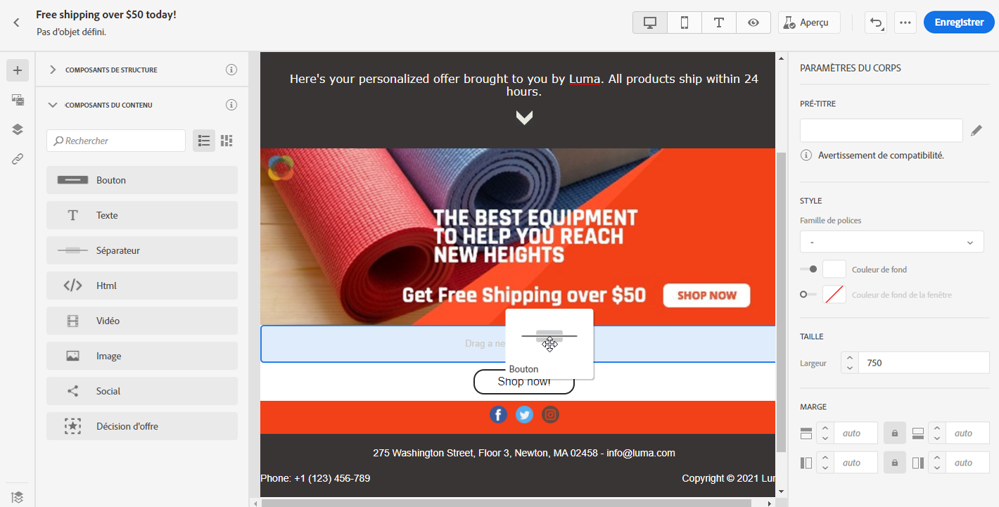

## HTML {#HTML}

Utilisez **[!UICONTROL HTML]** pour copier-coller les différentes parties de votre code HTML existant. Cela vous permet de créer des composants HTML modulaires gratuits.

Pour rendre un contenu externe compatible avec le Concepteur d’email, Adobe recommande de créer entièrement un message et de copier le contenu de votre email existant dans des composants.

1. Dans **[!UICONTROL Composants de contenu]**, faites glisser-déposer **[!UICONTROL HTML]** dans un **[!UICONTROL composant de structure]**.

   

1. Cliquez sur votre nouveau composant ajouté, puis **[!UICONTROL Afficher le code source]** pour ajouter votre code HTML.

   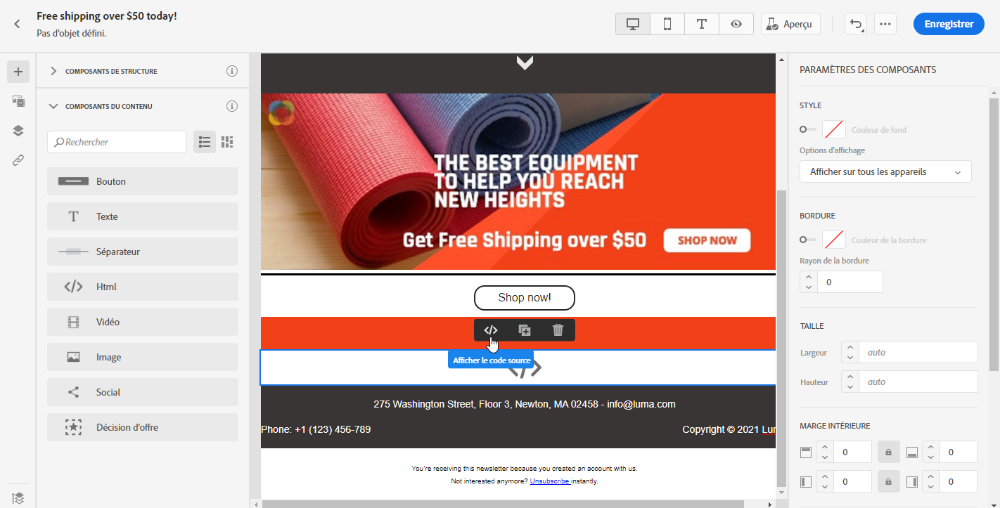

1. Copiez-collez le code HTML à ajouter à votre e-mail et cliquez sur **[!UICONTROL Enregistrer]**.

1. Vous pouvez désormais personnaliser davantage votre code HTML en modifiant le **[!UICONTROL style]**, la **[!UICONTROL marge]** et la **[!UICONTROL bordure]** par exemple ou en ajoutant un lien pour rediriger votre audience vers un autre contenu.

## Image {#image}

Utilisez le composant **[!UICONTROL Image]** pour insérer un fichier image de votre ordinateur dans votre e-mail.

1. Dans **[!UICONTROL Composants de contenu]**, faites glisser-déposer une **[!UICONTROL image]** dans un **[!UICONTROL composant de structure]**.

   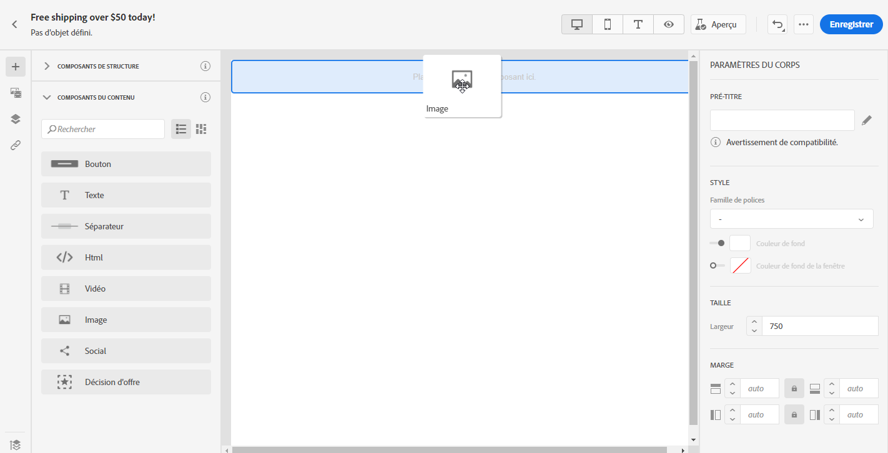

1. Cliquez sur **[!UICONTROL Parcourir]** pour choisir un fichier image dans vos ressources.

   Pour en savoir plus sur [!DNL Assets Essentials], consultez la [documentation Adobe Experience Manager Assets Essentials](https://experienceleague.adobe.com/docs/experience-manager-assets-essentials/help/introduction.html?lang=fr){target=&quot;_blank&quot;}.

1. Cliquez sur le composant que vous venez d&#39;ajouter pour configurer vos **[!UICONTROL composants de contenu]** et pour accéder aux **[!UICONTROL Paramètres des composants]** dans le volet droit du Concepteur d&#39;email.

1. Configurez vos propriétés d’image :

   * **[!UICONTROL Titre d&#39;image]** vous permet de définir un titre pour votre image.
   * **[!UICONTROL Text alt]** vous permet de définir la légende liée à votre image. Cela correspond à l’attribut alt en HTML.

   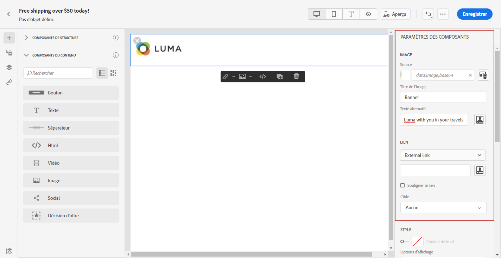

1. Vous pouvez désormais personnaliser davantage votre image en modifiant le **[!UICONTROL style]**, la **[!UICONTROL marge]** et la **[!UICONTROL bordure]** par exemple ou en ajoutant un lien pour rediriger votre audience vers un autre contenu.

## Vidéo {#Video}

>[!CONTEXTUALHELP]
>id="ac_edition_video"
>title="Paramètres vidéo"
>abstract="Utilisez ce composant pour insérer une vidéo dans votre email. Notez que les vidéos ne fonctionnent pas sur tous les clients de messagerie. Nous vous conseillons de définir une image de remplacement."
>additional-url="https://www.emailonacid.com/blog/article/email-development/a_how_to_guide_to_embedding_html5_video_in_email/" text="Informations supplémentaires"

Utilisez le composant **[!UICONTROL Vidéo]** pour insérer une vidéo dans votre e-mail via un lien URL.

1. Dans **[!UICONTROL Composants de contenu]**, faites glisse-déposer une **[!UICONTROL vidéo]** dans un **[!UICONTROL composant de tructure]**.

   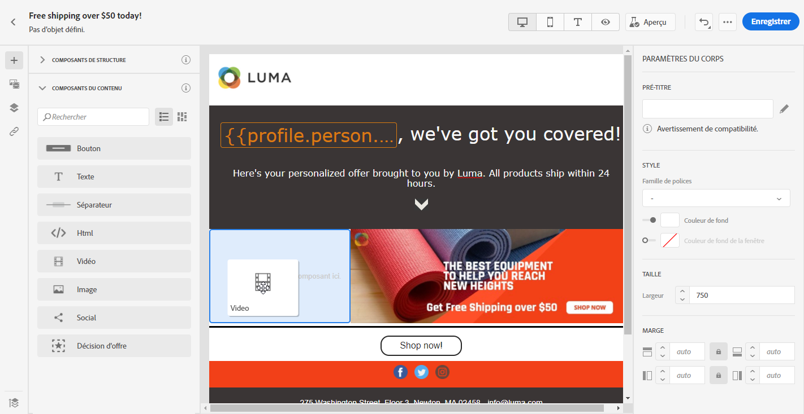

1. Cliquez sur le composant que vous venez d&#39;ajouter pour configurer vos **[!UICONTROL composants de contenu]** et pour accéder aux **[!UICONTROL Paramètres des composants]** dans le volet droit du Concepteur d&#39;email.

1. Dans le champ **[!UICONTROL Lien vidéo]** des **[!UICONTROL Paramètres des composants]**, ajoutez votre URL de vidéo.

   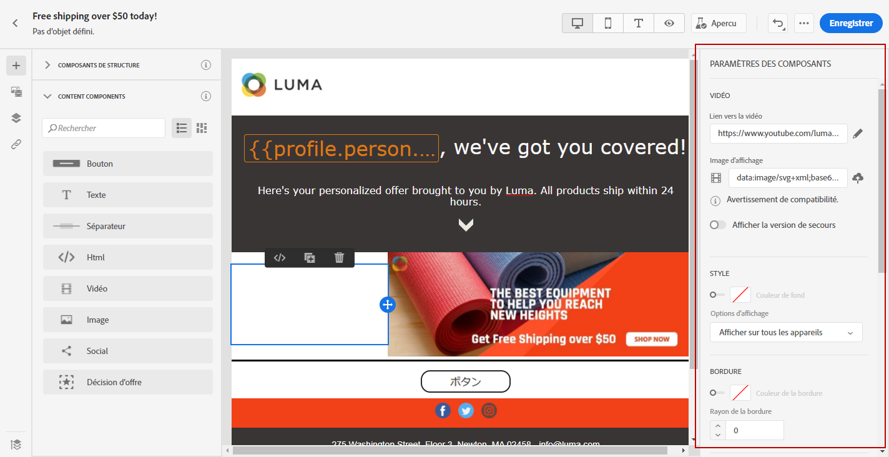

1. Vous pouvez ajouter une **[!UICONTROL image d’illustration]** à votre vidéo pour spécifier une image à afficher jusqu’à ce que votre audience clique sur le bouton de lecture.

1. Vous pouvez désormais personnaliser davantage votre image en modifiant, par exemple, **[!UICONTROL Style]**, **[!UICONTROL Marge]** et **[!UICONTROL Bordure]**.

## Social {#social}

Utilisez le composant **[!UICONTROL Social]** pour insérer des liens vers des pages de réseaux sociaux dans votre e-mail.

1. Dans **[!UICONTROL Composants de contenu]**, faites glisser-déposer l&#39;élément **[!UICONTROL Social]** dans un **[!UICONTROL composant de structure]**.

   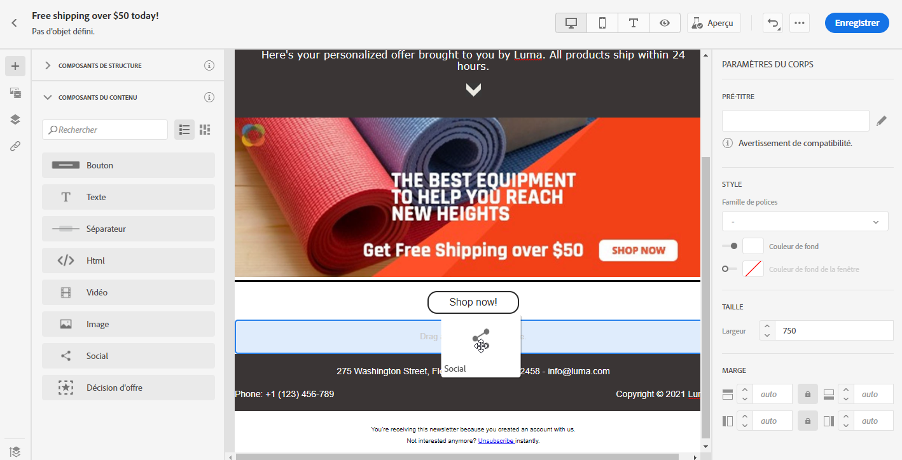

1. Cliquez sur le composant que vous venez d&#39;ajouter pour configurer vos **[!UICONTROL composants de contenu]** et pour accéder aux **[!UICONTROL Paramètres des composants]** dans le volet droit du Concepteur d&#39;email.

1. Dans le champ **[!UICONTROL Social]** des **[!UICONTROL Paramètres des composants]**, sélectionnez le réseau social que vous souhaitez ajouter ou supprimer.

   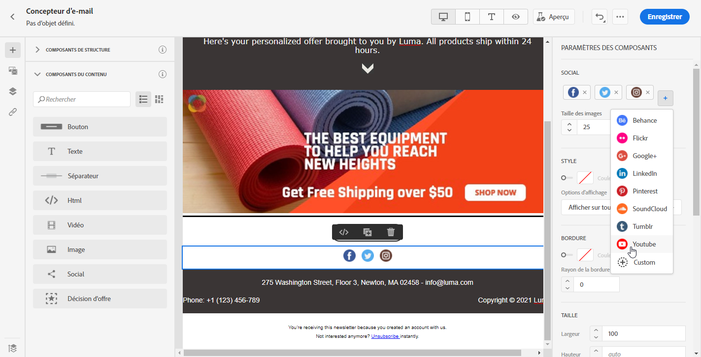

1. Sélectionnez la taille de vos icônes dans le champ **[!UICONTROL Taille des images]**.

1. Cliquez sur chacune des icônes de vos réseaux sociaux pour configurer l&#39;**[!UICONTROL URL]** vers laquelle votre audience sera redirigée.

   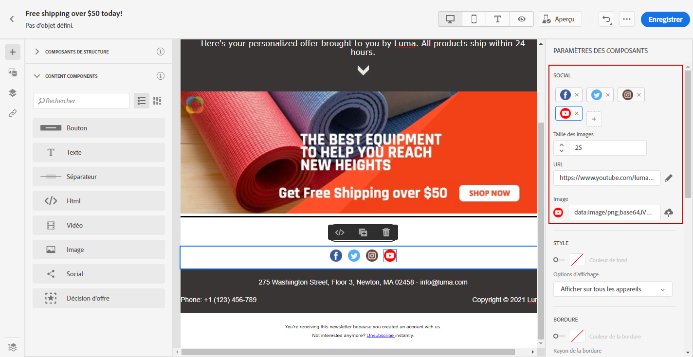

1. Vous pouvez également modifier les icônes de chacun de vos réseaux sociaux si nécessaire dans le champ **[!UICONTROL Image]**.

1. Vous pouvez désormais personnaliser davantage vos icônes de réseaux sociaux en modifiant les paramètres **[!UICONTROL Style]**, **[!UICONTROL Marge]** et **[!UICONTROL Bordure]**.

## Décision d&#39;offre {#offer-decision}

Utilisez le composant **[!UICONTROL Décision d’offre]** pour insérer des décisions dans vos messages. Les décisions s’appuient sur la gestion de décision pour choisir la meilleure offre à fournir à vos clients.

Rubriques connexes :

* [Prise en main de la gestion des décisions](../offers/get-started/starting-offer-decisioning.md)
* [Ajouter des offres personnalisées dans les emails](deliver-personalized-offers.md)
