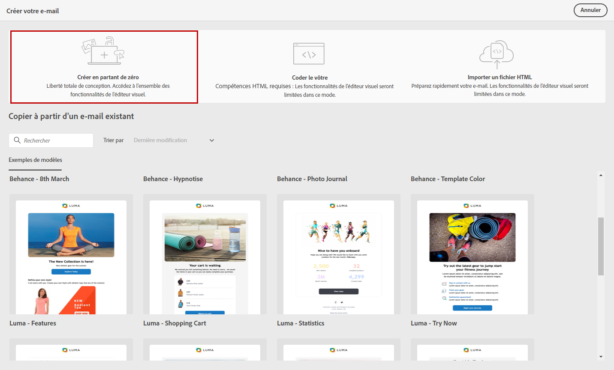
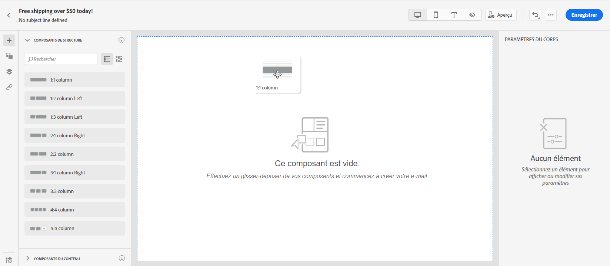
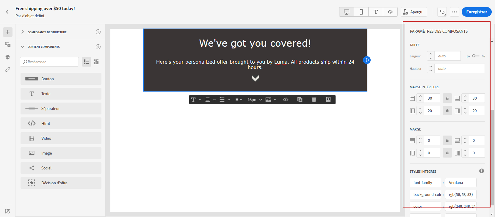
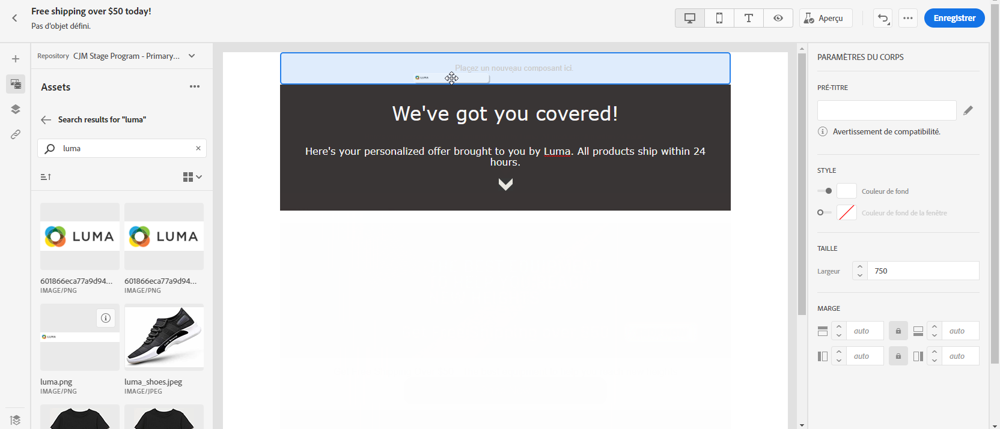
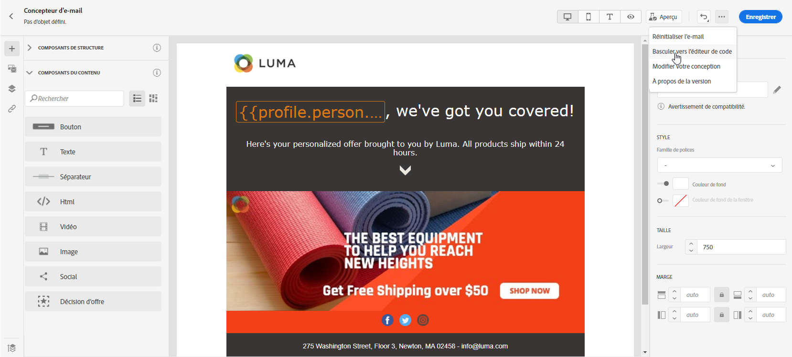

# Commencer à partir de zéro {#create-email-content}

>[!CONTEXTUALHELP]
>id="ac_structure_components"
>title="À propos des composants de structure"
>abstract="Les composants de structure définissent la disposition de votre email."

>[!CONTEXTUALHELP]
>id="ac_edition_columns"
>title="Définition des colonnes de l’email"
>abstract="Le Concepteur d’email vous permet de définir facilement la disposition de votre email en définissant la structure des colonnes."

Le Concepteur d’email permet de définir facilement la structure de votre email. En ajoutant et en déplaçant des éléments structurels à l’aide de simples actions de glisser-déposer, vous pouvez concevoir la forme de votre email en quelques secondes.

Pour commencer à créer le contenu de votre e-mail avec le Concepteur d&#39;e-mail, procédez comme suit :

1. Dans la page d&#39;accueil du Concepteur d&#39;e-mail, cliquez sur le bouton **[!UICONTROL Créer en partant de zéro]**.

   

1. Commencez à concevoir le contenu de votre e-mail à l&#39;aide du glisser-déposer de **[!UICONTROL composants de structure]** pour définir la mise en page de votre e-mail.

   >[!NOTE]
   >
   >Les colonnes empilées ne sont pas compatibles avec tous les programmes de messagerie. Lorsqu’elles ne sont pas prises en charge, les colonnes ne sont pas empilées.
   >
   >Une fois qu’ils ont été placés dans l’email, vous ne pouvez pas déplacer ni supprimer vos composants, à moins qu’un composant de contenu ou un fragment ne soit déjà placé à l’intérieur.

   

1. Ajoutez autant de **[!UICONTROL composants de structure]** que nécessaire.

   Sélectionnez le composant **[!UICONTROL n:n colonne]** pour définir le nombre de colonnes de votre choix (entre 3 et 10). Vous pouvez également définir la largeur de chaque colonne en déplaçant les flèches situées en bas de chaque colonne.

   >[!NOTE]
   >
   >La taille de chaque colonne ne peut pas être inférieure à 10 % de la largeur totale du composant de structure. Vous ne pouvez pas supprimer une colonne qui n’est pas vide.

1. Dans la liste déroulante **[!UICONTROL Composants du contenu]**, vous pouvez ajouter autant de **[!UICONTROL Composants de contenu]** que nécessaire dans votre composant de structure. [En savoir plus sur les composants de contenu](content-components.md).

   

1. Chaque composant peut être davantage personnalisé via la section **[!UICONTROL Paramètres des composants]**. Par exemple, vous pouvez changer le style de texte, la marge intérieure ou la marge de votre composant. [En savoir plus sur l’alignement et la marge intérieure](adjusting-vertical-alignment-and-padding.md).

   

1. À partir du **[!UICONTROL sélecteur de ressources]**, vous pouvez ajouter directement à votre adresse email des ressources stockées dans la **[!UICONTROL bibliothèque de ressources]**. [En savoir plus sur la gestion des ressources](assets-essentials.md).

   Double-cliquez sur le dossier contenant vos ressources, puis faites glisser et déposez la ressource que vous souhaitez ajouter à votre email.

   

1. Ajoutez des champs de personnalisation pour personnaliser le contenu à partir des données de vos profils. [En savoir plus sur la personnalisation de contenu](../personalization/personalize.md).

   

1. Dans l’onglet **[!UICONTROL Liens]** du volet de gauche, vérifiez la liste de toutes les URL de votre contenu qui feront l’objet d’un suivi. Si nécessaire, vous pouvez modifier leur **[!UICONTROL Type de tracking]**, leur **[!UICONTROL Libellé]** et leurs **[!UICONTROL Balises]**.

   

   >[!NOTE]
   >
   >Pour en savoir plus sur les liens et le suivi des messages, consultez [cette page](message-tracking.md).

1. Au besoin, vous pouvez passer à l’éditeur de code pour personnaliser davantage votre e-mail en cliquant sur **[!UICONTROL Basculer vers l’éditeur de code]** dans le menu avancé. Pour plus d’informations sur l’éditeur de code, consultez [cette page](code-content.md#).

   >[!NOTE]
   >
   >Vous ne pourrez pas utiliser le concepteur visuel pour cet e-mail après avoir basculé vers l’éditeur de code.

   

1. Cliquez sur **[!UICONTROL Afficher l&#39;aperçu]** pour vérifier le rendu de votre e-mail. Vous pouvez choisir la vue bureau ou la vue mobile.

   Pour plus d&#39;informations sur la façon de prévisualiser votre e-mail, reportez-vous à [cette page](preview.md).

   

1. Lorsque votre email est prêt, cliquez sur **[!UICONTROL Enregistrer et fermer]**.

Le contenu de votre email peut maintenant être utilisé dans un message. [Découvrez comment envoyer un message](../messages/publish-manage-message.md).
