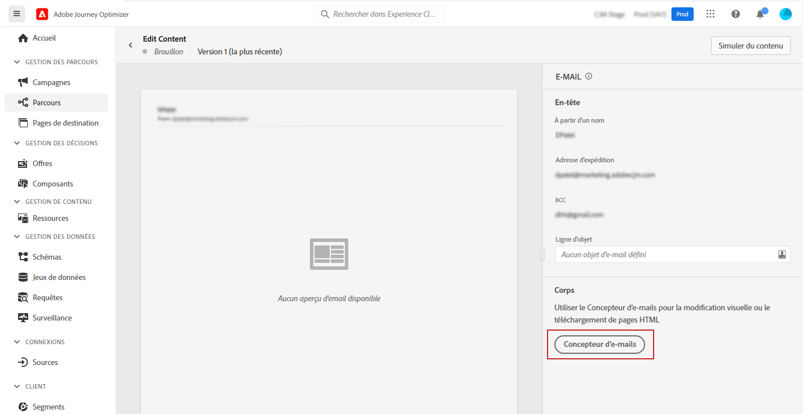
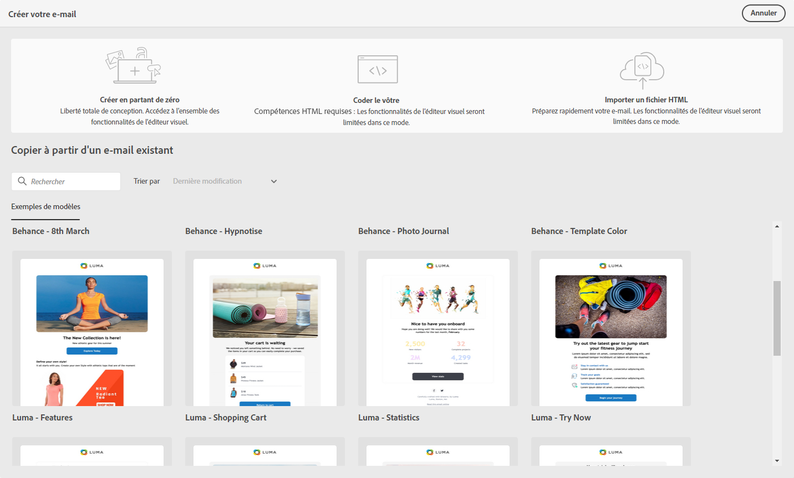

# Prise en main de la conception d’e-mails {#get-started-content-design}

➡️ [Découvrez cette fonctionnalité en vidéo](#video)

1. Dans le message que vous venez de créer, sélectionnez **[!UICONTROL Concepteur d&#39;email]** dans la section **[!UICONTROL Corps]**.

   

1. Dans la page d&#39;accueil du Concepteur d&#39;email, choisissez la manière de concevoir votre email à l&#39;aide des options suivantes :

   * **Concevoir vos e-mails à partir de rien** dans l&#39;interface du concepteur d&#39;e-mail et tirer parti des images provenant de [Adobe Experience Manager Assets Essentials](assets-essentials.md). Découvrez comment concevoir votre contenu d&#39;e-mail ou utiliser des modèles intégrés [dans cette section](create-email-content.md).

   * **Copier à partir d’un e-mail existant** depuis une liste d’exemples de modèles.

   * **Codez ou collez du code HTML brut** directement dans le concepteur d&#39;email. Découvrez comment coder votre propre contenu [dans cette section](code-content.md).

   * **Importez du contenu HTML existant** à partir d’un fichier ou d’un dossier .zip. Découvrez comment importer un contenu d&#39;e-mail [dans cette section](existing-content.md).

   

Ces fonctionnalités sont toutes disponibles lors de l’accès au concepteur d’email à partir de l’écran de création de messages. [En savoir plus sur la création de messages](../messages/get-started-content.md).

>[!NOTE]
>
>Notez que les modèles de la zone inférieure sont statiques et ne peuvent pas être modifiés. Ils ne sont disponibles qu&#39;à titre d&#39;illustration.
>
>Une fois que vous avez [créé votre message](../messages/get-started-content.md), vous pouvez commencer à créer le contenu de votre e-mail.

## Vidéo pratique {#video}

Découvrez comment créer du contenu d&#39;e-mail avec l&#39;éditeur de messages.

>[!VIDEO](https://video.tv.adobe.com/v/334150?quality=12)