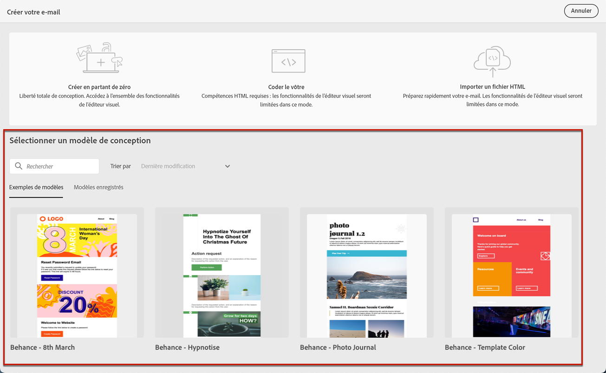
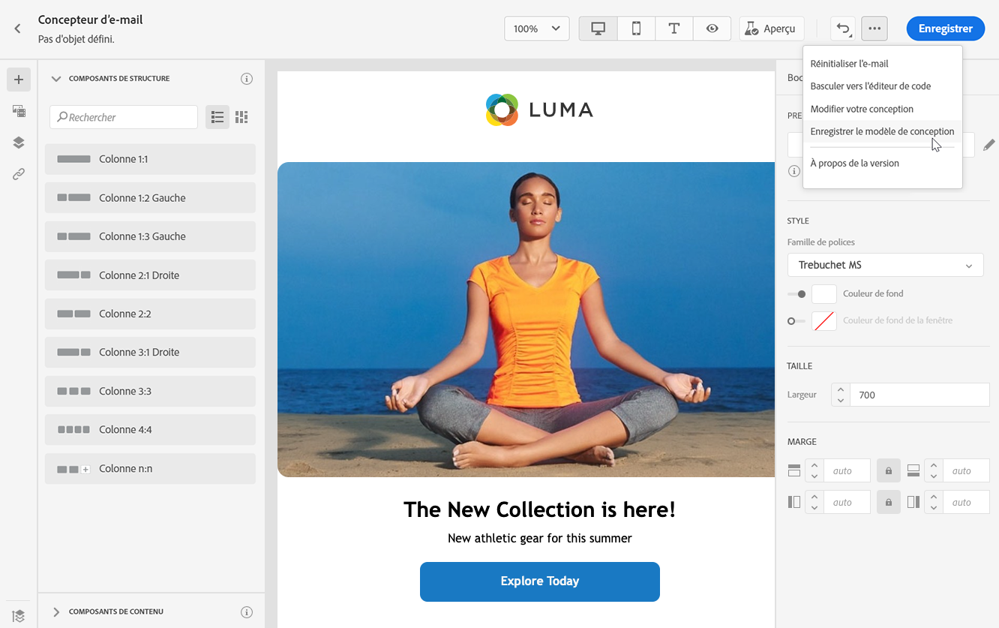
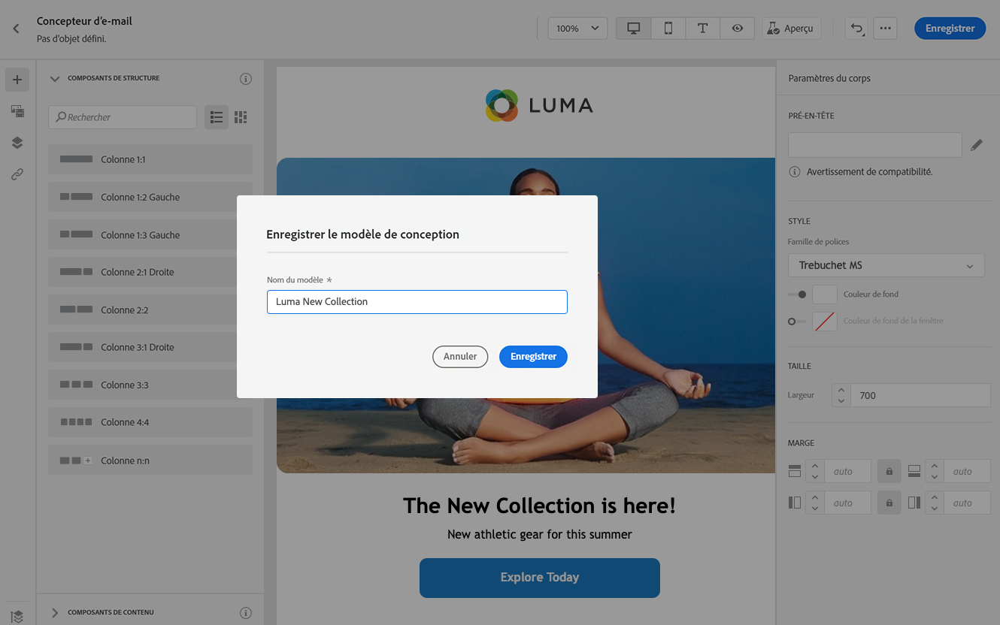
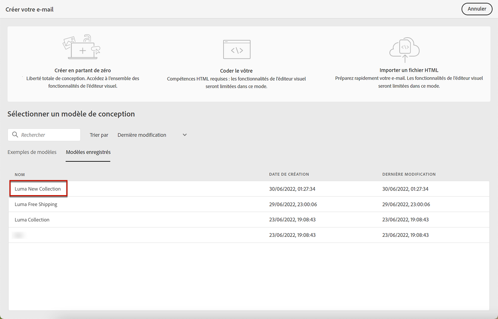
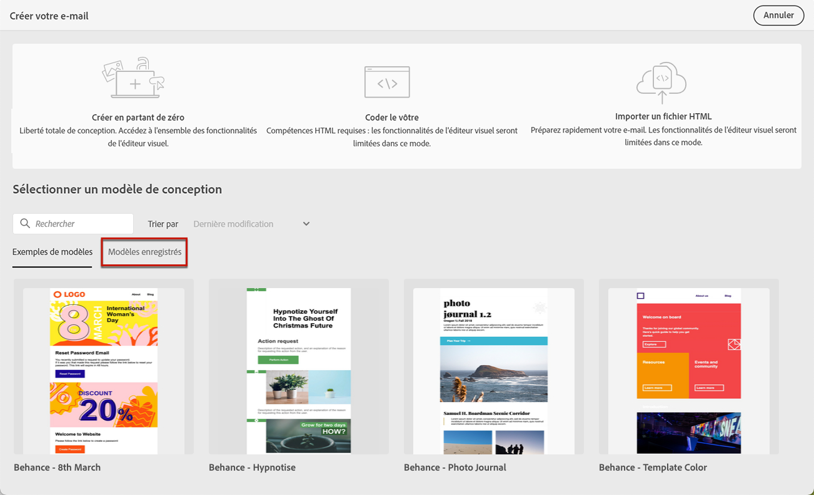
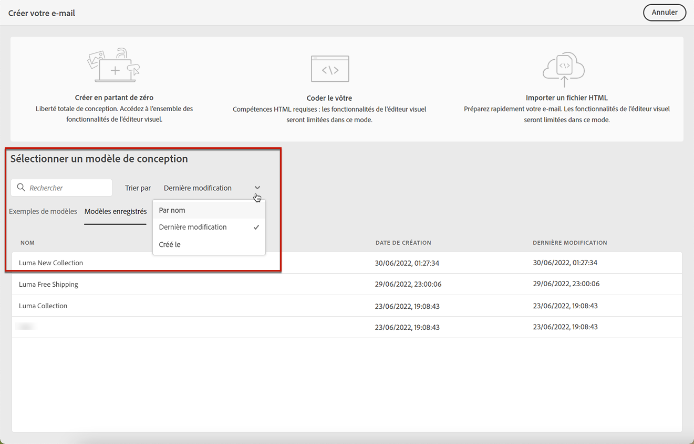
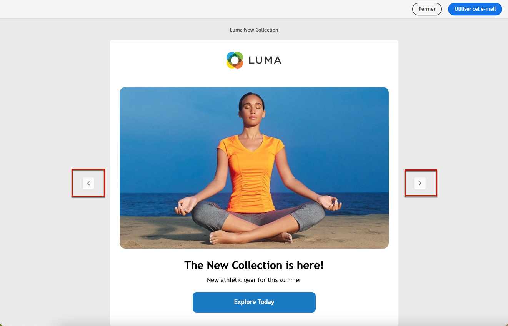

# Utiliser des modèles d’e-mail {#email-templates}

Utilisez la section **[!UICONTROL Sélectionner un modèle de conception]** pour commencer à créer votre contenu à partir d’un modèle.

Vous pouvez choisir parmi les options suivantes :
* 20 modèles d’e-mail prêts à l’emploi.
* Modèles enregistrés. [En savoir plus](#save-as-template)

## Enregistrer en tant que modèle {#save-as-template}

>[!CONTEXTUALHELP]
>id="ajo_messages_depecrated_inventory"
>title="Découvrez comment migrer vos messages"
>abstract="Le 25 juillet 2022, le menu Messages a disparu et les messages sont maintenant créés directement depuis un Parcours. Si vous souhaitez réutiliser vos messages hérités dans les parcours, vous devez les enregistrer en tant que modèles."

Une fois que vous avez créé le [contenu de votre e-mail](design-emails.md), vous pouvez l’enregistrer pour une réutilisation ultérieure. Pour ce faire, suivez les étapes ci-après.

1. Cliquez sur les points de suspension en haut à droite de l’écran.

1. Sélectionnez **[!UICONTROL Enregistrer le modèle de conception]** dans le menu déroulant.

   

1. Ajoutez un nom pour ce modèle.

   

1. Cliquez sur **[!UICONTROL Enregistrer]**.

La prochaine fois que vous créerez un e-mail, vous pourrez utiliser ce modèle pour créer votre contenu. [Voici comment procéder](#use-saved-template)

## Utiliser un modèle enregistré {#use-saved-template}

1. Ouvrez le [Concepteur d’e-mail](create-email-content.md).

1. Dans **[!UICONTROL Créer votre écran de messagerie]**, l’onglet **[!UICONTROL Exemples de modèles]** est sélectionné par défaut. Sélectionnez l’onglet **[!UICONTROL Modèles enregistrés]** .

   

1. La liste de tous les [modèles précédemment enregistrés](#save-as-template) s’affiche. Vous pouvez les trier : **[!UICONTROL Par nom]**, **[!UICONTROL Dernière modification]** et **[!UICONTROL Dernière création]**.

   

1. Sélectionnez le modèle de votre choix dans la liste.

1. Une fois sélectionné, vous pouvez naviguer entre tous les modèles enregistrés à l’aide des flèches droite et gauche.

   

1. Cliquez sur **[!UICONTROL Utiliser cet e-mail]** en haut à droite de l’écran.

1. Modifiez votre contenu selon vos besoins à l’aide du concepteur d’e-mail.
