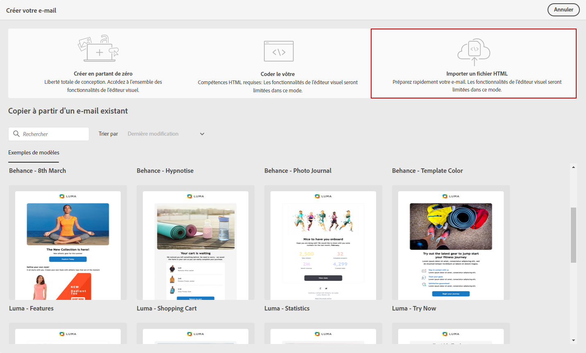

# Importation du contenu de vos e-mails {#existing-content}

Journey Optimizer vous permet d&#39;importer du contenu HTML existant pour concevoir vos e-mails. Ce contenu peut être le suivant :

* Un **fichier HTML** avec une feuille de style incorporée,
* Un **dossier .zip** avec le fichier HTML, la feuille de style (.css) et les images.

   >[!NOTE]
   >
   >Il n’existe aucune contrainte sur la structure des fichiers .zip. Cependant, les références doivent être relatives et s’ajuster à l’arborescence du dossier .zip.

Pour importer un fichier contenant du contenu HTML, procédez comme suit :

1. Dans la page d&#39;accueil du Concepteur d’email, sélectionnez **[!UICONTROL Importer du contenu HTML]**.

   

1. Faites glisser et déposez le fichier HTML ou .zip contenant votre contenu HTML.

1. Une fois le contenu HTML téléchargé, vous pouvez tirer parti des fonctions du Concepteur d’email pour modifier et prévisualiser votre e-mail. [En savoir plus dans cette section](create-email-content.md).

   

## Vidéo pratique {#video}

Découvrez comment importer du contenu HTML existant, améliorer la conception et ajouter une page miroir et des liens de désabonnement. Apprenez également comment coder le contenu.

>[!VIDEO](https://video.tv.adobe.com/v/334102?quality=12)
