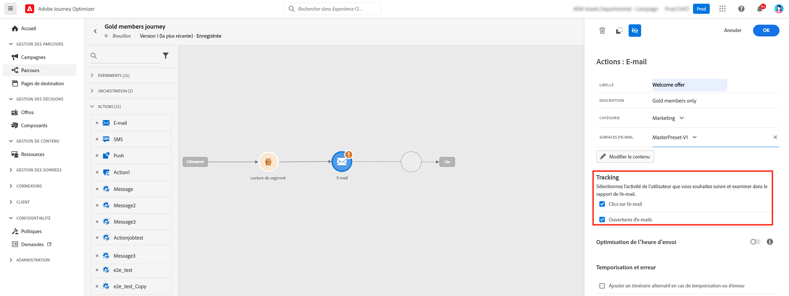
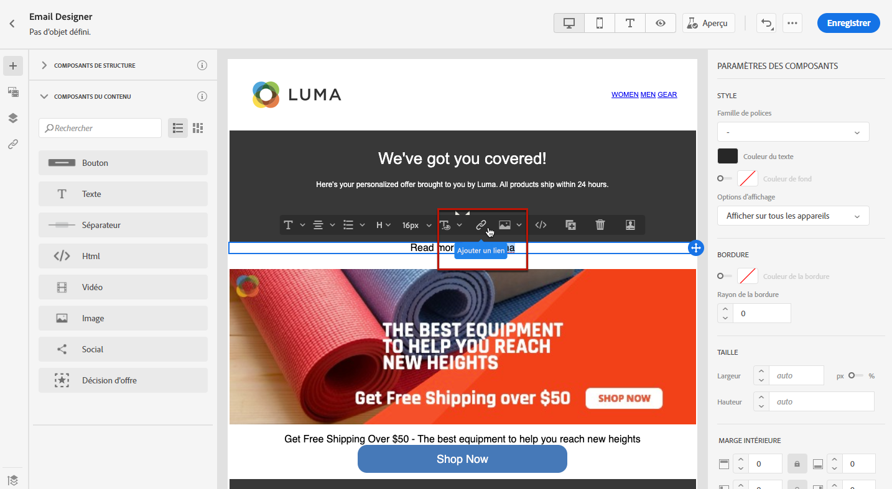
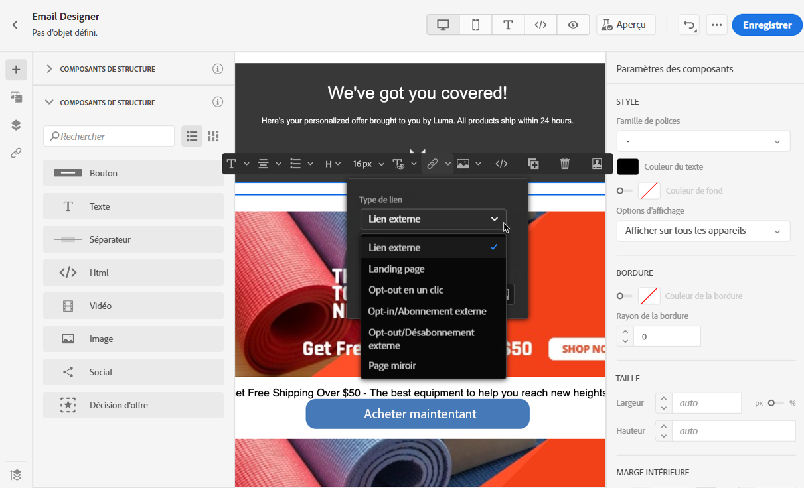
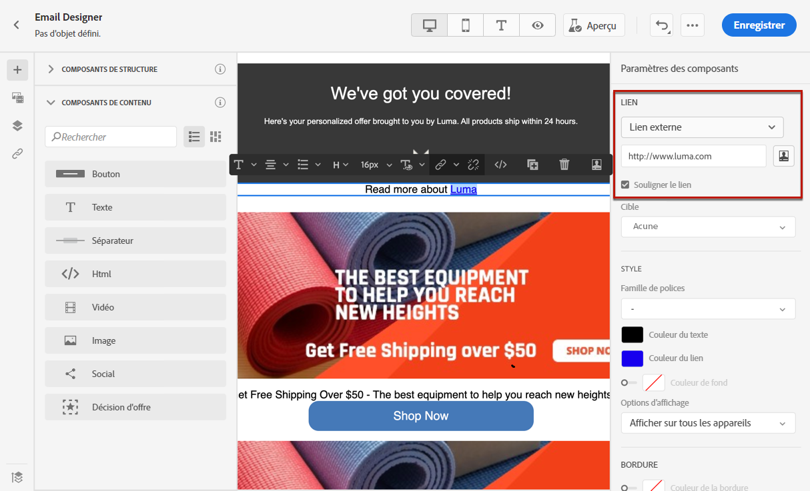
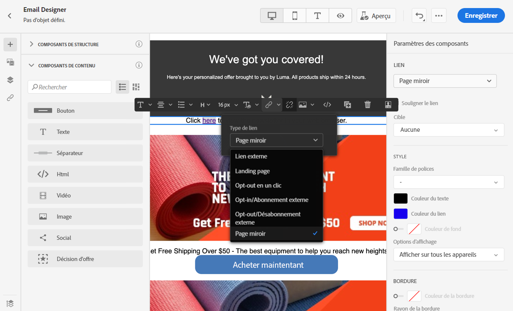
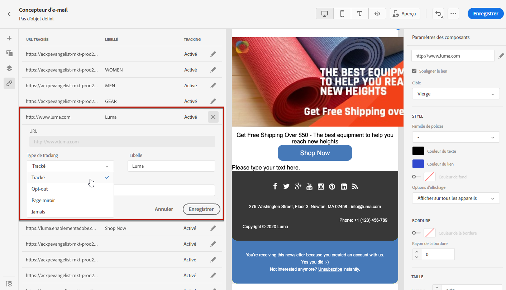

# Ajout de liens et suivi des messages {#tracking}

Utilisez [!DNL Journey Optimizer] pour ajouter des liens à votre contenu et suivre les messages envoyés afin de surveiller le comportement de vos destinataires.

## Activation du suivi {#enable-tracking}

Vous pouvez activer le suivi au niveau des e-mails en cochant les options **[!UICONTROL Ouvertures d’e-mails]** et/ou **[!UICONTROL Clics sur les e-mails]** lorsque vous [créez votre message](../messages/get-started-content.md).

>[!NOTE]
>
>Les deux options sont activées par défaut.

Vous pourrez ainsi suivre le comportement de vos destinataires via :

* **[!UICONTROL Ouvertures d’e-mails]** : messages ayant été ouverts.
* **[!UICONTROL Clics sur les e-mails]** : clics sur les liens dans un e-mail.

## Insertion de liens {#insert-links}

Lors de la conception d&#39;un message, vous pouvez ajouter des liens à votre contenu.

>[!NOTE]
>
>Lorsque le [suivi est activé](#enable-tracking), tous les liens inclus dans le contenu du message sont suivis.

Pour insérer des liens dans le contenu de votre e-mail, procédez comme suit :

1. Sélectionnez un élément et cliquez sur **[!UICONTROL Insérer un lien]** dans la barre d&#39;outils contextuelle.

   

1. Choisissez le type de lien que vous souhaitez créer :

   * **[!UICONTROL Lien externe]** : insérez un lien vers une URL externe.

   * **[!UICONTROL Page de destination]** : insérez un lien vers une page de destination. En savoir plus dans [cette section](../landing-pages/get-started-lp.md)

   * **[!UICONTROL Opt-out en un clic]** : insérez un lien pour permettre aux utilisateurs de se désabonner rapidement de vos communications sans avoir à confirmer leur opt-out. En savoir plus dans [cette section](../messages/consent.md#one-click-opt-out).

   * **[!UICONTROL Abonnement/opt-in externe]** : insérez un lien pour accepter la réception de communications de votre marque.

   * **[!UICONTROL Désabonnement/opt-out externe]** : insérez un lien pour se désabonner de la réception des communications de votre marque. En savoir plus sur la gestion des processus d’opt-out dans [cette section](../messages/consent.md#opt-out-management).

   * **[!UICONTROL Page miroir]** : insérez un lien pour afficher le contenu de l’e-mail dans un navigateur web. En savoir plus dans [cette section](#mirror-page).

   

1. Vous pouvez personnaliser vos liens. Pour en savoir plus sur les URL personnalisées, consultez [cette section](../personalization/personalization-syntax.md#perso-urls).

1. Enregistrez vos modifications.

1. Une fois le lien créé, vous pouvez toujours le modifier à partir du volet **[!UICONTROL Paramètres des composants]** à droite.

   * Vous pouvez éditer le lien et en modifier le type.
   * Vous pouvez souligner le lien ou non en cochant l’option correspondante.

   

>[!NOTE]
>
>Les e-mails de type marketing doivent inclure un [lien d’opt-out](../messages/consent.md#opt-out-management), qui n’est pas obligatoire pour les messages transactionnels. La catégorie du message (**[!UICONTROL Marketing]** ou **[!UICONTROL Transactionnel]**) est définie au niveau de la [surface de canal](../configuration/channel-surfaces.md#email-type) (c’est-à-dire au niveau du préréglage de message) et lors de la [création du message](../messages/get-started-content.md#create-new-message).

## Lien vers une page miroir {#mirror-page}

La page miroir est une page HTML accessible en ligne via un navigateur web. Son contenu est identique à celui de votre e-mail.

Pour ajouter un lien vers une page miroir dans votre e-mail, [insérez un lien](#insert-links) et sélectionnez **[!UICONTROL Page miroir]** comme type de lien.

La page miroir est automatiquement créée.

>[!NOTE]
>
>Vous ne pouvez pas modifier le lien généré automatiquement.

Une fois l&#39;e-mail envoyé, lorsque les destinataires cliquent sur le lien de la page miroir, le contenu de l’email s&#39;affiche dans leur navigateur web par défaut.

>[!NOTE]
>
>Dans le [BAT](preview.md#send-proofs) envoyé aux profils de test, le lien vers la page miroir n’est pas actif. Il n&#39;est activé que dans les messages finaux.

La période de conservation d’une page miroir est de 60 jours. Passé ce délai, la page miroir n’est plus disponible.

## Gestion du suivi {#manage-tracking}

Le [Concepteur d&#39;e-mail](create-email-content.md) permet de gérer les URL suivies, par exemple modifier le type de suivi pour chaque lien.

1. Cliquez sur l&#39;icône **[!UICONTROL Liens]** du volet de gauche pour afficher la liste de toutes les URL de votre contenu qui feront l&#39;objet d&#39;un suivi.

   Cette liste permet d&#39;avoir une vue centrale et de localiser chaque URL dans le contenu de l&#39;e-mail.

1. Pour modifier un lien, cliquez sur l&#39;icône de crayon correspondante.

   

1. Si nécessaire, vous pouvez modifier le **[!UICONTROL Type de suivi]** :

   

   Pour chaque URL suivie, vous pouvez définir le mode de tracking sur l&#39;une des valeurs suivantes :

   * **[!UICONTROL Suivi]** : active le tracking sur cette URL.
   * **[!UICONTROL Opt-out]** : considère cette URL comme une option d&#39;opt-out ou une URL de désabonnement.
   * **[!UICONTROL Page miroir]** : considère cette URL comme une URL de page miroir.
   * **[!UICONTROL Jamais]** : n&#39;active jamais le suivi de cette URL. <!--This information is saved: if the URL appears again in a future message, its tracking is automatically deactivated.-->

La création de rapports sur les ouvertures et les clics est disponible dans le [rapport dynamique](../reports/live-report.md) et dans le [rapport global](../reports/global-report.md).
