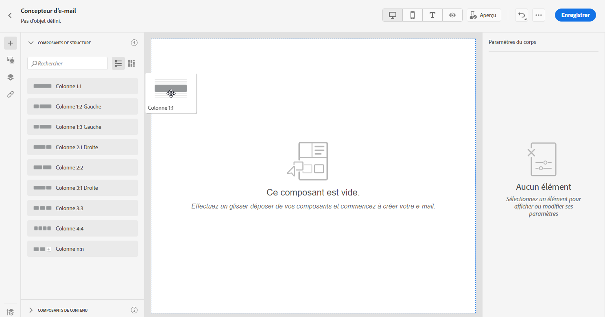
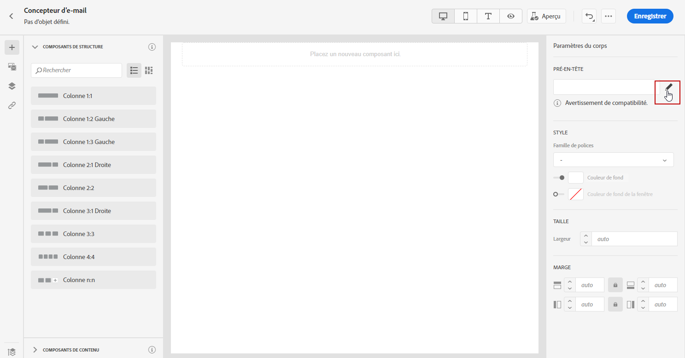
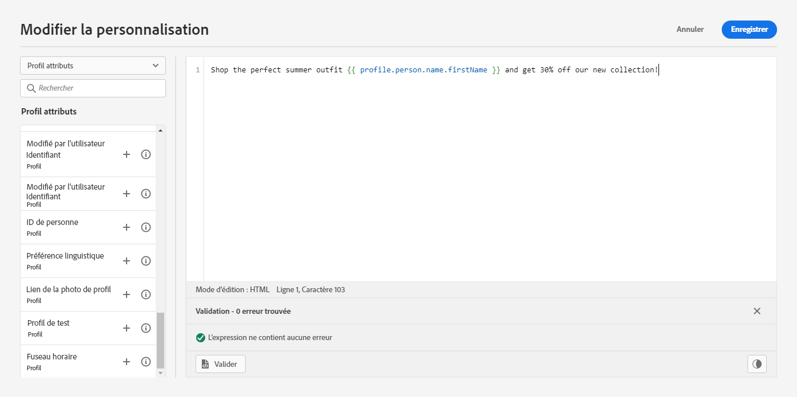

# Ajouter un pré-titre {#preheader}

>[!CONTEXTUALHELP]
>id="ac_edition_preheader"
>title="Ajouter un pré-titre"
>abstract="Un pré-titre est un texte de résumé court qui suit l’objet d’un message lorsque vous le visualisez depuis votre client de messagerie. Dans de nombreux cas, il fournit un bref résumé de l’e-mail, généralement en une seule phrase."

Un pré-titre est un texte de résumé court qui suit l’objet d’un message lorsque vous le visualisez depuis votre client de messagerie. Dans de nombreux cas, il fournit un bref résumé de l’e-mail, généralement en une seule phrase.

>[!NOTE]
>
>Les pré-titres ne sont pas pris en charge par tous les clients de messagerie. S’il n’est pas pris en charge, le pré-titre ne s’affiche pas.

Pour définir le pré-titre d’un e-mail, procédez comme suit :

1. Depuis le Concepteur d&#39;e-mail, ajoutez des **[!UICONTROL composants de structure]** pour commencer à concevoir votre e-mail.

   

1. Dans le volet de droite **[!UICONTROL Paramètres du corps]**, cliquez sur **Modifier** en regard du champ **[!UICONTROL Pré-titre]** pour ajouter du contenu.

   

1. Ajoutez votre pré-titre. Vous pouvez le personnaliser davantage en cliquant sur l&#39;icône **[!UICONTROL Ajouter une personnalisation]**.

   

1. Dans la fenêtre **[!UICONTROL Modifier la personnalisation]**, vous pouvez ajouter **[!UICONTROL Bloc de contenu]**, **[!UICONTROL Contenu dynamique]** ou **[!UICONTROL Champs de personnalisation]**.

1. Cliquez sur **[!UICONTROL Valider]** pour vérifier la syntaxe de votre personnalisation.

   

1. Cliquez sur **[!UICONTROL Enregistrer]**.

Votre pré-titre est maintenant configuré pour votre e-mail.
