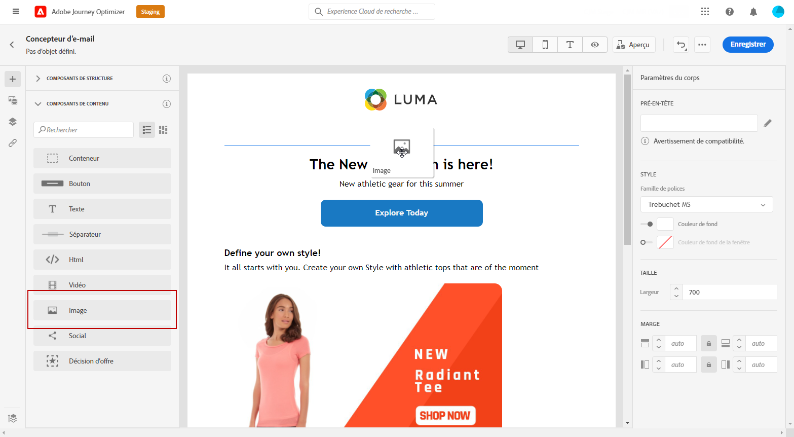
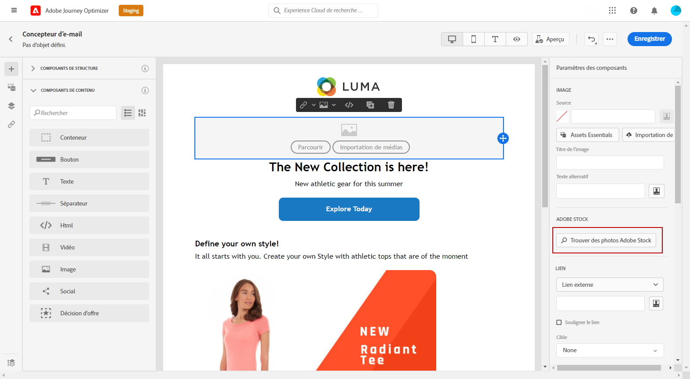
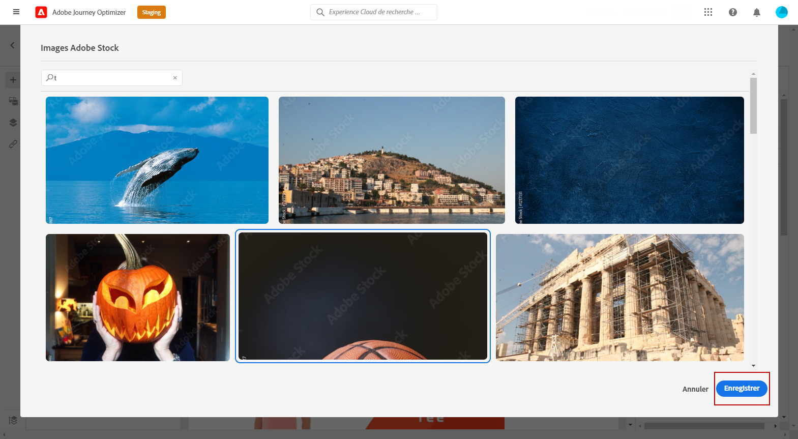
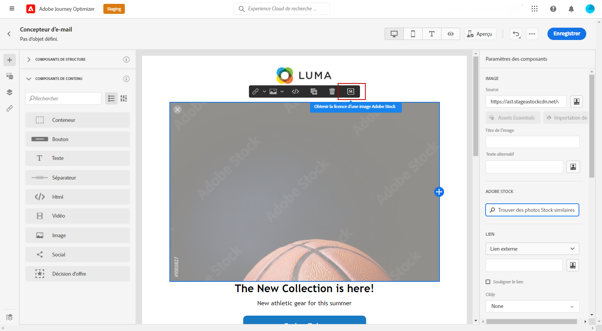
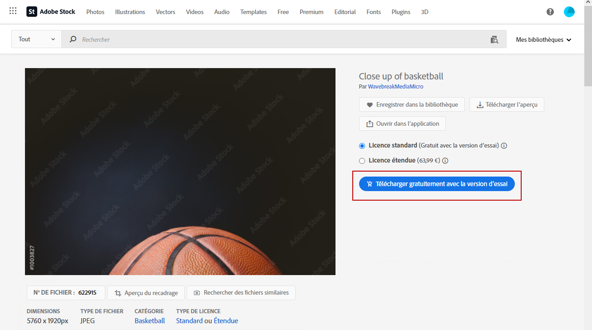
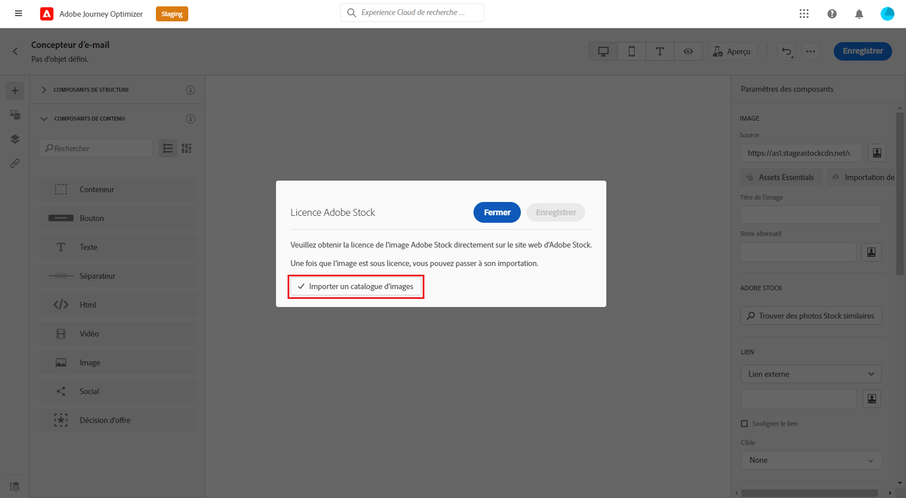
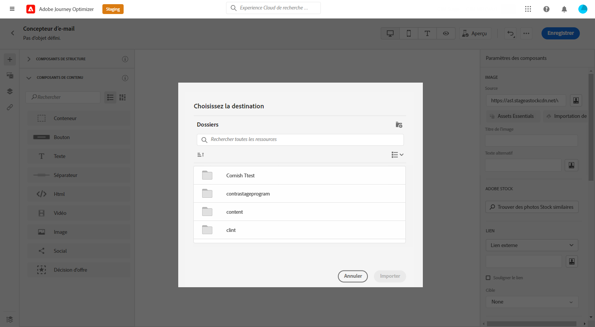
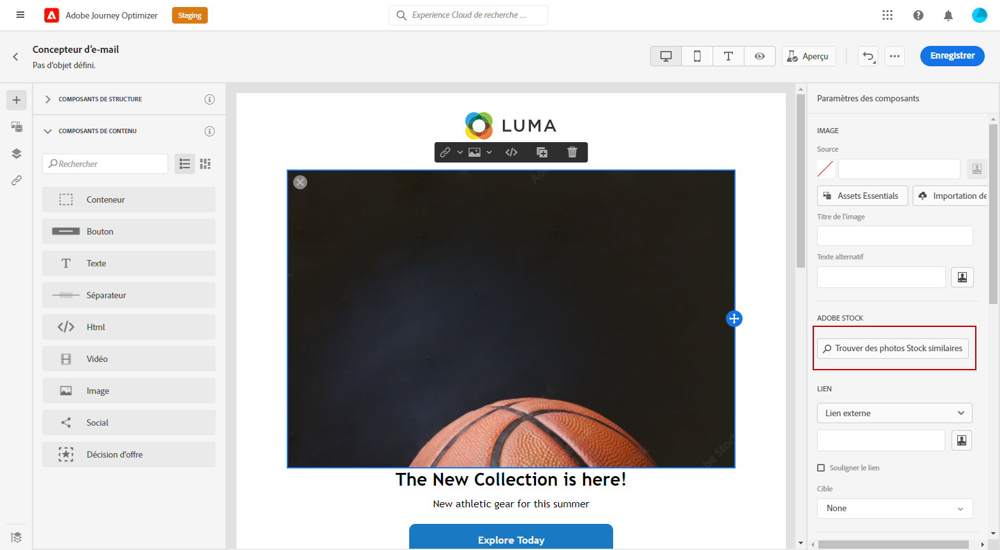

# Gestion des images [!DNL Adobe Stock] {#stock}

## Prise en main de [!DNL Adobe Stock] {#get-started-stock}

[!DNL Adobe Stock] permet d’accéder à des millions de photos, vidéos, illustrations et graphiques vectoriels de qualité supérieure, organisés et libres de droits. Vous pouvez choisir d’acheter un pack de crédits pour acquérir des ressources sous licence ou d’acheter uniquement une licence Standard ou Étendue pour la ressource nécessaire. Adobe Stock fournit également une collection gratuite de ressources.

Pour plus d’informations sur [!DNL Adobe Stock], consultez [Prise en main d’Adobe Stock](https://helpx.adobe.com/stock/get-started.html).

Avec [!DNL Adobe Journey Optimizer], vous pouvez charger des images dans vos e-mails directement depuis [!DNL Adobe Stock] et les ajouter à votre dossier Ressources. L’option **[!UICONTROL Rechercher une image similaire]** vous permet de trouver les images correspondant au contenu, à la couleur et à la composition de la ressource utilisée dans votre diffusion.
[En savoir plus sur la conception des e-mails](design-emails.md).

## Insertion et importation d’images [!DNL Adobe Stock] {#add-stock-image}

>[!NOTE]
>
> Le **[!UICONTROL Recherche de photos Adobe Stock]** Cette option sera uniquement disponible pour les utilisateurs ayant accès à un profil de produit AEM Assets Essentials. Voir à ce sujet la section [Documentation essentielle des ressources](https://experienceleague.adobe.com/docs/experience-manager-assets-essentials/help/get-started-admins/deploy-administer.html#add-users-to-essentials).

Après avoir modifié et personnalisé votre e-mail, vous pouvez ajouter des images issues de [!DNL Adobe Stock] à votre modèle :

1. Effectuez un glisser-déposer d’un **[!UICONTROL Composant de contenu]** image vers votre e-mail.

   

1. Dans le menu **[!UICONTROL Paramètres des composants]**, sélectionnez **[!UICONTROL Trouver des photos Adobe Stock]**.

   

1. Parcourez la bibliothèque ou entrez votre terme de recherche dans le champ. Sélectionnez l’image choisie, puis cliquez sur **[!UICONTROL Enregistrer]**.

   

1. Pour acquérir une licence et télécharger votre image, sélectionnez votre **[!UICONTROL Composant de contenu]** image et cliquez sur **[!UICONTROL Obtenir le licence d’une image Adobe Stock]**. Vous serez redirigé vers le site web [!DNL Adobe Stock].

   >[!NOTE]
   > Si votre image est déjà sous licence, elle sera représentée par l’icône . Dans ce cas, vous pouvez passer à l’étape 7.

   

1. Depuis le site web [!DNL Adobe Stock], vous devez acheter votre ressource pour pouvoir télécharger l’image et supprimer le filigrane.

   Cet achat dépendra de votre abonnement ou de votre formule Adobe Stock. Si vous disposez de plusieurs comptes Adobe Stock, vous serez redirigé vers le dernier identifiant Stock utilisé. Dans ce cas, assurez-vous d’être connecté au compte approprié avant d’obtenir une licence pour votre ressource.
Pour en savoir plus à ce sujet, consultez cette [page](https://stock.adobe.com/plans).

   >[!WARNING]
   > Si un e-mail contenant une image sans licence est envoyé, l’image conserve son formulaire sans licence avec le filigrane.

   

1. Une fois votre achat terminé, vous pouvez désormais revenir à votre e-mail dans [!DNL Adobe Journey Optimizer] et sélectionner **[!UICONTROL Importer un catalogue d’images]** pour importer votre image sous licence dans vos ressources.

   

1. Sélectionnez le dossier dans lequel votre ressource sera stockée. Pour plus d’informations sur les [!DNL Assets Essentials], consultez cette [page](assets-essentials.md#get-started-assets-essentials).

   

1. Après avoir sélectionné votre image dans [!DNL Adobe Stock], utilisez l’option **[!UICONTROL Trouver des photos Stock similaires]** pour localiser les ressources correspondant au contenu, à la couleur et à la composition d’une image.

   Notez que cette option est disponible pour les images Stock sous licence/sans licence et les images de votre dossier Ressources.

   

1. Personnalisez davantage votre image à l’aide de la fonction **[!UICONTROL Paramètres des composants]**. [En savoir plus sur les paramètres des composants](content-components.md)

   

Une fois votre message créé et personnalisé, vous pouvez le publier pour le rendre disponible pour exécution. [En savoir plus](../messages/publish-manage-message.md)
