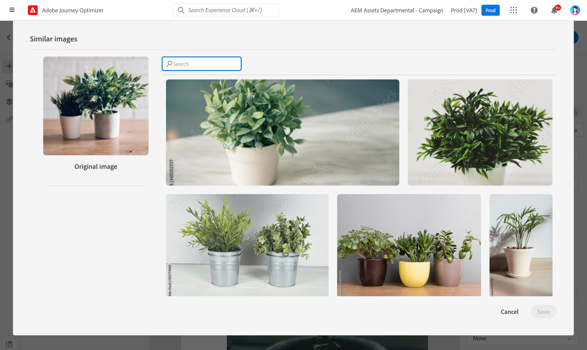

# Utilisation de [!DNL Adobe Stock] images {#stock}

## Prise en main de [!DNL Adobe Stock] {#get-started-stock}

Le [!DNL Adobe Stock] et [!DNL Adobe Journey Optimizer] Le module d’intégration du Concepteur d’email permet aux clients de naviguer, d’acquérir sous licence et d’enregistrer des images pour les utiliser dans la création de messages.

[Adobe Stock](https://helpx.adobe.com/stock/get-started.html){target=&quot;_blank&quot;} permet d’accéder à des millions de photos, vidéos, illustrations et graphiques vectoriels organisés, de haute qualité et libres de droits. Vous pouvez choisir d’acheter un pack de crédits pour acquérir des ressources sous licence ou d’acheter uniquement une licence Standard ou Étendue pour la ressource nécessaire. Adobe Stock fournit également une collection gratuite de ressources.

Avec [!DNL Adobe Journey Optimizer], vous pouvez charger des images dans vos e-mails directement depuis [!DNL Adobe Stock] et les ajouter à votre dossier Ressources. Le **[!UICONTROL Rechercher une image similaire]** permet de rechercher des images correspondant au contenu, à la couleur et à la composition de la ressource utilisée dans votre diffusion.

## Autorisations{#stock-permissions}

Le **[!UICONTROL Recherche de photos Adobe Stock]** est disponible pour les utilisateurs ayant accès à un profil de produit AEM Assets Essentials.

Voir à ce sujet la section [Documentation essentielle des ressources](https://experienceleague.adobe.com/docs/experience-manager-assets-essentials/help/get-started-admins/deploy-administer.html#add-users-to-essentials){target=&quot;_blank&quot;}.

## Insérer une image à partir de [!DNL Adobe Stock] {#add-stock-image}

Pour ajouter des images à partir de [!DNL Adobe Stock] pour accéder à votre contenu, procédez comme suit :

1. Dans la **[!UICONTROL Composants de contenu]** dans le Concepteur d&#39;email, effectuez un glisser-déposer d&#39;une **Image**.

1. Cliquez sur le bouton **[!UICONTROL Recherche de photos Adobe Stock]** sur le côté gauche du Concepteur d&#39;email.

   

1. Parcourez la bibliothèque ou saisissez un terme dans le champ de recherche.

   

1. Sélectionnez l’image choisie, puis cliquez sur **[!UICONTROL Enregistrer]**.

   Si l’image que vous avez sélectionnée n’est pas sous licence, vous devez [obtenir la licence](#license-stock-image).

## Rechercher des photos similaires {#similar-stock-image}

Vous pouvez remplacer n’importe quelle image existante dans le contenu de votre email par une photo issue de la fonction [!DNL Adobe Stock]. Notez que cette option est disponible pour toutes les images : images Stock sous licence/sans licence depuis votre dossier Ressources.

Pour parcourir des photos similaires, procédez comme suit :

1. Sélectionnez l’image à remplacer.
1. Cliquez sur le bouton **[!UICONTROL Rechercher des photos Stock similaires]** pour afficher les ressources dans [!DNL Adobe Stock] qui correspondent au contenu, à la couleur et à la composition de l’image.

   

1. Sélectionnez l’image choisie, puis cliquez sur **[!UICONTROL Enregistrer]**.

   

   Si l’image que vous avez sélectionnée n’est pas sous licence, vous devez [obtenir la licence](#license-stock-image).

1. Si nécessaire, personnalisez votre image avec le **[!UICONTROL Paramètres des composants]** . [En savoir plus sur les paramètres des composants](content-components.md)

Une fois votre message créé et personnalisé, vous pouvez le publier pour le rendre disponible pour exécution. [En savoir plus](../messages/publish-manage-message.md)

## Obtenez la licence à partir de [!DNL Adobe Stock] {#license-stock-image}

Si votre image est déjà sous licence, elle est représentée par la variable  icône . Si ce n&#39;est pas le cas, vous devez obtenir une licence.

Pour acquérir sous licence et télécharger votre image, procédez comme suit :

1. Sélectionnez-le et cliquez sur le bouton **[!UICONTROL Image Adobe Stock sous licence]** icône .

   

   Vous êtes alors redirigé vers la [!DNL Adobe Stock] à l’aide de la licence .

   

1. Dans la [!DNL Adobe Stock] site web, vous devez acheter votre ressource pour pouvoir télécharger l’image et supprimer le filigrane.

   Cet achat dépend de votre abonnement ou de votre formule Adobe Stock. Si vous disposez de plusieurs comptes Adobe Stock, vous serez redirigé vers le dernier identifiant Stock utilisé. Dans ce cas, assurez-vous d’être connecté au compte approprié avant d’obtenir une licence pour votre ressource.

   Pour en savoir plus sur les tarifs et les forfaits Adobe Stock dans [Documentation Adobe Stock](https://stock.adobe.com/plans){target=&quot;_blank&quot;}.

   >[!WARNING]
   > Si un courrier électronique contenant une image sans licence est envoyé, l’image conserve son formulaire sans licence avec le filigrane.

1. Une fois votre achat terminé, vous pouvez désormais revenir à votre e-mail dans [!DNL Adobe Journey Optimizer] et sélectionner **[!UICONTROL Importer un catalogue d’images]** pour importer votre image sous licence dans vos ressources.

   

1. Sélectionnez dans quel dossier stocker votre ressource. Pour plus d’informations sur les [!DNL Assets Essentials], consultez cette [page](assets-essentials.md#get-started-assets-essentials).

## Rubriques connexes{#stock-related-topics}

* [Conception d’emails dans Journey Optimizer](design-emails.md)
* [Paramètres des composants pour la conception d’un email](content-components.md)
* [Prise en main d’Adobe Stock](https://helpx.adobe.com/stock/get-started.html){target=&quot;_blank&quot;}.

