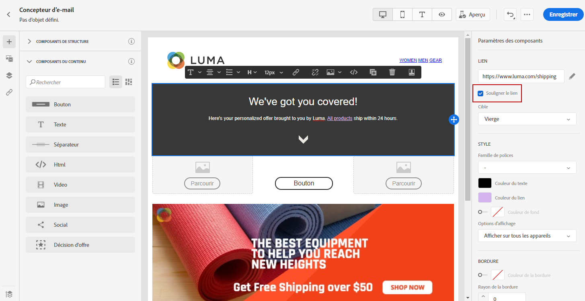
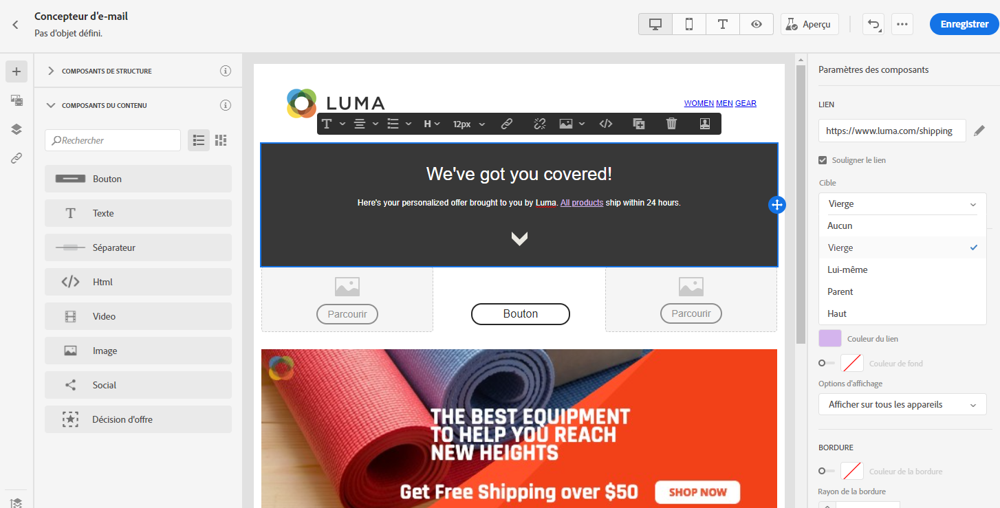
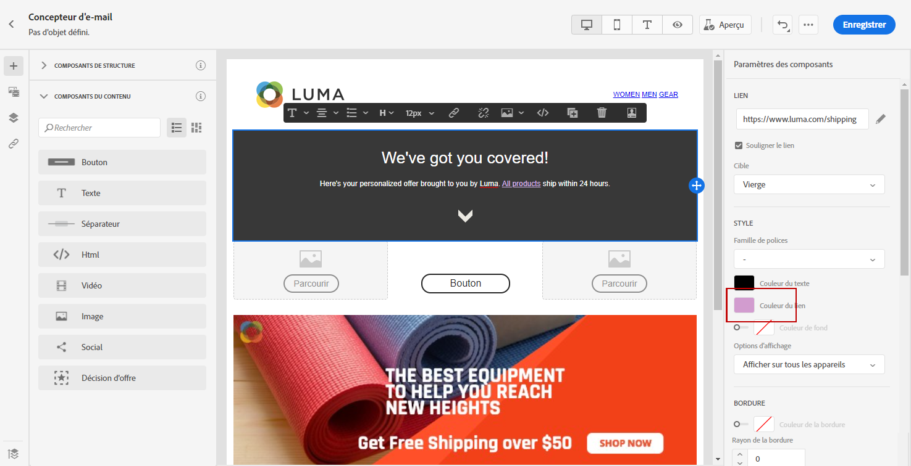

# Définition d&#39;un style pour les liens {#styling-links}

Vous pouvez souligner un lien et sélectionner sa couleur et sa cible dans le Concepteur d&#39;email.

1. Dans un **[!UICONTROL composant de contenu]** texte où un lien est inséré, sélectionnez votre lien.

1. Dans les **[!UICONTROL paramètres du composant]**, cochez la case **[!UICONTROL Souligner le lien]** pour souligner le texte du libellé de votre lien.

   

1. Choisissez comment votre audience sera redirigée avec la liste déroulante **[!UICONTROL Cible]** :

   * **[!UICONTROL Aucune]** : ouvre le lien dans le même cadre que celui sur lequel l’utilisateur a cliqué (par défaut).
   * **[!UICONTROL Vierge]** : ouvre le lien dans une nouvelle fenêtre ou un nouvel onglet.
   * **[!UICONTROL Self]** : ouvre le lien dans le même cadre que celui sur lequel l’utilisateur a cliqué.
   * **[!UICONTROL Parent]** : ouvre le lien dans le cadre parent.
   * **[!UICONTROL Haut]** : ouvre le lien dans le corps complet de la fenêtre.

   

1. Pour changer la couleur de votre lien, cliquez sur **[!UICONTROL Couleur du lien]**.

   

1. Choisissez la couleur dont vous avez besoin.

1. Enregistrez vos modifications.
