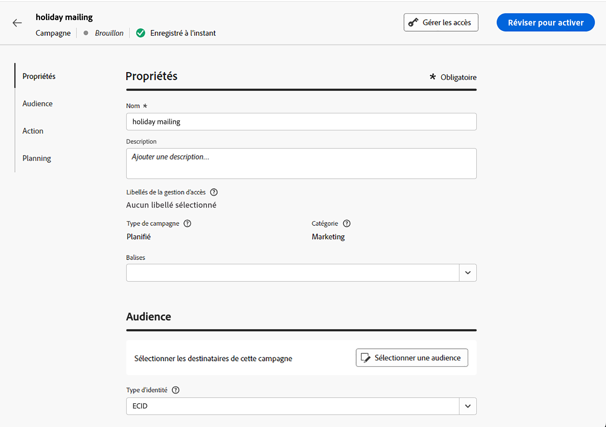

# Créer un message de publipostage direct {#create-direct}

>[!CONTEXTUALHELP]
>id="ajo_direct_mail"
>title="Création de publipostage direct"
>abstract="Créez des messages de publipostage direct dans des campagnes planifiées et concevez les fichiers d’extraction requis par les fournisseurs de publipostage direct pour envoyer du courrier à votre clientèle."

## Créer une campagne courrier{#create-dm-campaign}

1. Créez une campagne planifiée et choisissez **[!UICONTROL Canal Courrier]** comme action.

1. Sélectionnez la variable **[!UICONTROL Surface de courrier]** pour utiliser et cliquer sur **[!UICONTROL Créer]**. [Découvrez comment créer une surface de courrier](direct-mail-configuration.md#direct-mail-surface).

   {width="800" align="center"}

1. Dans le **[!UICONTROL Propriétés]** , modifiez la section de votre campagne **[!UICONTROL Titre]** et **[!UICONTROL Description]**.

1. Pour définir votre audience cible, cliquez sur le bouton **[!UICONTROL Sélection de l’audience]** et choisissez parmi les audiences Adobe Experience Platform disponibles. [En savoir plus](../audience/about-audiences.md).

   >[!IMPORTANT]
   >
   >Pour l’instant, la sélection d’audience est limitée à 3 millions de profils. Cette limitation peut être levée sur demande auprès de votre représentant d’Adobe.

1. Dans le **[!UICONTROL Espace de noms d’identité]** , sélectionnez l’espace de noms approprié pour identifier les individus dans l’audience choisie. [En savoir plus](../event/about-creating.md#select-the-namespace).

   {width="800" align="center"}

1. Les campagnes peuvent être planifiées pour une date spécifique ou définies pour être récurrentes à intervalles réguliers. Découvrez comment configurer le **[!UICONTROL Planning]** de votre campagne dans [cette section](../campaigns/create-campaign.md#schedule).

Vous pouvez maintenant commencer à configurer le fichier d&#39;extraction à envoyer à votre opérateur de services postaux.

## Configuration du fichier d’extraction {#extraction-file}

1. Dans l&#39;écran de configuration de l&#39;opération, cliquez sur le bouton **[!UICONTROL Modifier le contenu]** pour configurer le contenu du fichier d&#39;extraction.

1. Réglez les propriétés du fichier d&#39;extraction :

   1. Spécifiez les **[!UICONTROL Nom du fichier]** pour le fichier d’extraction.

   1. Si vous le souhaitez, activez la variable **[!UICONTROL Ajouter un horodatage pour exporter le nom de fichier]** si vous souhaitez ajouter un horodatage automatique au nom de fichier spécifié.

   1. Il peut parfois s’avérer nécessaire d’ajouter des informations au début ou à la fin du fichier d’extraction. Pour ce faire, utilisez la méthode **[!UICONTROL Remarques]** puis indiquez si vous souhaitez inclure la note en tant qu’en-tête ou pied de page.

      {width="800" align="center"}

1. Configurez les colonnes et les informations à afficher dans le fichier d&#39;extraction :

   1. Cliquez sur le bouton **[!UICONTROL Ajouter]** pour créer une colonne.

   1. La variable **[!UICONTROL Formatage]** s’affiche sur le côté droit, ce qui vous permet de configurer la colonne sélectionnée. Spécifiez un **[!UICONTROL Libellé]** pour la colonne .

   1. Dans le **[!UICONTROL Données]** , sélectionnez les attributs de profil à afficher à l’aide du champ [Éditeur d’expression](../personalization/personalization-build-expressions.md).

   1. Pour trier le fichier d&#39;extraction à l&#39;aide d&#39;une colonne, sélectionnez la colonne et activez l&#39;option **[!UICONTROL Tri par]** . La variable **[!UICONTROL Trier par]** s’affiche en regard du libellé de la colonne dans la variable **[!UICONTROL Champs de données]** .

      {width="800" align="center"}

   1. Répétez ces étapes pour ajouter autant de colonnes que nécessaire à votre fichier d&#39;extraction. Vous pouvez ajouter jusqu’à 50 colonnes.

      Pour modifier la position d’une colonne, faites-la glisser jusqu’à l’emplacement de votre choix dans le **[!UICONTROL Champ de données]** . Pour supprimer une colonne, sélectionnez-la et cliquez sur le bouton **[!UICONTROL Supprimer]** dans le **[!UICONTROL Formatage]** volet.

Vous pouvez maintenant tester votre courrier et l’envoyer à votre audience. [Découvrez comment tester et envoyer des messages de courrier](test-send-direct-mail.md)
