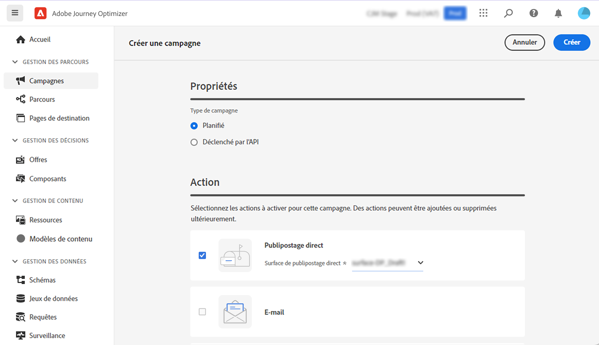
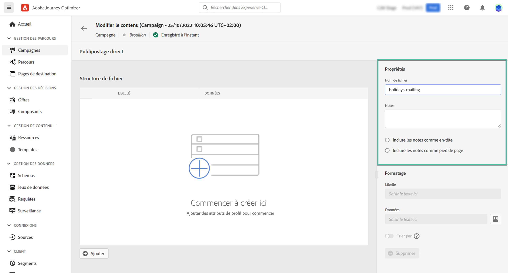
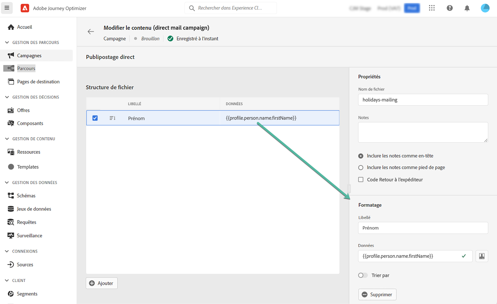

# Créer un message de publipostage direct {#create-direct}

>[!BEGINSHADEBOX]

**Sur cette page :** ajoutez un message de publipostage direct à une campagne ou à un parcours et configurez son fichier d’extraction afin que votre fournisseur de publipostage direct dispose des données personnalisées nécessaires pour envoyer du courrier à vos clients.

>[!ENDSHADEBOX]

>[!CONTEXTUALHELP]
>id="ajo_direct_mail"
>title="Création de publipostage direct"
>abstract="Créez des messages de publipostage direct dans des campagnes et parcours planifiés et concevez les fichiers d’extraction requis par les fournisseurs de publipostage direct pour envoyer du courrier à votre clientèle."

>[!CONTEXTUALHELP]
>id="ajo_journey_direct_mail"
>title="Activité Fin"
>abstract="Le courrier est un canal hors ligne qui vous permet de personnaliser et de générer les fichiers d’extraction requis par les fournisseurs de courrier tiers pour envoyer du courrier à votre clientèle."

Pour créer des messages de publipostage direct, créez une campagne planifiée ou un parcours, puis configurez le fichier d’extraction. Ce fichier est requis par les opérateurs de services postaux pour envoyer du courrier à vos clientes et clients.

>[!IMPORTANT]
>
>Avant d’envoyer un message de courrier, assurez-vous d’avoir configuré les éléments suivants :
>
>1. [Configuration du routage des fichiers](../direct-mail/direct-mail-configuration.md#file-routing-configuration) qui spécifie le serveur sur lequel le fichier d’extraction doit être chargé et stocké,
>1. [Configuration de message de publipostage direct](../direct-mail/direct-mail-configuration.md#direct-mail-surface) qui fera référence à la configuration du routage des fichiers.

## Ajouter un message de courrier {#create-dm-campaign}

>[!CONTEXTUALHELP]
>id="ajo_journey_action_direct_mail"
>title="Canal de courrier"
>abstract="Une action de canal de courrier génère le contenu du courrier pour les profils lorsqu’ils atteignent cette étape du parcours. Le libellé identifie l’activité dans le canevas du parcours et l’action fait référence à une configuration de courrier qui définit le contenu diffusé. La section **Optimisation** peut inclure des expériences de contenu ou des règles de ciblage, la section **Multilingue** peut diffuser du contenu dans plusieurs langues et la section **Délai d’expiration ou erreur** peut définir un autre chemin en cas d’échec de l’action."
>additional-url="https://experienceleague.adobe.com/fr/docs/journey-optimizer/using/orchestrate-journeys/about-journey-building/journey-action#add-action" text="Commencer avec les actions de canal"

Parcourez les onglets ci-dessous pour savoir comment ajouter un Message de publipostage direct dans une campagne ou un parcours.

>[!BEGINTABS]

>[!TAB Ajouter un message Courrier à un Parcours ]

1. Ouvrez votre parcours, puis effectuez un glisser-déposer d’une activité **[!UICONTROL Publipostage direct]** depuis la section **Actions** de la palette.

1. Fournissez des informations de base sur votre message (libellé, description, catégorie), puis choisissez la configuration de message à utiliser. Par défaut, le champ de **[!UICONTROL configuration]** est prérempli avec la dernière configuration utilisée par l’utilisateur ou l’utilisatrice pour ce canal. Pour plus d’informations sur la configuration de votre parcours, consultez [cette page](../building-journeys/journey-gs.md).

1. Configurez le fichier d’extraction à envoyer à votre fournisseur de services de publipostage. Pour ce faire, cliquez sur le bouton **[!UICONTROL Modifier le contenu]**.

   

1. Ajustez les propriétés du fichier d’extraction, telles que le nom du fichier, ou les colonnes à afficher. Pour plus d’informations sur la configuration des propriétés du fichier d’extraction, consultez cette section : [Créer un message de publipostage direct](../direct-mail/create-direct-mail.md#extraction-file).

   

1. Une fois le contenu du fichier d’extraction défini, prévisualisez-le à l’aide de l’option **[!UICONTROL Simuler du contenu]**. [Découvrir comment prévisualiser et tester votre contenu](../content-management/preview-test.md)

   {width="800" align="center"}

Lorsque votre fichier d’extraction est prêt, terminez la configuration de votre [parcours](../building-journeys/journey-gs.md) pour l’envoyer.

>[!TAB Ajouter un message de publipostage direct à une campagne]

1. Accédez au menu **[!UICONTROL Campagnes]**, puis cliquez sur **[!UICONTROL Créer une campagne]**.

1. Sélectionnez le type de campagne **Planifié - Marketing**.

1. Dans la section **[!UICONTROL Propriétés]**, modifiez le **[!UICONTROL Titre]** et la **[!UICONTROL Description]** de votre campagne.

1. Pour définir votre audience cible, cliquez sur le bouton **[!UICONTROL Sélectionner une audience]** et choisissez parmi les audiences Adobe Experience Platform disponibles. [En savoir plus](../audience/about-audiences.md).

   >[!IMPORTANT]
   >
   >Pour l’instant, la sélection d’audience est limitée à 3 millions de profils. Cette limite peut être levée sur demande auprès de votre représentant ou représentante Adobe.

1. Dans le champ **[!UICONTROL Espace de noms d’identité]**, sélectionnez l’espace de noms approprié pour identifier les personnes dans l’audience choisie. [En savoir plus](../event/about-creating.md#select-the-namespace).

1. Dans la section **[!UICONTROL Actions]**, choisissez le **[!UICONTROL Publipostage direct]**.

1. Sélectionnez ou créez une **[!UICONTROL configuration depublipostage direct]** à utiliser. [Découvrez comment créer une configuration de publipostage direct](direct-mail-configuration.md#direct-mail-surface).

   {width="800" align="center"}

   >[!AVAILABILITY]
   >
   >Le publipostage direct prend en charge la fonctionnalité **Exclusion** mais ne prend actuellement pas en charge **Traitements**. [Découvrez comment utiliser les expériences](../content-management/get-started-experiment.md)

1. Les campagnes peuvent être planifiées pour une date spécifique ou définies pour être récurrentes à intervalles réguliers. Découvrez comment configurer le **[!UICONTROL Planning]** de votre campagne dans [cette section](../campaigns/campaign-schedule.md).

Vous pouvez maintenant commencer à configurer le fichier d’extraction à envoyer à votre opérateur de publipostage direct.

>[!ENDTABS]

## Configurer le fichier d’extraction {#extraction-file}

>[!CONTEXTUALHELP]
>id="ajo_direct_mail_data_fields"
>title="Champs de données"
>abstract="Ajoutez et configurez les colonnes et les informations à afficher dans le fichier d’extraction requis par les fournisseurs de publipostage direct pour envoyer du courrier à vos clientes et clients. Vous pouvez ajouter jusqu’à 50 colonnes."

>[!CONTEXTUALHELP]
>id="ajo_direct_mail_formatting"
>title="Formatage des fichiers d’extraction"
>abstract="Pour chaque champ, indiquez un libellé et les informations à afficher à l’aide de l’éditeur de personnalisation.   L’option <b>Trier par</b> vous permet d’utiliser le champ sélectionné pour trier les colonnes du fichier d’extraction."

Le fichier d’extraction est requis par les opérateurs de services postaux pour envoyer du courrier à vos clientes et clients. Pour définir la configuration du fichier d&#39;extraction, procédez comme suit :

1. Dans l’écran de configuration de la campagne ou du parcours, cliquez sur le bouton **[!UICONTROL Modifier le contenu]** pour configurer le contenu du fichier d’extraction.

1. Pour ajouter des politiques de décision à votre message de publipostage direct, sélectionnez une colonne dans la section **[!UICONTROL Champs de données]** et ouvrez l’éditeur de personnalisation à l’aide de l’icône . Accédez au menu **[!UICONTROL Politiques de décision]** pour créer et insérer une politique de décision. Vous pouvez ensuite utiliser les attributs d&#39;élément de décision comme données de colonne dans le fichier d&#39;extraction.

   >[!AVAILABILITY]
   >
   >Experience Decisioning dans le publipostage direct est une nouvelle fonctionnalité. Auparavant, les fichiers d’extraction de publipostage direct ne pouvaient pas utiliser le moteur de décision. Vous pouvez désormais ajouter des politiques de décision et inclure des attributs d’élément de décision en tant que données de colonne dans l’exportation.

   [Découvrez comment ajouter une politique de décision dans le courrier](../experience-decisioning/create-decision-policy.md#add). Pour les workflows de diffusion de décisions par lots et des exemples (publipostage direct personnalisé ou exportation vers des systèmes en aval), consultez [&#x200B; Diffusion de décisions par lots dans le publipostage direct](../experience-decisioning/batch-decisioning-direct-mail.md).

1. Ajustez les propriétés du fichier d’extraction :

   1. Dans le champ **[!UICONTROL Nom de fichier]**, indiquez le nom du fichier d’extraction.

      >[!NOTE]
      >
      >Par défaut, le fichier est écrit dans le répertoire racine du serveur. Le champ **[!UICONTROL Nom de fichier]** accepte également le format « /votre/chemin/ici/NomDeFichier.csv », où le chemin d’accès spécifié correspond au répertoire cible sur le serveur sélectionné. <!--TBC if for SFTP and Azure only, or for all servers including S3-->

   1. Vous pouvez éventuellement activer l’option **[!UICONTROL Ajouter une date et une heure pour exporter le nom de fichier]** si vous souhaitez ajouter une date et une heure automatiques au nom de fichier spécifié.

   1. Il peut parfois s’avérer nécessaire d’ajouter des informations au début ou à la fin du fichier d’extraction. Pour ce faire, utilisez le champ **[!UICONTROL Notes]**, puis indiquez si vous souhaitez inclure la note en tant qu’en-tête ou pied de page.

      {width="800" align="center"}

1. Configurez les colonnes et les informations à afficher dans le fichier d’extraction :

   1. Cliquez sur le bouton **[!UICONTROL Ajouter]** pour créer une nouvelle colonne.

   1. Le volet **[!UICONTROL Formatage]** s’affiche sur le côté droit, ce qui vous permet de configurer la colonne sélectionnée. Spécifiez un **[!UICONTROL Libellé]** pour la colonne.

   1. Dans le champ **[!UICONTROL Données]**, sélectionnez les attributs de profil à afficher à l’aide de l’[éditeur de personnalisation](../personalization/personalization-build-expressions.md).

   1. Pour trier le fichier d’extraction à l&#39;aide d’une colonne, sélectionnez la colonne et activez l’option **[!UICONTROL Trier par]**. L’icône **[!UICONTROL Trier par]** s’affiche en regard du libellé de la colonne dans la section **[!UICONTROL Champs de données]**.

      {width="800" align="center"}

   1. Répétez ces étapes pour ajouter autant de colonnes que nécessaire pour votre fichier d’extraction. Vous pouvez ajouter jusqu’à 50 colonnes.

      Pour modifier la position d’une colonne, faites-la glisser et déposez-la à l’emplacement de votre choix dans la section **[!UICONTROL Champ de données]**. Pour supprimer une colonne, sélectionnez-la et cliquez sur le bouton **[!UICONTROL Supprimer]** dans le volet **[!UICONTROL Formatage]**.

Vous pouvez maintenant tester votre message de courrier et l’envoyer à votre audience. [Découvrez comment tester et envoyer des messages de courrier](test-send-direct-mail.md).

## Rubriques connexes {#related-topics}

* [Commencer à utiliser le courrier](get-started-direct-mail.md)
* [Configurer le canal courrier](direct-mail-configuration.md)
* [Test et envoi de publipostage direct](test-send-direct-mail.md)
* [Prévisualiser et tester le contenu](../content-management/preview-test.md)

Pour des questions courantes sur le publipostage direct, voir [Prise en main du publipostage direct](get-started-direct-mail.md).
