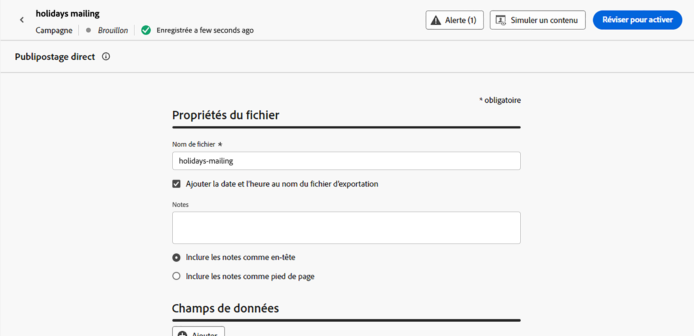

# Créer un message de publipostage direct {#create-direct}

>[!CONTEXTUALHELP]
>id="ajo_direct_mail"
>title="Création de publipostage direct"
>abstract="Créez des messages de publipostage direct dans des campagnes planifiées et concevez les fichiers d’extraction requis par les fournisseurs de publipostage direct pour envoyer du courrier à votre clientèle."

Pour créer des messages de courrier, créez une campagne planifiée et configurez le fichier d’extraction. Ce fichier est requis par les opérateurs de services postaux pour envoyer du courrier à vos clientes et clients.

>[!IMPORTANT]
>
>Avant d’envoyer un message de courrier, assurez-vous d’avoir configuré les éléments suivants :
>
>1. [Configuration du routage des fichiers](../direct-mail/direct-mail-configuration.md#file-routing-configuration) qui spécifie le serveur sur lequel le fichier d’extraction doit être chargé et stocké,
>1. [Configuration de message de publipostage direct](../direct-mail/direct-mail-configuration.md#direct-mail-surface) qui fera référence à la configuration du routage des fichiers.

## Créer une campagne par courrier{#create-dm-campaign}

Pour créer une campagne de publipostage direct, vous devez configurer une campagne planifiée, sélectionner votre audience cible et configurer les paramètres de publipostage direct, y compris la configuration du message. Procédez comme suit :

1. Accédez au menu **[!UICONTROL Campagnes]**, puis cliquez sur **[!UICONTROL Créer une campagne]**.

1. Sélectionner le type de campagne que vous souhaitez exécuter.

   * **Scheduled - Marketing** : permet d’exécuter la campagne immédiatement ou à une date spécifiée. Les campagnes planifiées visent à envoyer des messages marketing. Elles sont configurées et exécutées à partir de l’interface d’utilisation.

   * **Déclenchée par API - Marketing/Transactionnelle** : permet d’exécuter la campagne à l’aide d’un appel API. Les campagnes déclenchées par API sont destinées à envoyer des messages marketing, ou transactionnels, c’est-à-dire des messages envoyés suite à une action effectuée par une personne : réinitialisation du mot de passe, abandon de panier, etc.

1. Dans la section **[!UICONTROL Propriétés]**, modifiez le **[!UICONTROL Titre]** et la **[!UICONTROL Description]** de votre campagne.

1. Pour définir votre audience cible, cliquez sur le bouton **[!UICONTROL Sélectionner une audience]** et choisissez parmi les audiences Adobe Experience Platform disponibles. [En savoir plus](../audience/about-audiences.md).

   >[!IMPORTANT]
   >
   >Pour l’instant, la sélection d’audience est limitée à 3 millions de profils. Cette limite peut être levée sur demande auprès de votre représentant ou représentante Adobe.

1. Dans le champ **[!UICONTROL Espace de noms d’identité]**, sélectionnez l’espace de noms approprié pour identifier les personnes dans l’audience choisie. [En savoir plus](../event/about-creating.md#select-the-namespace).

1. Dans la section **[!UICONTROL Actions]**, choisissez le **[!UICONTROL Publipostage direct]**.

1. Sélectionnez ou créez une **[!UICONTROL configuration depublipostage direct]** à utiliser. [Découvrez comment créer une configuration de publipostage direct](direct-mail-configuration.md#direct-mail-surface).

   {width="800" align="center"}

   >[!AVAILABILITY]
   >
   >Le publipostage direct prend en charge la fonctionnalité **Exclusion** mais ne prend actuellement pas en charge **Traitements**. [Découvrez comment utiliser les expériences](../content-management/get-started-experiment.md)

1. Les campagnes peuvent être planifiées pour une date spécifique ou définies pour être récurrentes à intervalles réguliers. Découvrez comment configurer le **[!UICONTROL Planning]** de votre campagne dans [cette section](../campaigns/campaign-schedule.md).

Vous pouvez maintenant commencer à configurer le fichier d’extraction à envoyer à votre opérateur de publipostage direct.

## Configurer le fichier d’extraction {#extraction-file}

>[!CONTEXTUALHELP]
>id="ajo_direct_mail_data_fields"
>title="Champs de données"
>abstract="Ajoutez et configurez les colonnes et les informations à afficher dans le fichier d’extraction requis par les fournisseurs de publipostage direct pour envoyer du courrier à vos clientes et clients. Vous pouvez ajouter jusqu’à 50 colonnes."

>[!CONTEXTUALHELP]
>id="ajo_direct_mail_formatting"
>title="Formatage des fichiers d’extraction"
>abstract="Pour chaque champ, indiquez un libellé et les informations à afficher à l’aide de l’éditeur de personnalisation.   L’option <b>Trier par</b> vous permet d’utiliser le champ sélectionné pour trier les colonnes du fichier d’extraction."

Le fichier d’extraction est requis par les opérateurs de services postaux pour envoyer du courrier à vos clientes et clients. Pour définir la configuration du fichier d&#39;extraction, procédez comme suit :

1. Dans l’écran de configuration de la campagne, cliquez sur le bouton **[!UICONTROL Modifier le contenu]** pour configurer le contenu du fichier d’extraction.

1. Ajustez les propriétés du fichier d’extraction :

   1. Dans le champ **[!UICONTROL Nom de fichier]**, indiquez le nom du fichier d’extraction.

      >[!NOTE]
      >
      >Par défaut, le fichier est écrit dans le répertoire racine du serveur. Le champ **[!UICONTROL Nom de fichier]** accepte également le format « /votre/chemin/ici/NomDeFichier.csv », où le chemin d’accès spécifié correspond au répertoire cible sur le serveur sélectionné. <!--TBC if for SFTP and Azure only, or for all servers including S3-->

   1. Vous pouvez éventuellement activer l’option **[!UICONTROL Ajouter une date et une heure pour exporter le nom de fichier]** si vous souhaitez ajouter une date et une heure automatiques au nom de fichier spécifié.

   1. Il peut parfois s’avérer nécessaire d’ajouter des informations au début ou à la fin du fichier d’extraction. Pour ce faire, utilisez le champ **[!UICONTROL Notes]**, puis indiquez si vous souhaitez inclure la note en tant qu’en-tête ou pied de page.

      {width="800" align="center"}

1. Configurez les colonnes et les informations à afficher dans le fichier d’extraction :

   1. Cliquez sur le bouton **[!UICONTROL Ajouter]** pour créer une nouvelle colonne.

   1. Le volet **[!UICONTROL Formatage]** s’affiche sur le côté droit, ce qui vous permet de configurer la colonne sélectionnée. Spécifiez un **[!UICONTROL Libellé]** pour la colonne.

   1. Dans le champ **[!UICONTROL Données]**, sélectionnez les attributs de profil à afficher à l’aide de l’[éditeur de personnalisation](../personalization/personalization-build-expressions.md).

   1. Pour trier le fichier d’extraction à l&#39;aide d’une colonne, sélectionnez la colonne et activez l’option **[!UICONTROL Trier par]**. L’icône **[!UICONTROL Trier par]** s’affiche en regard du libellé de la colonne dans la section **[!UICONTROL Champs de données]**.

      {width="800" align="center"}

   1. Répétez ces étapes pour ajouter autant de colonnes que nécessaire pour votre fichier d’extraction. Vous pouvez ajouter jusqu’à 50 colonnes.

      Pour modifier la position d’une colonne, faites-la glisser et déposez-la à l’emplacement de votre choix dans la section **[!UICONTROL Champ de données]**. Pour supprimer une colonne, sélectionnez-la et cliquez sur le bouton **[!UICONTROL Supprimer]** dans le volet **[!UICONTROL Formatage]**.

Vous pouvez maintenant tester votre message de courrier et l’envoyer à votre audience. [Découvrez comment tester et envoyer des messages de courrier](test-send-direct-mail.md).

