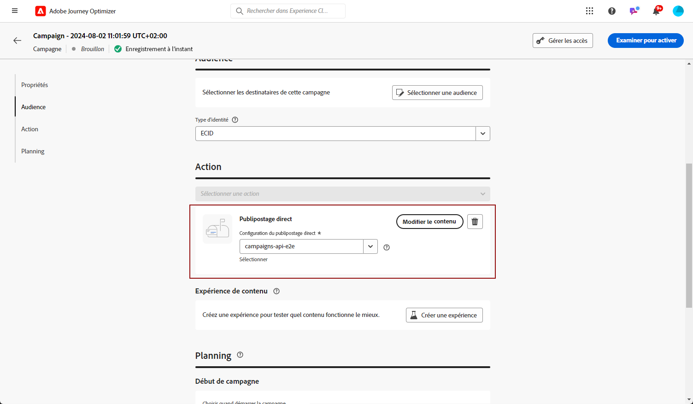
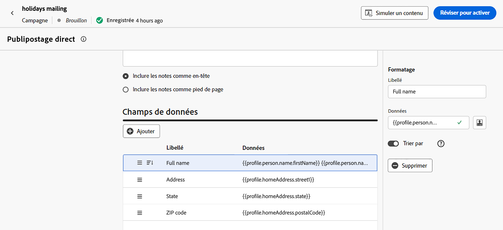

# Créer un message de courrier {#create-direct}

>[!CONTEXTUALHELP]
>id="ajo_direct_mail"
>title="Création de courrier"
>abstract="Créez des messages de courrier dans des campagnes planifiées et concevez les fichiers d&#39;extraction requis par les opérateurs de services postaux pour envoyer du courrier à vos clients."

Le canal Courrier est un canal off-line qui vous permet de personnaliser et de générer les fichiers d’extraction requis par les opérateurs de services postaux pour envoyer du courrier à vos clients.

Lorsque vous créez un courrier, Journey Optimizer génère un fichier contenant tous les profils ciblés et les données sélectionnées (adresse postale, attributs de profil, par exemple). Votre opérateur de services postaux pourra alors récupérer ce fichier et s&#39;occupera de l&#39;envoi réel.

Les messages directs ne peuvent être créés que dans le cadre de campagnes planifiées. Elles ne sont pas disponibles pour une utilisation dans des campagnes déclenchées par l’API ou dans des parcours.

>[!IMPORTANT]
>
>Avant d&#39;envoyer un courrier, vérifiez que vous avez configuré :
>
>1. A [configuration du routage des fichiers](../direct-mail/direct-mail-configuration.md#file-routing-configuration) qui spécifie le serveur sur lequel le fichier d&#39;extraction doit être téléchargé et stocké,
>1. A [surface du message courrier](../direct-mail/direct-mail-configuration.md#direct-mail-surface) qui fera référence à la configuration de routage des fichiers.

## Créer un message de courrier {#create}

Les étapes de création et d&#39;envoi d&#39;un courrier sont les suivantes :

1. Créez une opération planifiée, puis sélectionnez **[!UICONTROL Direct mail]** comme action et choisissez la surface du canal à utiliser. [Découvrez comment créer une surface de courrier](../direct-mail/direct-mail-configuration.md#direct-mail-surface)

   

1. Cliquez sur **[!UICONTROL Create]** définissez ensuite des informations de base sur votre campagne (nom, description). [Découvrez comment configurer une campagne](../campaigns/create-campaign.md)

   

1. Cliquez sur le bouton **[!UICONTROL Edit content]** pour configurer le fichier d&#39;extraction à envoyer à votre opérateur de services postaux.

1. Définissez le nom du fichier d’extraction dans la variable **[!UICONTROL Filename]** champ .

   Il peut arriver que vous deviez ajouter des informations au début ou à la fin du fichier d’extraction. Pour ce faire, utilisez la méthode **[!UICONTROL Notes]** puis indiquez si vous souhaitez inclure la note en tant qu’en-tête ou pied de page.

   <!--Click on the button to the right of the Output file field and enter the desired label. You can use personalization fields, content blocks and dynamic text (see Defining content). For example, you can complete the label with the delivery ID or the extraction date.-->

   

1. Utilisez la zone de gauche pour définir les informations à afficher en colonnes dans le fichier d&#39;extraction :

   1. Cliquez sur le bouton **[!UICONTROL Add]** pour ajouter une nouvelle colonne, puis sélectionnez-la dans la liste.

   1. Dans le **[!UICONTROL Formatting]** , indiquez un libellé pour la colonne, puis définissez les attributs de profil à afficher à l’aide de la fonction [Éditeur d’expression](../personalization/personalization-build-expressions.md).

      

   1. Pour trier le fichier d’extraction à l’aide de la colonne sélectionnée, faites basculer le **[!UICONTROL Sort by]** sur . Le **[!UICONTROL Sort By]** s’affiche alors en regard du libellé de la colonne dans la structure du fichier.

1. Répétez ces étapes pour ajouter autant de colonnes que nécessaire pour créer votre fichier d&#39;extraction. Vous pouvez ajouter jusqu’à 50 colonnes.

   

   Vous pouvez supprimer une colonne à tout moment en la sélectionnant et en cliquant sur le bouton **[!UICONTROL Remove]** à partir du bouton **[!UICONTROL Formatting]** .

1. Une fois le contenu du courrier défini, effectuez le paramétrage de votre opération.

   Lorsque la campagne démarrera, le fichier d&#39;extraction sera automatiquement généré et exporté vers le serveur spécifié dans votre [configuration du routage des fichiers](../direct-mail/direct-mail-configuration.md).
