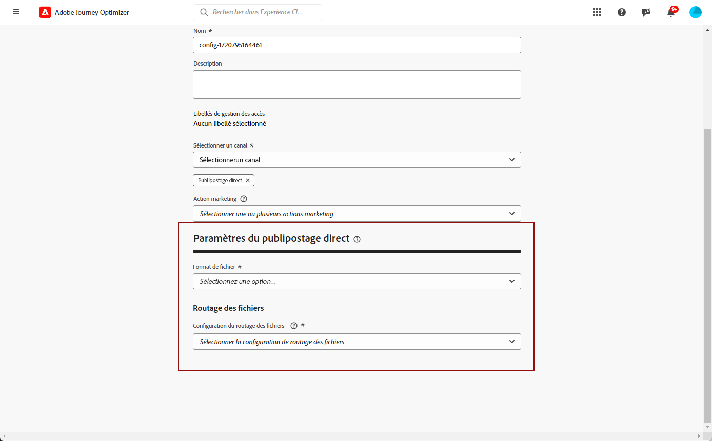

# Configuration du publipostage direct {#direct-mail-configuration}

[!DNL Journey Optimizer] vous permet de personnaliser et de générer les fichiers requis par les fournisseurs de publipostage direct pour envoyer du courrier à vos clients.

Lors de la [création d’un message de publipostage direct](../direct-mail/create-direct-mail.md), vous définissez les données de l’audience ciblée, y compris les informations de contact sélectionnées (adresse postale par exemple). Un fichier contenant ces données sera alors automatiquement généré et exporté vers un serveur, où votre fournisseur de publipostage direct pourra les récupérer et prendre en charge l’envoi.

Avant de pouvoir générer ce fichier, vous devez créer les éléments suivants :

1. Une [configuration du routage des fichiers](#file-routing-configuration) pour spécifier le serveur sur lequel le fichier sera exporté et chiffré, le cas échéant.

   >[!CAUTION]
   >
   >Pour créer une configuration de routage de fichier, vous devez disposer de l’autorisation intégrée **[!DNL Manage file routing]**. [En savoir plus](../administration/ootb-product-profiles.md#content-library-manager).

1. Une [surface de publipostage direct](#direct-mail-surface) qui fera référence à la configuration du routage des fichiers. Si vous n’avez configuré aucune option de routage de fichier, vous ne pourrez pas créer de surface de publipostage direct.

## Configurer le routage des fichiers {#file-routing-configuration}

>[!CONTEXTUALHELP]
>id="ajo_dm_file_routing_details"
>title="Définir la configuration du routage des fichiers"
>abstract="Une fois que vous avez créé un message de publipostage direct, le fichier contenant les données de l’audience ciblée sera généré et exporté vers un serveur. Vous devez spécifier les détails du serveur afin que votre fournisseur de publipostage direct puisse accéder à ce fichier et l’utiliser pour diffuser du publipostage direct."
>additional-url="https://experienceleague.adobe.com/docs/journey-optimizer/using/direct-mail/create-direct-mail.html?lang=fr" text="Créer un message de publipostage direct"

>[!CONTEXTUALHELP]
>id="ajo_dm_file_routing_details_header"
>title="Définir la configuration du routage des fichiers"
>abstract="Vous devez définir l’endroit où le fichier sera exporté pour que votre fournisseur de publipostage direct puisse l’utiliser."

>[!CONTEXTUALHELP]
>id="ajo_dm_select_file_routing"
>title="Configuration du routage des fichiers"
>abstract="Sélectionnez la configuration du routage des fichiers de votre choix, qui définit l’endroit où le fichier sera exporté pour que votre fournisseur de publipostage direct puisse l’utiliser."

>[!CONTEXTUALHELP]
>id="ajo_dm_file_routing_type"
>title="Sélectionnez le type de serveur pour votre fichier"
>abstract="Choisissez le type de serveur à utiliser pour l’exportation de vos fichiers de publipostage direct. Actuellement, seuls Amazon S3 et SFTP sont pris en charge par Journey Optimizer."

>[!CONTEXTUALHELP]
>id="ajo_dm_file_routing_aws_region"
>title="Choisissez la région AWS"
>abstract="Sélectionnez la région géographique du serveur AWS où vous souhaitez exporter vos fichiers de publipostage direct. En règle générale, il est préférable de choisir la région la plus proche du lieu où se trouve votre fournisseur de publipostage direct."

>[!NOTE]
>
>Actuellement, Amazon S3, SFTP et Azure sont pris en charge dans [!DNL Journey Optimizer].

Pour diffuser un message de publipostage direct, [!DNL Journey Optimizer] génère et exporte vers un serveur le fichier contenant les données de votre audience ciblée.

Vous devez spécifier les détails du serveur afin que votre fournisseur de publipostage direct puisse accéder à ce fichier et l’utiliser pour diffuser du courrier.

Pour configurer le routage des fichiers, suivez les étapes ci-dessous.

>[!BEGINTABS]

>[!TAB Amazon S3]

1. Accédez au menu **[!UICONTROL Administration]** > **[!UICONTROL Canaux]** > **[!UICONTROL Configuration du routage des fichiers]** > **[!UICONTROL Routage des fichiers]**, puis cliquez sur **[!UICONTROL Créer une configuration de routage]**.

   {width="800" align="center"}

1. Attribuez un nom à votre configuration.

1. Sélectionnez **Amazon S3** comme **[!UICONTROL type de serveur]** à utiliser pour exporter les fichiers de publipostage direct.

   {width="800" align="center"}

1. Renseigner les détails et les informations d’identification de votre serveur

   * **Nom du compartiment AWS** : pour savoir où trouver votre nom du compartiment AWS, consultez [cette page](https://docs.aws.amazon.com/AmazonS3/latest/userguide/UsingBucket.html).

   * **Clé d’accès AWS** : pour savoir où trouver votre ID de la clé d’accès AWS, consultez [cette page](https://docs.aws.amazon.com/IAM/latest/UserGuide/security-creds.html#access-keys-and-secret-access-keys).

   * **Clé d’accès AWS** : pour savoir où trouver votre clé secrète AWS, consultez [cette page](https://aws.amazon.com/fr/blogs/security/wheres-my-secret-access-key/).

   * **Région AWS** : sélectionnez la **[!UICONTROL région AWS]** où se trouve l’infrastructure du serveur. Les régions AWS sont des zones géographiques qu’AWS utilise pour héberger ses infrastructures cloud. En règle générale, il est préférable de choisir la région la plus proche de l’emplacement de votre fournisseur de publipostage direct.

   {width="800" align="center"}

1. Pour chiffrer le fichier, copiez-collez votre clé de chiffrement dans le champ **[!UICONTROL Clé de chiffrement PGP/GPG]**.

1. Sélectionnez **[!UICONTROL Envoyer]**. La configuration du routage des fichiers est créée avec le statut **[!UICONTROL Actif]**. Elle est maintenant prête à être utilisée dans une [surface de publipostage direct](#direct-mail-surface).

   Vous pouvez également sélectionner **[!UICONTROL Enregistrer comme brouillon]** pour créer la configuration du routage des fichiers, mais vous ne pourrez pas la sélectionner pour une surface tant qu&#39;elle ne sera pas **[!UICONTROL Active]**.

>[!TAB SFTP]

1. Accédez au menu **[!UICONTROL Administration]** > **[!UICONTROL Canaux]** > **[!UICONTROL Configuration du routage des fichiers]** > **[!UICONTROL Routage des fichiers]**, puis cliquez sur **[!UICONTROL Créer une configuration de routage]**.

   {width="800" align="center"}

1. Attribuez un nom à votre configuration.

1. Sélectionnez SFTP comme **[!UICONTROL type de serveur]** à utiliser pour exporter les fichiers de publipostage direct.

   {width="800" align="center"}

1. Renseignez les détails et les informations d’identification de votre serveur :

   * **Compte** : nom du compte utilisé pour se connecter au serveur SFTP.

   * **Adresse du serveur** : URL du serveur SFTP.

   * **Port** : numéro de port de la connexion FTP.

   * **Mot de passe** : mot de passe utilisé pour se connecter au serveur SFTP.

   

1. Pour chiffrer le fichier, copiez-collez votre clé de chiffrement dans le champ **[!UICONTROL Clé de chiffrement PGP/GPG]**.

1. Sélectionnez **[!UICONTROL Envoyer]**. La configuration du routage des fichiers est créée avec le statut **[!UICONTROL Actif]**. Elle est maintenant prête à être utilisée dans une [surface de publipostage direct](#direct-mail-surface).

   Vous pouvez également sélectionner **[!UICONTROL Enregistrer comme brouillon]** pour créer la configuration du routage des fichiers, mais vous ne pourrez pas la sélectionner pour une surface tant qu&#39;elle ne sera pas **[!UICONTROL Active]**.

>[!TAB Azure]

1. Accédez au menu **[!UICONTROL Administration]** > **[!UICONTROL Canaux]** > **[!UICONTROL Configuration du routage des fichiers]** > **[!UICONTROL Routage des fichiers]**, puis cliquez sur **[!UICONTROL Créer une configuration de routage]**.

   {width="800" align="center"}

1. Attribuez un nom à votre configuration.

1. Sélectionnez le **[!UICONTROL type de serveur]** Azure pour exporter les fichiers de publipostage direct.

   {width="800" align="center"}

1. Renseignez les détails et les informations d’identification de votre serveur :

   * **Chaîne de connexion Azure** : pour rechercher votre **chaîne de connexion Azure**, consultez [cette page](https://learn.microsoft.com/fr-fr/azure/storage/common/storage-configure-connection-string#configure-a-connection-string-for-an-azure-storage-account).

     La **chaîne de connexion Azure** doit suivre le format présenté ci-dessous :

     `DefaultEndpointsProtocol=[http|https];AccountName=myAccountName;AccountKey=myAccountKey`

   * **Nom du conteneur** : pour rechercher votre **nom du conteneur**, consultez [cette page](https://learn.microsoft.com/fr-fr/azure/storage/blobs/blob-containers-portal).

     Le **nom du conteneur** doit contenir uniquement le nom du conteneur sans aucune barre oblique. Pour spécifier un chemin d’accès dans le conteneur permettant d’enregistrer le fichier, mettez à jour le nom de fichier de la campagne de publipostage direct afin d’inclure le chemin d’accès souhaité.

1. Pour chiffrer le fichier, copiez-collez votre clé de chiffrement dans le champ **[!UICONTROL Clé de chiffrement PGP/GPG]**.

1. Sélectionnez **[!UICONTROL Envoyer]**. La configuration du routage des fichiers est créée avec le statut **[!UICONTROL Actif]**. Elle est maintenant prête à être utilisée dans une [surface de publipostage direct](#direct-mail-surface).

   Vous pouvez également sélectionner **[!UICONTROL Enregistrer comme brouillon]** pour créer la configuration du routage des fichiers, mais vous ne pourrez pas la sélectionner pour une surface tant qu&#39;elle ne sera pas **[!UICONTROL Active]**.

>[!ENDTABS]

## Création d’une surface de publipostage {#direct-mail-surface}

>[!CONTEXTUALHELP]
>id="ajo_dm_surface_settings"
>title="Définir les paramètres du publipostage direct"
>abstract="Une surface de publipostage direct contient les paramètres de formatage du fichier qui contient les données de l’audience ciblée et qui seront utilisées par le fournisseur du publipostage direct. Vous devez également définir l’endroit où le fichier sera exporté en sélectionnant la configuration du routage du fichier."
>additional-url="https://experienceleague.adobe.com/docs/journey-optimizer/using/direct-mail/direct-mail-configuration.html?lang=fr#file-routing-configuration" text="Configurer le routage des fichiers"

<!--
>[!CONTEXTUALHELP]
>id="ajo_dm_surface_sort"
>title="Define the sort order"
>abstract="If you select this option, the sort will be by profile ID, ascending or descending. If you unselect it, the sorting configuration defined when creating the direct mail message within a journey or a campaign."-->

>[!CONTEXTUALHELP]
>id="ajo_dm_surface_split"
>title="Définir le seuil de partage des fichiers"
>abstract="Vous devez définir le nombre maximum d’enregistrements pour chaque fichier contenant les données d’audience. Vous pouvez sélectionner un nombre compris entre 1 et 200 000 enregistrements. Une fois le seuil spécifié atteint, un autre fichier sera créé pour les enregistrements restants."

Pour pouvoir diffuser du publipostage direct avec [!DNL Journey Optimizer], vous devez créer une surface de canal pour définir les paramètres de formatage du fichier qui sera utilisé par le fournisseur du publipostage direct.

Une surface de publipostage direct doit également inclure la configuration du routage des fichiers qui définit le serveur sur lequel votre fichier de publipostage direct sera exporté.

1. Créer une surface de canal. [En savoir plus](../configuration/channel-surfaces.md)

1. Sélectionnez le canal **[!UICONTROL Publipostage direct]**.

   {width="800" align="center"}

1. Définissez les paramètres du publipostage direct dans la section dédiée de la configuration de la surface du canal.

   {width="800" align="center"}

   <!---->

1. Sélectionnez le format du fichier : **[!UICONTROL CSV]** ou **[!UICONTROL Texte délimité]**.

1. Si vous sélectionnez **[!UICONTROL Texte délimité]**, définissez le séparateur de colonne de votre choix : tabulation, point-virgule, barre verticale ou esperluette.

   

1. Sélectionnez la **[!UICONTROL Configuration du routage des fichiers]** parmi celles que vous avez créées. Ceci définit l’endroit où le fichier sera exporté pour que votre fournisseur de publipostage direct l’utilise.

   >[!CAUTION]
   >
   >Si vous n’avez configuré aucune option de routage de fichier, vous ne pourrez pas créer de surface de publipostage direct. [En savoir plus](#file-routing-configuration)

   {width="800" align="center"}

   <!---->

1. Soumettre la surface de publipostage direct.

Vous pouvez désormais [créer un publipostage direct](../direct-mail/create-direct-mail.md) dans une campagne. Une fois la campagne lancée, le fichier contenant les données de l’audience ciblée sera automatiquement exporté vers le serveur que vous avez défini. Le fournisseur de publipostage direct pourra alors récupérer ce fichier et poursuivre la diffusion du publipostage direct.

>[!NOTE]
>
>Les lignes en double où toutes les valeurs de la ligne sont identiques sont automatiquement supprimées du fichier.

<!--
    In the **[!UICONTROL Insertion]** section, you can choose to automatically remove duplicate rows.

    Define the maximum number of records (i.e. rows) for each file containing profile data. After the specified threshold is reached, another file will be created for the remaining records.

    

    For example, if there are 100,000 records in the file and the threshold limit is set to 60,000, the records will be split into two files. The first file will contain 60,000 rows, and the second file will contain the remaining 40,000 rows.

    >[!NOTE]
    >
    >NOTE You can set any number between 1 and 200,000 records, meaning each file must contain at least 1 row and no more than 200,000 rows.

-->