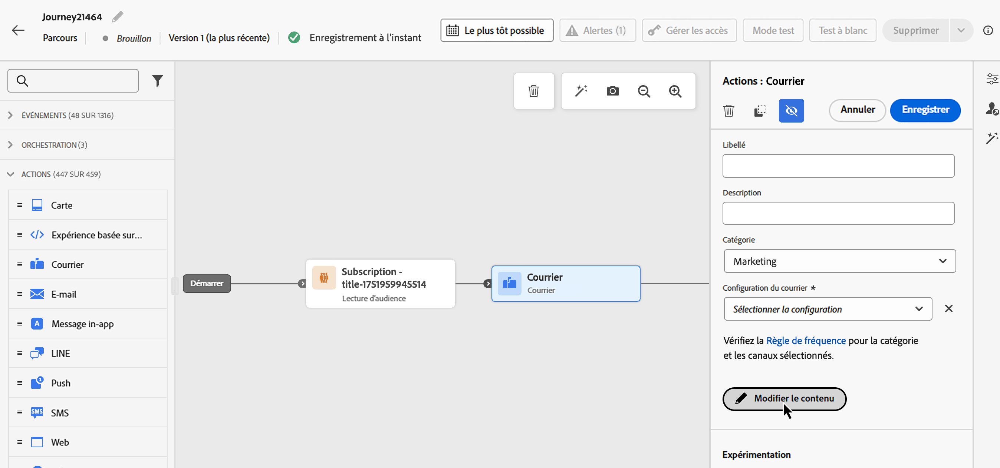
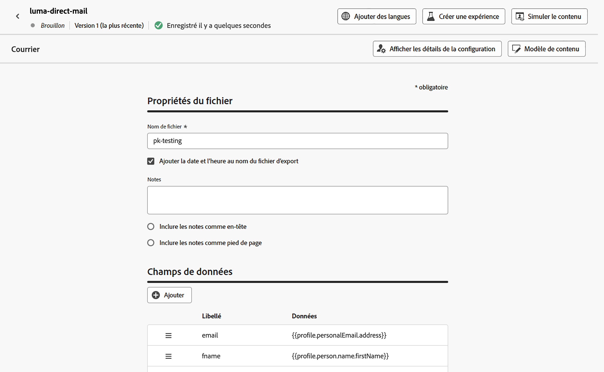

# Envoi de messages de publipostage direct avec parcours {#direct-mail-journeys}

>[!CONTEXTUALHELP]
>id="ajo_journey_direct_mail"
>title="Activité de fin"
>abstract="Le courrier est un canal hors ligne qui vous permet de personnaliser et de générer les fichiers d’extraction requis par les fournisseurs de courrier tiers pour envoyer du courrier à votre clientèle."

Le courrier est un canal hors ligne qui vous permet de personnaliser et de générer les fichiers d’extraction requis par les fournisseurs de courrier tiers pour envoyer du courrier à votre clientèle.

Lors de la création d’un message de publipostage direct, [!DNL Journey Optimizer] génère automatiquement un fichier contenant tous les profils ciblés et les données sélectionnées, telles que les adresses postales et les attributs de profil. Ce fichier est envoyé au serveur de votre choix afin qu’il soit accessible par le fournisseur de courrier tiers de votre choix, qui gérera le processus de courrier réel pour vous.

Vous devez travailler avec le fournisseur de publipostage direct tiers de votre choix pour obtenir les consentements requis de vos clients, le cas échéant, afin que vos clients puissent recevoir du courrier de votre part. Votre utilisation des services de publipostage est soumise aux conditions générales supplémentaires du fournisseur de publipostage direct tiers concerné. Adobe ne contrôle pas les produits tiers et n’en n’est pas responsable. Pour tout problème ou toute demande d’assistance liés à l’envoi de votre message de publipostage direct, contactez le fournisseur de publipostage direct tiers de votre choix.

>[!NOTE]
>
>Cette page décrit le processus de création et d’envoi de messages de publipostage direct avec des parcours. Pour plus d’informations sur le canal Publipostage direct et sur la création de campagnes par publipostage direct, reportez-vous à cette section : [Prise en main du publipostage direct](../direct-mail/get-started-direct-mail.md).

## Créer une configuration de routage de fichier

>[!CONTEXTUALHELP]
>id="ajo_dm_file_routing_frequency"
>title="Choisissez la région AWS"
>abstract="Si votre configuration du routage des fichiers doit être envoyée à l’aide de parcours, vous pouvez spécifier la fréquence à laquelle le fichier sera envoyé au serveur."

Avant de créer un message de publipostage direct, assurez-vous d’avoir configuré une configuration du routage des fichiers qui spécifie le serveur sur lequel le fichier d’extraction doit être téléchargé et stocké. Pour ce faire, procédez comme suit :

1. Accédez au menu **[!UICONTROL Administration]** > **[!UICONTROL Canaux]** > **[!UICONTROL Paramètres de publipostage direct]** > **[!UICONTROL Routage des fichiers]**, puis cliquez sur **[!UICONTROL Créer une configuration de routage de fichiers]**.

1. Définissez les propriétés de configuration du routage des fichiers, telles que son nom et le type de serveur à utiliser. Vous trouverez des informations détaillées sur la configuration du routage des fichiers dans la section [Configuration du publipostage direct](../direct-mail/direct-mail-configuration.md#file-routing-configuration).

   Si votre configuration du routage des fichiers doit être envoyée à l’aide de parcours, vous pouvez spécifier la fréquence à laquelle le fichier sera envoyé au serveur.

   

1. Cliquez sur **[!UICONTROL Envoyer]** pour confirmer la création de la configuration du routage des fichiers. La configuration est créée avec le statut **[!UICONTROL Actif]**. Elle est maintenant prête à être référencée dans une configuration de publipostage direct.

## Créer une configuration de publipostage direct {#direct-mail-surface}

Une configuration de publipostage direct contient les paramètres de formatage du fichier qui contient les données de l’audience ciblée et qui seront utilisées par le fournisseur du publipostage direct. Vous devez également définir l’endroit où le fichier sera exporté en sélectionnant la configuration du routage du fichier. Vous trouverez des informations détaillées sur la création d’une configuration de publipostage direct dans la section [Configuration du publipostage direct](../direct-mail/direct-mail-configuration.md#file-routing-configuration).

Une fois que votre configuration du publipostage direct est prête, vous pouvez ajouter une action de publipostage direct dans votre parcours.

## Ajouter une action Courrier à votre parcours

Pour ajouter une action Courrier dans un parcours, procédez comme suit :

1. Ouvrez votre parcours, puis effectuez un glisser-déposer d’une activité **[!UICONTROL Publipostage direct]** depuis la section **Actions** de la palette.

1. Fournissez des informations de base sur votre message (libellé, description, catégorie), puis choisissez la configuration de message à utiliser. Par défaut, le champ **[!UICONTROL configuration]** est prérempli avec la dernière configuration utilisée par l’utilisateur ou l’utilisatrice pour ce canal. Pour plus d’informations sur la configuration de votre parcours, consultez [cette page](../building-journeys/journey-gs.md).

1. Configurez le fichier d’extraction à envoyer à votre fournisseur de publipostage direct. Pour ce faire, cliquez sur le bouton **[!UICONTROL Modifier le contenu]**.

   

1. Ajustez les propriétés du fichier d’extraction, telles que le nom du fichier, ou les colonnes à afficher. Pour plus d’informations sur la configuration des propriétés du fichier d’extraction, consultez cette section : [Créer un message de publipostage direct](../direct-mail/create-direct-mail.md#extraction-file).

   

1. Une fois le contenu du fichier d’extraction défini, vous pouvez utiliser des profils de test pour le prévisualiser. Si vous avez inséré du contenu personnalisé, vous pouvez vérifier l’affichage de celui-ci dans le message à l’aide des données de profil de test.

   Pour ce faire, cliquez sur **[!UICONTROL Simuler du contenu]** puis ajoutez un profil de test pour vérifier le rendu du fichier d’extraction à l’aide des données du profil de test. Vous trouverez des informations détaillées sur la sélection des profils de test et la prévisualisation de votre contenu dans la section [Gestion de contenu](../content-management/preview-test.md).

   {width="800" align="center"}

Lorsque votre fichier d’extraction est prêt, effectuez la configuration de votre parcours  pour l’envoyer.
