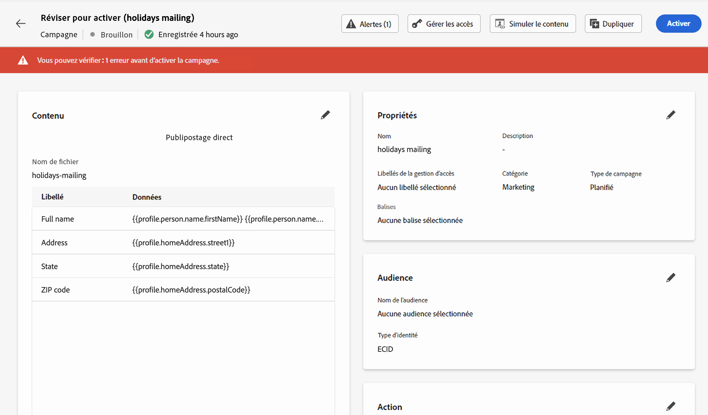

# Vérifier et envoyer un message de publipostage direct {#direct-mail-test-send}

## Prévisualiser le fichier d’extraction {#preview-dm}

Une fois le contenu du fichier d’extraction défini, vous pouvez utiliser des profils de test pour le prévisualiser. Si vous avez inséré du contenu personnalisé, vous pouvez vérifier l’affichage de celui-ci dans le message à l’aide des données de profil de test.

Pour ce faire, cliquez sur **[!UICONTROL Simuler du contenu]**, ajoutez ensuite un profil de test pour vérifier le rendu du fichier d’extraction à l’aide des données de profil de test.

{width="800" align="center"}

Vous trouverez des informations détaillées sur la sélection des profils de test et la prévisualisation de votre contenu dans la section [Gestion de contenu](../content-management/preview-test.md).

Une fois que le contenu du fichier est prêt à être envoyé, fermez l’écran de simulation, puis cliquez sur le bouton **[!UICONTROL Examiner pour activer]**.

## Valider et activer la campagne par courrier {#dm-validate}

>[!IMPORTANT]
>
> Si votre campagne est soumise à une politique de validation, vous devrez demander l’approbation afin de pouvoir envoyer votre campagne par courrier. [En savoir plus](../test-approve/gs-approval.md)

Avant d’activer la campagne de publipostage direct, assurez-vous que la campagne ou le parcours et le fichier d’extraction sont correctement configurés. Pour cela, vérifiez les alertes dans la section supérieure de l’éditeur. Certaines d’entre elles sont de simples avertissements, mais d’autres peuvent vous empêcher d’envoyer le message. Deux types d’alertes peuvent se produire : avertissements et erreurs.

* Les **avertissements** se rapportent aux recommandations et aux bonnes pratiques. Par exemple, un message d’avertissement s’affiche si votre SMS est vide.

* Les **erreurs** vous empêchent de publier la campagne tant qu’elles ne sont pas corrigées. Par exemple, un message d’erreur vous avertit lorsque l’objet est manquant.

{width="800" align="center"}

Lorsque votre campagne de publipostage direct est prête, effectuez la configuration de votre [parcours ](../building-journeys/journey-gs.md) ou [campagne](../campaigns/create-campaign.md) pour l’envoyer.

>[!NOTE]
>
>Le fichier exporté se termine par défaut par une nouvelle ligne. Cela garantit la compatibilité avec les outils de traitement des données standard.

Une fois l’envoi effectué, vous pouvez mesurer l’impact de votre campagne ou de votre parcours par publipostage direct dans les rapports. Pour plus d’informations sur les rapports de publipostage direct, reportez-vous aux sections suivantes :
* [Rapport de campagne par courrier](../reports/campaign-global-report-cja-direct.md)
* [Rapport de parcours de courrier](../reports/journey-global-report-cja-direct.md)

## Gérer le consentement relatif au courrier {#dm-consent-management}

Dans [!DNL Journey Optimizer], le consentement est géré par le [Schéma de consentement](https://experienceleague.adobe.com/docs/experience-platform/xdm/field-groups/profile/consents.html?lang=fr){target="_blank"} d’Experience Platform. Par défaut, la valeur du champ de consentement est vide et traitée comme un consentement pour recevoir vos communications.

Si un profil s’est désabonné de la réception de courrier, dans les attributs de profil d’Experience Platform correspondants, la valeur de `consents.marketing.postalMail.val` sera `n` et le profil correspondant sera exclu des prochaines diffusions.

Pour l’activer à nouveau, l’attribut de profil doit être redéfini sur `consents.marketing.postalMail.val` : `y`.

Pour gérer les attributs d’un profil, accédez à Experience Platform et au profil en sélectionnant un espace de noms d’identité et une valeur d’identité correspondante. Pour en savoir plus, consultez la [documentation Experience Platform](https://experienceleague.adobe.com/docs/experience-platform/profile/ui/user-guide.html?lang=fr#getting-started){target="_blank"}.

En savoir plus sur la gestion des opt-outs de Journey Optimizer dans [cette section](../privacy/opt-out.md).
