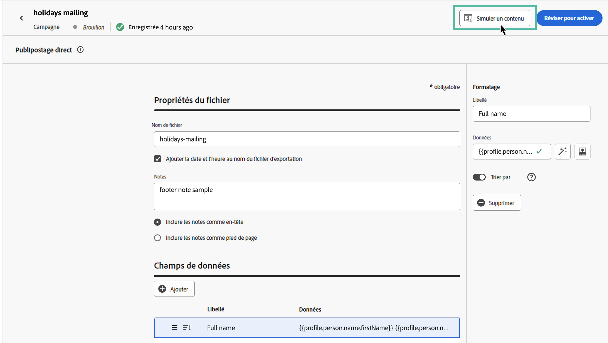
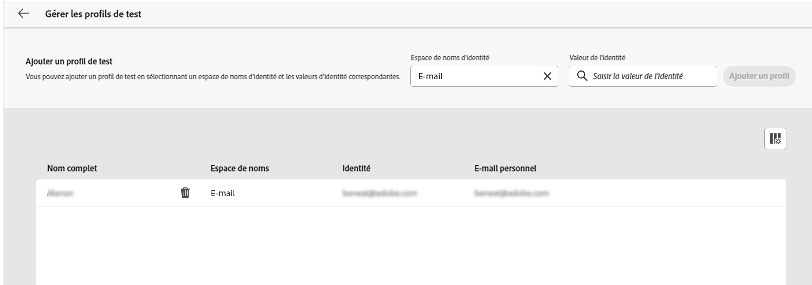

# Tester et envoyer un message de courrier {#direct-mail-test-send}

## Prévisualiser le fichier d’extraction {#preview-dm}

Une fois le contenu du fichier d’extraction défini, vous pouvez utiliser des profils de test pour le prévisualiser. Si vous avez inséré du contenu personnalisé, vous pouvez vérifier l’affichage de celui-ci dans le message à l’aide des données de profil de test.

1. Dans l’écran de configuration du contenu du fichier d’extraction, cliquez sur **[!UICONTROL Simuler du contenu]**.

   {width="800" align="center"}

1. Cliquez sur **[!UICONTROL Gérer les profils de test]** pour ajouter un profil de test.

1. Recherchez votre profil de test avec les champs **[!UICONTROL Espace de noms d’identité]** et **[!UICONTROL Valeur d’identité]**. Cliquez ensuite sur **[!UICONTROL Ajouter un profil]**.

   {width="800" align="center"}

1. Une fois que vous avez sélectionné votre profil de test, vous pouvez fermer la fenêtre **[!UICONTROL Ajouter un profil de test]**.

1. Dans la fenêtre **Prévisualiser et tester**, les données de profil de test sont ajoutées au contenu du fichier d’extraction, ce qui vous permet de prévisualiser le rendu du fichier.

   {width="800" align="center"}

Une fois que le contenu du fichier est prêt à être envoyé, fermez l’écran de simulation, puis cliquez sur le bouton **[!UICONTROL Examiner pour activer]**.

## Valider et activer la campagne par courrier {#dm-validate}

Avant d’activer la campagne par courrier, vérifiez que la campagne et que le fichier d’extraction sont correctement paramétrés. Pour cela, vérifiez les alertes dans la section supérieure de l’éditeur. Certaines d’entre elles sont de simples avertissements, mais d’autres peuvent vous empêcher d’envoyer le message. Deux types d’alertes peuvent se produire : avertissements et erreurs.

* Les **avertissements** se rapportent aux recommandations et aux bonnes pratiques. Par exemple, un message d’avertissement s’affiche si votre SMS est vide.

* Les **erreurs** vous empêchent de publier la campagne tant qu’elles ne sont pas corrigées. Par exemple, un message d’erreur vous avertit lorsque l’objet est manquant.

{width="800" align="center"}

Lorsque votre campagne par courrier est prête, cliquez sur le bouton **[!UICONTROL Activer]**. Lorsque la campagne démarrera, le fichier d’extraction sera automatiquement généré et exporté vers le serveur spécifié dans votre [configuration du routage des fichiers](../direct-mail/direct-mail-configuration.md).

Une fois le message envoyé, vous pouvez mesurer l’impact de votre campagne par courrier dans les rapports de la campagne. Pour plus d’informations sur les rapports, consultez cette section.

## Gérer le consentement relatif au courrier {#dm-consent-management}

Dans [!DNL Journey Optimizer], le consentement est géré par le [Schéma de consentement](https://experienceleague.adobe.com/docs/experience-platform/xdm/field-groups/profile/consents.html?lang=fr){target="_blank"} d’Experience Platform. Par défaut, la valeur du champ de consentement est vide et traitée comme un consentement pour recevoir vos communications.

Si un profil s’est désabonné de la réception de courrier, dans les attributs de profil d’Experience Platform correspondants, la valeur de `consents.marketing.postalMail.val` sera `n` et le profil correspondant sera exclu des prochaines diffusions.

Pour l’activer à nouveau, l’attribut de profil doit être redéfini sur `consents.marketing.postalMail.val` : `y`.

Pour gérer les attributs d’un profil, accédez à Experience Platform et au profil en sélectionnant un espace de noms d’identité et une valeur d’identité correspondante. Pour en savoir plus, consultez la [documentation Experience Platform](https://experienceleague.adobe.com/docs/experience-platform/profile/ui/user-guide.html?lang=fr#getting-started){target="_blank"}.

En savoir plus sur la gestion des désinscriptions de Journey Optimizer dans [cette section](../privacy/opt-out.md).
