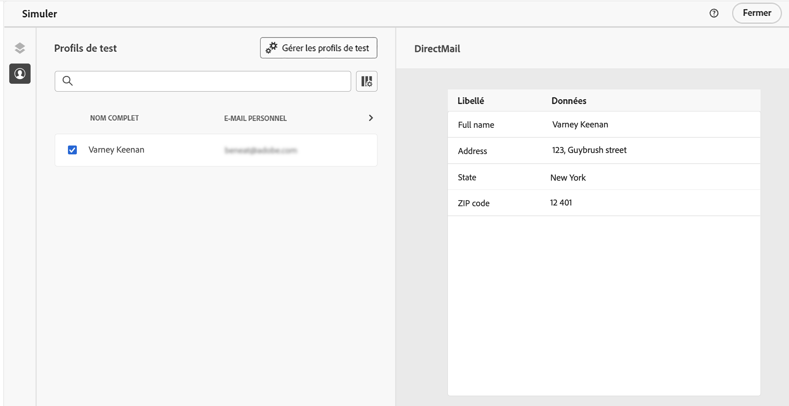

# Test et envoi d’un courrier {#direct-mail-test-send}

## Aperçu du fichier d&#39;extraction {#preview-dm}

Une fois le contenu du fichier d&#39;extraction défini, vous pouvez utiliser des profils de test pour le prévisualiser. Si vous avez inséré du contenu personnalisé, vous pouvez vérifier l’affichage de celui-ci dans le message à l’aide des données de profil de test.

1. Dans l&#39;écran de configuration du contenu du fichier d&#39;extraction, cliquez sur **[!UICONTROL Simulation du contenu]**.

   {width="800" align="center"}

1. Cliquez sur **[!UICONTROL Gérer les profils de test]** pour ajouter un profil de test.

1. Recherchez votre profil de test avec les champs **[!UICONTROL Espace de noms d’identité]** et **[!UICONTROL Valeur d’identité]**. Cliquez ensuite sur **[!UICONTROL Ajouter un profil]**.

   {width="800" align="center"}

1. Une fois que vous avez sélectionné votre profil de test, vous pouvez fermer la fenêtre **[!UICONTROL Ajouter un profil de test]**.

1. Dans la **Aperçu et test** , les données de profil de test sont ajoutées au contenu du fichier d’extraction, ce qui vous permet de prévisualiser le rendu du fichier.

   {width="800" align="center"}

Une fois que le contenu du fichier est prêt à être envoyé, fermez l’écran de simulation, puis cliquez sur le bouton **[!UICONTROL Réviser pour activer]** bouton .

## Valider et activer la campagne courrier {#dm-validate}

Avant d&#39;activer la campagne courrier, vérifiez que l&#39;opération et le fichier d&#39;extraction sont correctement paramétrés. Pour cela, cochez les alertes dans la section supérieure de l&#39;éditeur. Certaines d’entre elles sont de simples avertissements, mais d’autres peuvent vous empêcher d’envoyer le message. Deux types d’alertes peuvent se produire : avertissements et erreurs.

* Les **avertissements** se rapportent aux recommandations et aux bonnes pratiques. Par exemple, un message d’avertissement s’affiche si votre SMS est vide.

* **Erreurs** vous empêche de publier la campagne tant qu’elle n’est pas résolue. Par exemple, un message d’erreur vous avertit lorsque l’objet est manquant.

{width="800" align="center"}

Lorsque votre campagne par courrier est prête, cliquez sur le bouton **[!UICONTROL Activer]** bouton . Au démarrage de l&#39;opération, le fichier d&#39;extraction sera automatiquement généré et exporté vers le serveur spécifié dans votre [configuration du routage des fichiers](../direct-mail/direct-mail-configuration.md).

Une fois envoyé, vous pouvez mesurer l’impact de votre campagne courrier dans les rapports de campagne. Pour plus d’informations sur les rapports, consultez cette section.
